# Data QC, Density Plots for beta and M values, and PCA
Beryl  
2015-04-01  


```r
suppressPackageStartupMessages(library(ggplot2)) # for plotting
suppressPackageStartupMessages(library(pheatmap)) # for heatmap
suppressPackageStartupMessages(library(RColorBrewer)) # for heatmap palette
suppressPackageStartupMessages(library(plyr))  # data aggregation
suppressPackageStartupMessages(library(dplyr)) #data aggregation
suppressPackageStartupMessages(library(reshape))   #data aggregation
suppressPackageStartupMessages(library(knitr)) # present better tables
```


```r
load("../../data/GSE48684_raw_filtered.Rdata")
load("../../data/GSE48684_raw_filtered.beta.norm.Rdata")
load("../../data/GSE48684_raw_filtered.beta.norm.cgi.Rdata")
load("../../data/GSE48684_raw_filtered.m.norm.Rdata")
load("../../data/GSE48684_raw_filtered.m.norm.cgi.Rdata")
load("../../data/metadata.Rdata")
```

####Data QC
To inspect the datasets that we have so far, check the number of NAs. 


```r
checkNA <- function(df){
  length(which(is.na(df) == T))
}
order_by_group <- metadata$geo_accession[order(metadata$group, 
																							 metadata$colon_region)]


# raw data, probes filtered
#head(raw_data_filter)
str(raw_data_filter)
```

```
##  num [1:301208, 1:147] 0.8715 0.8977 0.7028 0.0625 0.7799 ...
##  - attr(*, "dimnames")=List of 2
##   ..$ : chr [1:301208] "cg00050873" "cg00063477" "cg00121626" "cg00212031" ...
##   ..$ : chr [1:147] "GSM1183439" "GSM1183440" "GSM1183441" "GSM1183442" ...
```

```r
checkNA(raw_data_filter)
```

```
## [1] 67794
```

```r
raw_data_filter <- raw_data_filter[, order_by_group]

# normalized data
#head(beta.norm)
str(beta.norm)
```

```
##  num [1:301208, 1:147] 0.901 0.922 0.759 0.066 0.821 ...
##  - attr(*, "dimnames")=List of 2
##   ..$ : chr [1:301208] "cg00050873" "cg00063477" "cg00121626" "cg00212031" ...
##   ..$ : chr [1:147] "GSM1183439" "GSM1183440" "GSM1183441" "GSM1183442" ...
```

```r
checkNA(beta.norm)
```

```
## [1] 67794
```

```r
beta.norm <- beta.norm[, order_by_group]

#head(beta.norm.CGI)
str(beta.norm.CGI)
```

```
## 'data.frame':	26403 obs. of  147 variables:
##  $ GSM1183439: num  0.201 0.487 0.189 0.205 0.212 ...
##  $ GSM1183440: num  0.202 0.535 0.187 0.212 0.214 ...
##  $ GSM1183441: num  0.205 0.523 0.185 0.218 0.221 ...
##  $ GSM1183442: num  0.206 0.52 0.184 0.201 0.207 ...
##  $ GSM1183443: num  0.206 0.528 0.164 0.208 0.203 ...
##  $ GSM1183444: num  0.204 0.52 0.188 0.208 0.207 ...
##  $ GSM1183445: num  0.207 0.401 0.144 0.15 0.187 ...
##  $ GSM1183446: num  0.205 0.526 0.185 0.211 0.21 ...
##  $ GSM1183447: num  0.192 0.403 0.136 0.143 0.195 ...
##  $ GSM1183448: num  0.2 0.479 0.166 0.188 0.203 ...
##  $ GSM1183449: num  0.194 0.396 0.146 0.154 0.187 ...
##  $ GSM1183450: num  0.189 0.357 0.149 0.159 0.205 ...
##  $ GSM1183451: num  0.194 0.465 0.151 0.146 0.186 ...
##  $ GSM1183452: num  0.22 0.574 0.189 0.283 0.233 ...
##  $ GSM1183453: num  0.212 0.566 0.209 0.269 0.23 ...
##  $ GSM1183454: num  0.205 0.536 0.175 0.204 0.215 ...
##  $ GSM1183455: num  0.205 0.542 0.149 0.152 0.197 ...
##  $ GSM1183456: num  0.202 0.529 0.18 0.192 0.213 ...
##  $ GSM1183457: num  0.185 0.513 0.162 0.191 0.215 ...
##  $ GSM1183458: num  0.204 0.421 0.169 0.175 0.207 ...
##  $ GSM1183459: num  0.203 0.538 0.193 0.236 0.218 ...
##  $ GSM1183460: num  0.21 0.472 0.186 0.221 0.227 ...
##  $ GSM1183461: num  0.199 0.536 0.192 0.213 0.209 ...
##  $ GSM1183462: num  0.195 0.521 0.187 0.216 0.214 ...
##  $ GSM1183463: num  0.202 0.567 0.187 0.233 0.213 ...
##  $ GSM1183464: num  0.206 0.581 0.196 0.233 0.221 ...
##  $ GSM1183465: num  0.199 0.559 0.187 0.24 0.21 ...
##  $ GSM1183466: num  0.199 0.472 0.164 0.187 0.19 ...
##  $ GSM1183467: num  0.204 0.521 0.183 0.2 0.214 ...
##  $ GSM1183468: num  0.208 0.493 0.18 0.201 0.214 ...
##  $ GSM1183469: num  0.215 0.527 0.19 0.21 0.215 ...
##  $ GSM1183470: num  0.213 0.482 0.173 0.196 0.221 ...
##  $ GSM1183471: num  0.209 0.51 0.181 0.215 0.215 ...
##  $ GSM1183472: num  0.21 0.515 0.189 0.209 0.231 ...
##  $ GSM1183473: num  0.207 0.548 0.175 0.201 0.216 ...
##  $ GSM1183474: num  0.212 0.508 0.181 0.212 0.2 ...
##  $ GSM1183475: num  0.209 0.512 0.177 0.204 0.208 ...
##  $ GSM1183476: num  0.212 0.476 0.176 0.201 0.208 ...
##  $ GSM1183477: num  0.208 0.524 0.183 0.206 0.213 ...
##  $ GSM1183478: num  0.208 0.513 0.181 0.199 0.21 ...
##  $ GSM1183479: num  0.188 0.534 0.185 0.221 0.22 ...
##  $ GSM1183480: num  0.211 0.485 0.173 0.194 0.203 ...
##  $ GSM1183481: num  0.212 0.494 0.175 0.197 0.215 ...
##  $ GSM1183482: num  0.213 0.498 0.178 0.2 0.209 ...
##  $ GSM1183483: num  0.203 0.564 0.179 0.219 0.211 ...
##  $ GSM1183484: num  0.2 0.53 0.174 0.184 0.217 ...
##  $ GSM1183485: num  0.2 0.508 0.184 0.202 0.205 ...
##  $ GSM1183486: num  0.197 0.535 0.185 0.216 0.217 ...
##  $ GSM1183487: num  0.231 0.577 0.202 0.269 0.235 ...
##  $ GSM1183488: num  0.211 0.513 0.182 0.202 0.219 ...
##  $ GSM1183489: num  0.196 0.555 0.205 0.243 0.234 ...
##  $ GSM1183490: num  0.202 0.555 0.218 0.235 0.224 ...
##  $ GSM1183491: num  0.207 0.588 0.2 0.243 0.223 ...
##  $ GSM1183492: num  0.219 0.597 0.2 0.263 0.229 ...
##  $ GSM1183493: num  0.213 0.556 0.173 0.225 0.213 ...
##  $ GSM1183494: num  0.206 0.487 0.179 0.216 0.205 ...
##  $ GSM1183495: num  0.203 0.53 0.178 0.214 0.213 ...
##  $ GSM1183496: num  0.21 0.519 0.186 0.213 0.216 ...
##  $ GSM1183497: num  0.212 0.53 0.174 0.199 0.209 ...
##  $ GSM1183498: num  0.205 0.522 0.182 0.206 0.207 ...
##  $ GSM1183499: num  0.191 0.532 0.169 0.191 0.21 ...
##  $ GSM1183500: num  0.211 0.515 0.184 0.21 0.21 ...
##  $ GSM1183501: num  0.211 0.491 0.173 0.194 0.211 ...
##  $ GSM1183502: num  0.203 0.501 0.178 0.19 0.206 ...
##  $ GSM1183503: num  0.224 0.452 0.164 0.187 0.209 ...
##  $ GSM1183504: num  0.211 0.467 0.183 0.197 0.211 ...
##  $ GSM1183505: num  0.205 0.489 0.174 0.186 0.212 ...
##  $ GSM1183506: num  0.2 0.431 0.155 0.158 0.197 ...
##  $ GSM1183507: num  0.209 0.426 0.157 0.164 0.201 ...
##  $ GSM1183508: num  0.191 0.424 0.15 0.153 0.201 ...
##  $ GSM1183509: num  0.201 0.452 0.162 0.164 0.205 ...
##  $ GSM1183510: num  0.209 0.463 0.17 0.185 0.212 ...
##  $ GSM1183511: num  0.22 0.467 0.163 0.176 0.202 ...
##  $ GSM1183512: num  0.213 0.449 0.162 0.15 0.196 ...
##  $ GSM1183513: num  0.206 0.488 0.168 0.201 0.208 ...
##  $ GSM1183514: num  0.194 0.398 0.156 0.18 0.197 ...
##  $ GSM1183515: num  0.211 0.541 0.172 0.185 0.205 ...
##  $ GSM1183516: num  0.209 0.489 0.167 0.174 0.203 ...
##  $ GSM1183517: num  0.196 0.346 0.168 0.175 0.188 ...
##  $ GSM1183518: num  0.211 0.48 0.187 0.218 0.222 ...
##  $ GSM1183519: num  0.188 0.456 0.161 0.183 0.214 ...
##  $ GSM1183520: num  0.21 0.597 0.188 0.254 0.233 ...
##  $ GSM1183521: num  0.21 0.498 0.166 0.176 0.206 ...
##  $ GSM1183522: num  0.201 0.431 0.17 0.17 0.184 ...
##  $ GSM1183523: num  0.21 0.486 0.156 0.18 0.205 ...
##  $ GSM1183524: num  0.207 0.468 0.172 0.201 0.216 ...
##  $ GSM1183525: num  0.204 0.548 0.181 0.223 0.21 ...
##  $ GSM1183526: num  0.182 0.38 0.14 0.147 0.204 ...
##  $ GSM1183527: num  0.198 0.379 0.14 0.134 0.193 ...
##  $ GSM1183528: num  0.21 0.535 0.187 0.209 0.218 ...
##  $ GSM1183529: num  0.207 0.539 0.175 0.21 0.21 ...
##  $ GSM1183530: num  0.208 0.526 0.166 0.178 0.211 ...
##  $ GSM1183531: num  0.209 0.419 0.173 0.179 0.214 ...
##  $ GSM1183532: num  0.21 0.4 0.149 0.169 0.203 ...
##  $ GSM1183533: num  0.21 0.452 0.177 0.2 0.216 ...
##  $ GSM1183534: num  0.206 0.445 0.167 0.186 0.202 ...
##  $ GSM1183535: num  0.216 0.51 0.162 0.182 0.211 ...
##  $ GSM1183536: num  0.196 0.386 0.145 0.165 0.19 ...
##  $ GSM1183537: num  0.202 0.347 0.137 0.164 0.188 ...
##   [list output truncated]
```

```r
checkNA(beta.norm.CGI)
```

```
## [1] 65
```

```r
beta.norm.CGI <- beta.norm.CGI[, order_by_group]

#M value transformed
#head(M.norm)
str(M.norm)
```

```
##  num [1:301208, 1:147] 3.18 3.55 1.66 -3.82 2.2 ...
##  - attr(*, "dimnames")=List of 2
##   ..$ : chr [1:301208] "cg00050873" "cg00063477" "cg00121626" "cg00212031" ...
##   ..$ : chr [1:147] "GSM1183439" "GSM1183440" "GSM1183441" "GSM1183442" ...
```

```r
checkNA(M.norm)
```

```
## [1] 67794
```

```r
#head(M.norm.CGI)
str(M.norm.CGI)
```

```
## 'data.frame':	26403 obs. of  147 variables:
##  $ GSM1183439: num  -2.655 -0.469 -3.205 -2.651 -2.591 ...
##  $ GSM1183440: num  -2.5986 -0.0914 -3.2807 -2.5384 -2.6179 ...
##  $ GSM1183441: num  -2.545 -0.253 -3.191 -2.374 -2.533 ...
##  $ GSM1183442: num  -2.559 -0.215 -3.317 -2.693 -2.699 ...
##  $ GSM1183443: num  -2.5574 -0.0956 -3.4414 -2.5855 -2.7708 ...
##  $ GSM1183444: num  -2.583 -0.139 -3.264 -2.645 -2.741 ...
##  $ GSM1183445: num  -2.491 -0.947 -3.59 -2.898 -2.866 ...
##  $ GSM1183446: num  -2.555 -0.156 -3.176 -2.531 -2.676 ...
##  $ GSM1183447: num  -2.817 -0.936 -3.72 -2.959 -2.744 ...
##  $ GSM1183448: num  -2.602 -0.559 -3.431 -2.751 -2.725 ...
##  $ GSM1183449: num  -2.733 -0.926 -3.536 -2.905 -2.732 ...
##  $ GSM1183450: num  -2.69 -1.28 -3.46 -2.88 -2.7 ...
##  $ GSM1183451: num  -2.74 -0.547 -3.477 -3.014 -2.841 ...
##  $ GSM1183452: num  -2.31 0.22 -3.21 -1.76 -2.38 ...
##  $ GSM1183453: num  -2.442 0.135 -3.188 -1.964 -2.434 ...
##  $ GSM1183454: num  -2.568 -0.136 -3.444 -2.599 -2.528 ...
##  $ GSM1183455: num  -2.5611 0.0855 -3.5442 -2.9533 -2.7577 ...
##  $ GSM1183456: num  -2.61 -0.15 -3.33 -2.59 -2.67 ...
##  $ GSM1183457: num  -2.93 -0.25 -3.47 -2.77 -2.73 ...
##  $ GSM1183458: num  -2.57 -0.804 -3.315 -2.831 -2.647 ...
##  $ GSM1183459: num  -2.5929 -0.0979 -3.1202 -2.3362 -2.6163 ...
##  $ GSM1183460: num  -2.389 -0.515 -3.103 -2.319 -2.397 ...
##  $ GSM1183461: num  -2.65 -0.13 -3.3 -2.55 -2.75 ...
##  $ GSM1183462: num  -2.723 -0.216 -3.452 -2.535 -2.713 ...
##  $ GSM1183463: num  -2.549 0.178 -3.286 -2.403 -2.653 ...
##  $ GSM1183464: num  -2.458 0.253 -3.29 -2.372 -2.621 ...
##  $ GSM1183465: num  -2.663 0.104 -3.274 -2.282 -2.659 ...
##  $ GSM1183466: num  -2.63 -0.47 -3.39 -2.7 -2.86 ...
##  $ GSM1183467: num  -2.598 -0.111 -3.317 -2.72 -2.714 ...
##  $ GSM1183468: num  -2.541 -0.397 -3.253 -2.658 -2.669 ...
##  $ GSM1183469: num  -2.485 -0.119 -3.089 -2.638 -2.689 ...
##  $ GSM1183470: num  -2.415 -0.465 -3.32 -2.627 -2.595 ...
##  $ GSM1183471: num  -2.521 -0.273 -3.295 -2.508 -2.681 ...
##  $ GSM1183472: num  -2.466 -0.204 -3.219 -2.563 -2.463 ...
##  $ GSM1183473: num  -2.5513 0.0485 -3.2894 -2.6986 -2.6741 ...
##  $ GSM1183474: num  -2.477 -0.359 -3.4 -2.632 -2.883 ...
##  $ GSM1183475: num  -2.555 -0.264 -3.379 -2.609 -2.765 ...
##  $ GSM1183476: num  -2.501 -0.388 -3.305 -2.679 -2.71 ...
##  $ GSM1183477: num  -2.535 -0.188 -3.262 -2.673 -2.701 ...
##  $ GSM1183478: num  -2.538 -0.201 -3.255 -2.668 -2.669 ...
##  $ GSM1183479: num  -2.789 0.031 -3.222 -2.496 -2.667 ...
##  $ GSM1183480: num  -2.439 -0.345 -3.275 -2.668 -2.833 ...
##  $ GSM1183481: num  -2.471 -0.356 -3.283 -2.68 -2.624 ...
##  $ GSM1183482: num  -2.46 -0.274 -3.212 -2.655 -2.743 ...
##  $ GSM1183483: num  -2.641 0.142 -3.289 -2.496 -2.848 ...
##  $ GSM1183484: num  -2.7005 0.0229 -3.4824 -2.7852 -2.7023 ...
##  $ GSM1183485: num  -2.7 -0.24 -3.29 -2.59 -2.83 ...
##  $ GSM1183486: num  -2.6433 -0.0467 -3.3132 -2.5103 -2.5938 ...
##  $ GSM1183487: num  -2.172 0.367 -2.87 -2.09 -2.4 ...
##  $ GSM1183488: num  -2.476 -0.248 -3.198 -2.647 -2.718 ...
##  $ GSM1183489: num  -2.721 0.121 -3.019 -2.3 -2.517 ...
##  $ GSM1183490: num  -2.645 0.105 -2.912 -2.382 -2.606 ...
##  $ GSM1183491: num  -2.665 0.346 -3.109 -2.335 -2.635 ...
##  $ GSM1183492: num  -2.322 0.447 -2.942 -2.081 -2.448 ...
##  $ GSM1183493: num  -2.448 0.125 -3.491 -2.424 -2.766 ...
##  $ GSM1183494: num  -2.551 -0.505 -3.32 -2.455 -2.957 ...
##  $ GSM1183495: num  -2.635 -0.063 -3.308 -2.556 -2.681 ...
##  $ GSM1183496: num  -2.4816 -0.0295 -3.1835 -2.5226 -2.7637 ...
##  $ GSM1183497: num  -2.476 -0.093 -3.329 -2.715 -2.825 ...
##  $ GSM1183498: num  -2.58 -0.083 -3.305 -2.586 -2.975 ...
##  $ GSM1183499: num  -2.6321 -0.0311 -3.348 -2.7364 -2.7333 ...
##  $ GSM1183500: num  -2.474 -0.358 -3.32 -2.603 -2.784 ...
##  $ GSM1183501: num  -2.495 -0.332 -3.299 -2.661 -2.689 ...
##  $ GSM1183502: num  -2.583 -0.269 -3.27 -2.762 -2.799 ...
##  $ GSM1183503: num  -2.376 -0.573 -3.554 -2.67 -2.636 ...
##  $ GSM1183504: num  -2.502 -0.514 -3.211 -2.637 -2.669 ...
##  $ GSM1183505: num  -2.541 -0.302 -3.384 -2.676 -2.72 ...
##  $ GSM1183506: num  -2.68 -0.747 -3.55 -2.971 -2.817 ...
##  $ GSM1183507: num  -2.489 -0.656 -3.539 -3.022 -2.843 ...
##  $ GSM1183508: num  -2.807 -0.637 -3.657 -3.027 -2.892 ...
##  $ GSM1183509: num  -2.644 -0.594 -3.409 -2.773 -2.77 ...
##  $ GSM1183510: num  -2.545 -0.513 -3.355 -2.631 -2.57 ...
##  $ GSM1183511: num  -2.335 -0.565 -3.397 -2.649 -2.802 ...
##  $ GSM1183512: num  -2.461 -0.659 -3.452 -3.016 -2.817 ...
##  $ GSM1183513: num  -2.52 -0.4 -3.37 -2.57 -2.68 ...
##  $ GSM1183514: num  -2.795 -0.893 -3.591 -2.872 -2.839 ...
##  $ GSM1183515: num  -2.557 0.191 -3.16 -2.633 -2.768 ...
##  $ GSM1183516: num  -2.482 -0.354 -3.395 -2.858 -2.725 ...
##  $ GSM1183517: num  -2.71 -1.26 -3.4 -2.82 -2.86 ...
##  $ GSM1183518: num  -2.419 -0.288 -3.162 -2.529 -2.547 ...
##  $ GSM1183519: num  -2.88 -0.38 -3.43 -2.79 -2.53 ...
##  $ GSM1183520: num  -2.516 0.487 -3.18 -2.16 -2.466 ...
##  $ GSM1183521: num  -2.45 -0.19 -3.31 -2.75 -2.74 ...
##  $ GSM1183522: num  -2.695 -0.692 -3.298 -2.897 -2.984 ...
##  $ GSM1183523: num  -2.462 -0.345 -3.535 -2.702 -2.701 ...
##  $ GSM1183524: num  -2.545 -0.412 -3.336 -2.608 -2.557 ...
##  $ GSM1183525: num  -2.668 0.152 -3.248 -2.457 -2.743 ...
##  $ GSM1183526: num  -2.827 -0.974 -3.603 -2.977 -2.815 ...
##  $ GSM1183527: num  -2.72 -1.05 -3.58 -3.1 -2.79 ...
##  $ GSM1183528: num  -2.514 -0.079 -3.254 -2.519 -2.53 ...
##  $ GSM1183529: num  -2.572 -0.109 -3.341 -2.515 -2.683 ...
##  $ GSM1183530: num  -2.5104 -0.0806 -3.4023 -2.788 -2.6165 ...
##  $ GSM1183531: num  -2.52 -0.77 -3.38 -2.78 -2.67 ...
##  $ GSM1183532: num  -2.477 -0.959 -3.568 -2.816 -2.769 ...
##  $ GSM1183533: num  -2.505 -0.537 -3.296 -2.549 -2.559 ...
##  $ GSM1183534: num  -2.599 -0.577 -3.366 -2.629 -2.72 ...
##  $ GSM1183535: num  -2.364 -0.155 -3.384 -2.777 -2.685 ...
##  $ GSM1183536: num  -2.67 -1.05 -3.53 -2.98 -2.95 ...
##  $ GSM1183537: num  -2.62 -1.25 -3.55 -2.89 -2.94 ...
##   [list output truncated]
```

```r
checkNA(M.norm.CGI)
```

```
## [1] 65
```

```r
M.norm.CGI <- M.norm.CGI[, order_by_group]

# metadata
load("../../data/metadata.Rdata")
head(metadata)
```

```
##               group                                title geo_accession
## GSM1183439 normal-H Genomic DNA from normal individual 1    GSM1183439
## GSM1183440 normal-H Genomic DNA from normal individual 2    GSM1183440
## GSM1183441 normal-H Genomic DNA from normal individual 3    GSM1183441
## GSM1183442 normal-H Genomic DNA from normal individual 4    GSM1183442
## GSM1183443 normal-H Genomic DNA from normal individual 5    GSM1183443
## GSM1183444 normal-H Genomic DNA from normal individual 6    GSM1183444
##                       tissue colon_region gender stage
## GSM1183439 colorectal mucosa        colon   male  <NA>
## GSM1183440 colorectal mucosa        colon   male  <NA>
## GSM1183441 colorectal mucosa        colon female  <NA>
## GSM1183442 colorectal mucosa        colon   male  <NA>
## GSM1183443 colorectal mucosa        colon   male  <NA>
## GSM1183444 colorectal mucosa        colon   male  <NA>
```

#### Density plots
Plot the density of average beta values of the filtered raw data before and after normalization.


```r
library(ggplot2)

aggregateAvgValue <- function(df, cat, group){
	# df is the matrix
	# cat is the beta/M value category (character)
	# group is the sample group (character)
	group_list <- as.character(metadata$geo_accession[which(metadata$group == group)])
	x <- df[, which(colnames(df) %in% group_list)]
	return(data.frame(avg_value = rowMeans(x, na.rm = T),
	                        category = cat,
													 group = group))
}

beta_means <-rbind(
			aggregateAvgValue(raw_data_filter, "raw_beta_value", "normal-H"),
			aggregateAvgValue(raw_data_filter, "raw_beta_value", "normal-C"),
			aggregateAvgValue(raw_data_filter, "raw_beta_value", "cancer"),
			aggregateAvgValue(raw_data_filter, "raw_beta_value", "adenoma"),
			aggregateAvgValue(beta.norm, "normalized_beta_value", "normal-H"),
			aggregateAvgValue(beta.norm, "normalized_beta_value", "normal-C"),
			aggregateAvgValue(beta.norm, "normalized_beta_value", "cancer"),
			aggregateAvgValue(beta.norm, "normalized_beta_value", "adenoma"))

head(beta_means)
```

```
##            avg_value       category    group
## cg00050873 0.7560952 raw_beta_value normal-H
## cg00063477 0.7655637 raw_beta_value normal-H
## cg00121626 0.4381524 raw_beta_value normal-H
## cg00212031 0.1779862 raw_beta_value normal-H
## cg00213748 0.6399644 raw_beta_value normal-H
## cg00214611 0.1657731 raw_beta_value normal-H
```

```r
str(beta_means)
```

```
## 'data.frame':	2409664 obs. of  3 variables:
##  $ avg_value: num  0.756 0.766 0.438 0.178 0.64 ...
##  $ category : Factor w/ 2 levels "raw_beta_value",..: 1 1 1 1 1 1 1 1 1 1 ...
##  $ group    : Factor w/ 4 levels "normal-H","normal-C",..: 1 1 1 1 1 1 1 1 1 1 ...
```


```r
ggplot(data = beta_means, aes(x = avg_value, col = category)) +
   geom_density() + 
	xlab("average beta value") +
   ggtitle("Average Beta value density before and after normalization") + 
   theme_bw()
```

```
## Warning: Removed 1 rows containing non-finite values (stat_density).
```

```
## Warning: Removed 1 rows containing non-finite values (stat_density).
```

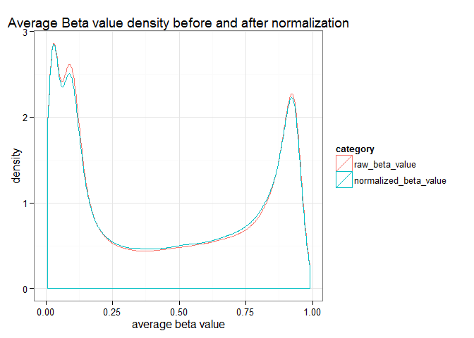 

#### put this on the poster :)


```r
ggplot(data = beta_means, aes(x = avg_value, col = group)) +
   geom_density() + 
		xlab("average beta value") +
   ggtitle("Average Beta value density distribution") + 
   theme_bw() +
	facet_grid(category ~ .)
```

```
## Warning: Removed 1 rows containing non-finite values (stat_density).
```

```
## Warning: Removed 1 rows containing non-finite values (stat_density).
```

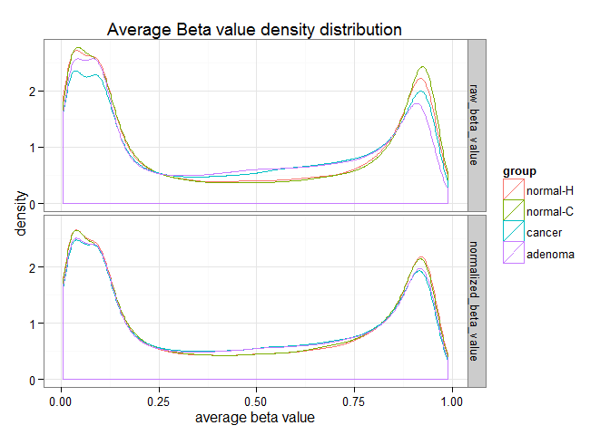 

```r
# save a large figure for poster
p <- ggplot(data = beta_means, aes(x = avg_value, col = group)) +
   geom_density() + 
		xlab("average beta value") +
   ggtitle("Average Beta value density distribution") + 
   theme_bw() +
	facet_grid(category ~ .) +
	theme(text = element_text(size=28))
ggsave(plot = p, filename = "../../figures/dataQC_beta_density.png", width = 16, height = 10.67, units = "in")
```

```
## Warning: Removed 1 rows containing non-finite values (stat_density).
```

```
## Warning: Removed 1 rows containing non-finite values (stat_density).
```

Aggregate for M values and plot the density for the 4 groups:


```r
m_means <-rbind(
			aggregateAvgValue(M.norm, "M_value", "normal-H"),
			aggregateAvgValue(M.norm, "M_value", "normal-C"),
			aggregateAvgValue(M.norm, "M_value", "cancer"),
			aggregateAvgValue(M.norm, "M_value", "adenoma"))

ggplot(data = m_means, aes(x = avg_value)) +
   geom_density() + 
		xlab("average M value") +
   ggtitle("Average M value density \nafter normalization") + 
   theme_bw()
```

```
## Warning: Removed 1 rows containing non-finite values (stat_density).
```

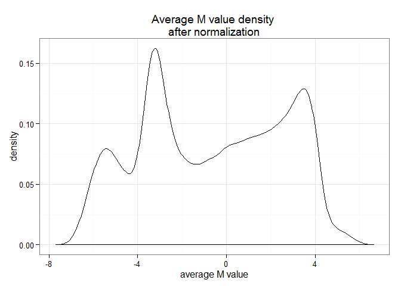 


```r
ggplot(data = m_means, aes(x = avg_value, col = group)) +
   geom_density() + 
		xlab("average M value") +
   ggtitle("Average M value density \nafter normalization") + 
   theme_bw()
```

```
## Warning: Removed 1 rows containing non-finite values (stat_density).
```

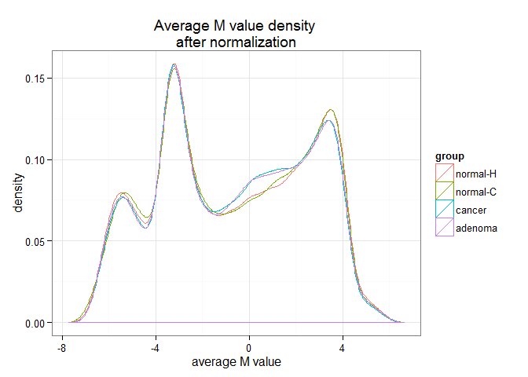 


The before and after normalization beta values have similar distribution, and consistent among groups.

The M value distributions have three peaks. The distributions are consistent among groups.

#### Heatmaps


```r
rownames(metadata) <- metadata$geo_accession

# make a function to produce heatmap
plotHeatmap <- function(x, title = "", legend = "group", size = 2, names = F){
  ## x is an ordered matrix
  ## title is the plot title
  ## size is the font size for the rows
  #get color palette
  # pallette code is modified from seminar03, courtesy of Dean Attali
  colour_scheme <- "BuPu"
  palette <- colorRampPalette(rev(brewer.pal(n = 9, colour_scheme)))
  paletteSize <- 256
  cols <- palette(paletteSize)
  #heatmap
  annotation <- metadata[legend] #get the legend
  pheatmap(x, color = cols,
           cluster_rows = FALSE, cluster_cols = FALSE, # turn off dendrogram
           annotation = annotation,
           fontsize_row = size,
           fontsize_col = size,
  				 show_rownames = names,
  				 show_colnames = names,
  				 main = title)
}

#reorder columns by group
order_by_group<-metadata$geo_accession[order(metadata$group, metadata$colon_region)]
beta_cor <- cor(na.omit(raw_data_filter[, order_by_group]))
```


```r
plotHeatmap(beta_cor, "heatmap for the sample correlation\n raw beta value",
						legend = c("group", "colon_region"))
```

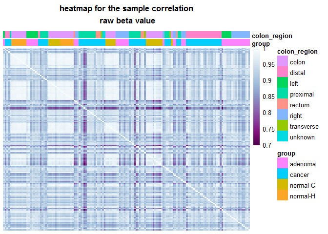 


```r
norm_beta_cor <- cor(na.omit(beta.norm[, order_by_group]))
plotHeatmap(norm_beta_cor, "heatmap for the sample correlation\n normalized beta value", legend = c("group", "colon_region"))
```

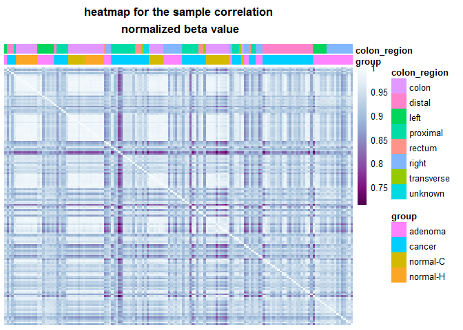 


```r
M_cor <- cor(na.omit(M.norm[, order_by_group]))
plotHeatmap(M_cor, "heatmap for the sample correlation\n M value", legend = c("group", "colon_region"))
```

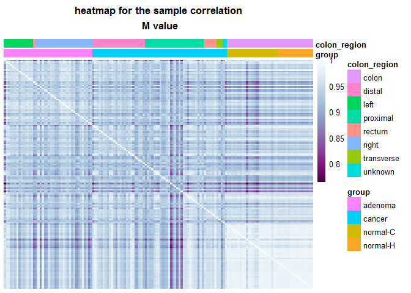 


#### PCA analysis

PCA for the normalized beta value


```r
df <- na.omit(beta.norm)
df_pca <- prcomp(df, center = F, scale = F)
plot(df_pca, main = "PCA of normalized beta value")
```

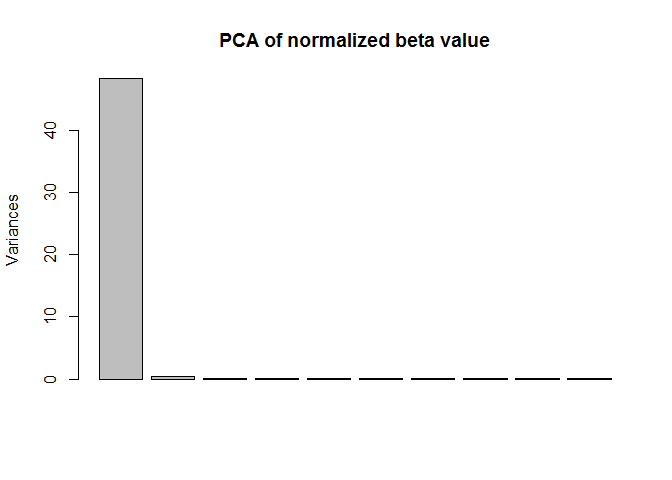 

```r
save(df_pca, file="../../data/pca/beta_norm_pca.Rdata")
df_prin_comp <- cbind(metadata, df_pca$rotation)
save(df_prin_comp, file="../../data/pca/beta_norm_pca_comp.Rdata")
```


```r
load("../../data/pca/beta_norm_pca_comp.Rdata")
# scatter plot
ggplot(df_prin_comp, aes(PC1, PC2, label = geo_accession, color = group)) +
  geom_point() +
  ggtitle("Scatterplot of the first two principal components\nnormalized beta value")
```

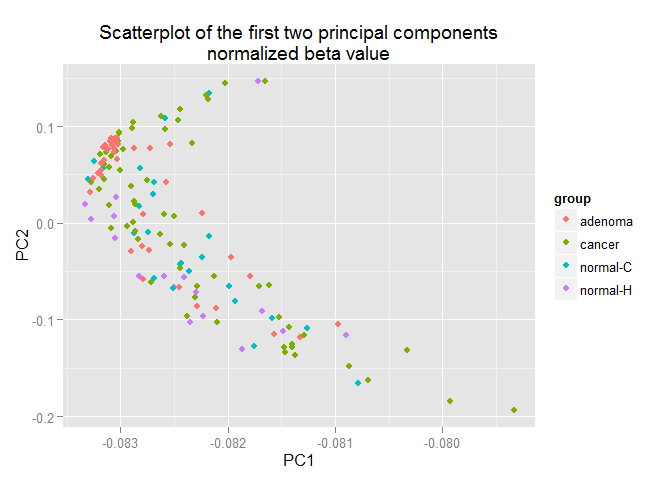 

```r
# save high res for figures
p <- ggplot(df_prin_comp, aes(PC1, PC2, label = geo_accession, color = group)) +
  geom_point(size = 6) +
	theme(text = element_text(size=28)) +
  ggtitle("Scatterplot of the first two principal components\nnormalized beta value")

ggsave(plot = p, filename = "../../figures/dataQC_norm_beta_PCA.png", width = 16, height = 10.67, units = "in")
```


For M value


```r
df <- na.omit(M.norm)
df_pca <- prcomp(df, center = F, scale = F)

plot(df_pca, main = "PCA of normalized M value")
```

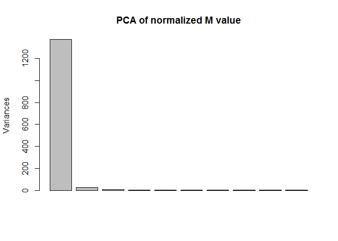 

```r
df_prin_comp <- cbind(metadata, df_pca$rotation)
save(df_prin_comp, file="../../data/pca/M_norm_pca_comp.Rdata")
```


```r
load("../../data/pca/M_norm_pca_comp.Rdata")
# scatter plot
ggplot(df_prin_comp, aes(PC1, PC2, label = geo_accession, color = group)) +
  geom_point() +
  ggtitle("Scatterplot of the first two principal components\nM value")
```

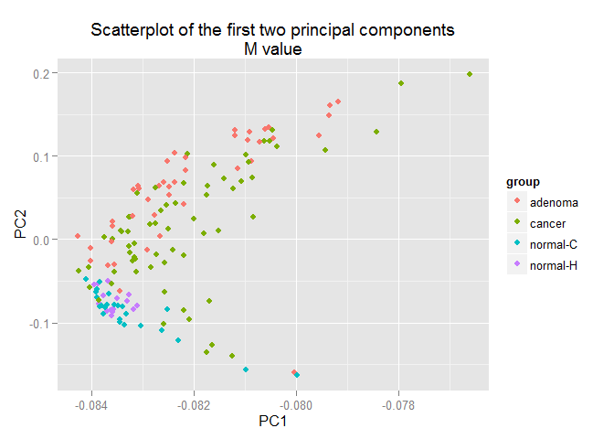 


```r
df <- na.omit(beta.norm.CGI)
df_pca <- prcomp(df, center = F, scale = F)

plot(df_pca, main = "PCA of normalized beta CGI value")
```

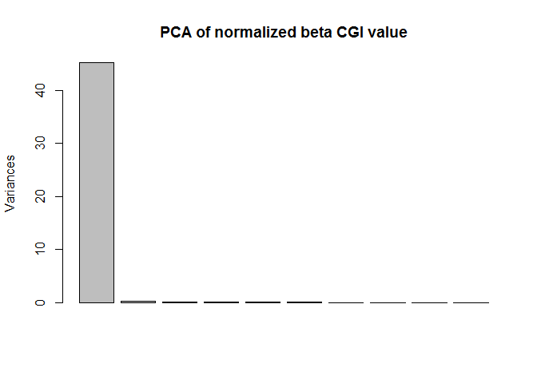 

```r
df_prin_comp <- cbind(metadata, df_pca$rotation)
save(df_prin_comp, file="../../data/pca/beta_norm_cgi_pca_comp.Rdata")
```


```r
load("../../data/pca/beta_norm_cgi_pca_comp.Rdata")
# scatter plot
ggplot(df_prin_comp, aes(PC1, PC2, label = geo_accession, color = group)) +
  geom_point() +
  ggtitle("Scatterplot of the first two principal components\nbeta value CGI")
```

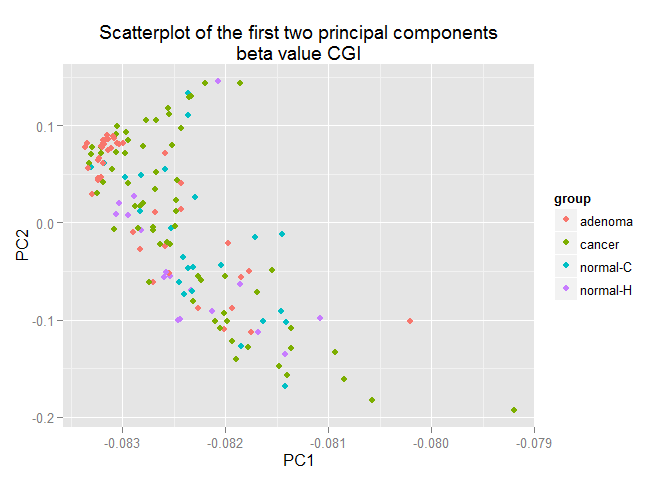 


```r
df <- na.omit(M.norm.CGI)
df_pca <- prcomp(df, center = F, scale = F)
plot(df_pca, main = "PCA of M CGI value")
```

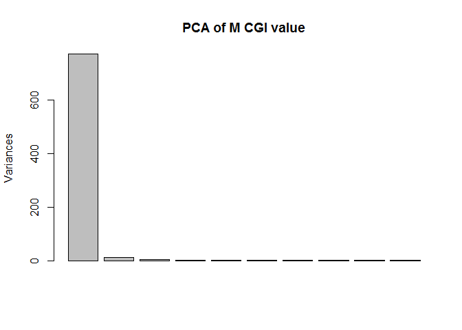 

```r
df_prin_comp <- cbind(metadata, df_pca$rotation)
save(df_prin_comp, file="../../data/pca/M_norm_cgi_pca_comp.Rdata")
```


```r
load("../../data/pca/M_norm_cgi_pca_comp.Rdata")
# scatter plot
ggplot(df_prin_comp, aes(PC1, PC2, label = geo_accession, color = group)) +
  geom_point() +
  ggtitle("Scatterplot of the first two principal components\nM value CGI")
```

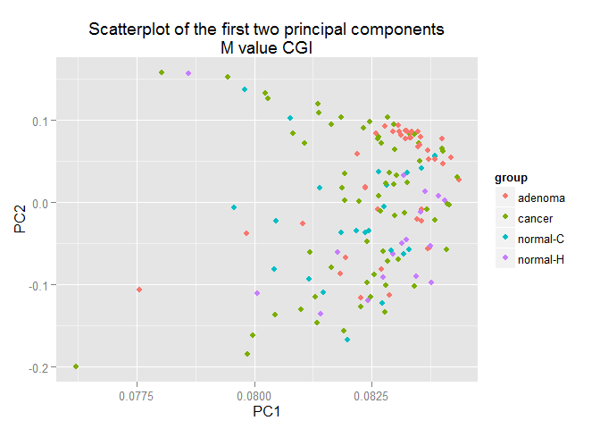 

