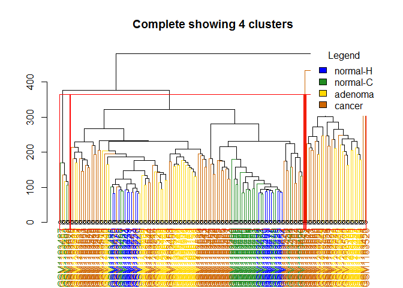
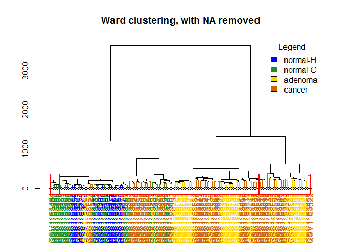
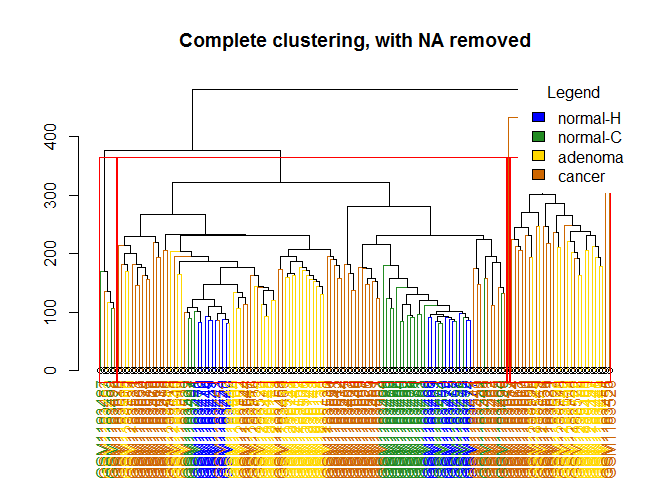
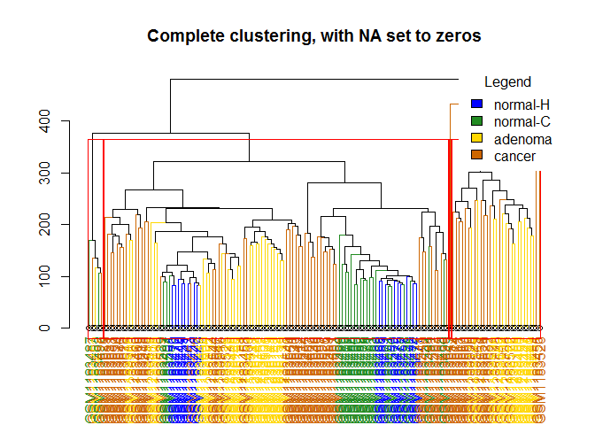

# hierarchicalClustering_normalized
Santina  
Friday, April 03, 2015  

Repeating the work done on [hierarchical clustering on filtered raw data](https://github.com/STAT540-UBC/yy_team01_colorectal-cancer_STAT540_2015/blob/master/analysis_reports/01hclustering/hierarchicalClustering.md) 

The goal is to see if there are distinguishable features between different patient groups that clustering methods that come with R packages can pick out and correctly group the samples into their corresponding groups. 

This report is purely for internal communication and to generate figures for the poster.

# Load the data


```r
library(knitr)
knitr::opts_chunk$set(ig.height = 09, fig.width = 15)
load('../../data/GSE48684_raw_filtered.beta.norm.cgi.Rdata')
data <- beta.norm.CGI
load('../../data/metadata.Rdata')
meta <- metadata
```

For my personal preference I'm gonna reorganize the meta data a bit. 


```r
#meta$geo_accession <- NULL

#remove redundant words 
meta$title <- as.factor(gsub("Genomic DNA from ", "", meta$title)) 
meta$title <- as.factor(gsub("Genomic DNA of ", "", meta$title))
head(meta) # yay
```

```
##               group               title geo_accession            tissue
## GSM1183439 normal-H normal individual 1    GSM1183439 colorectal mucosa
## GSM1183440 normal-H normal individual 2    GSM1183440 colorectal mucosa
## GSM1183441 normal-H normal individual 3    GSM1183441 colorectal mucosa
## GSM1183442 normal-H normal individual 4    GSM1183442 colorectal mucosa
## GSM1183443 normal-H normal individual 5    GSM1183443 colorectal mucosa
## GSM1183444 normal-H normal individual 6    GSM1183444 colorectal mucosa
##            colon_region gender stage
## GSM1183439        colon   male  <NA>
## GSM1183440        colon   male  <NA>
## GSM1183441        colon female  <NA>
## GSM1183442        colon   male  <NA>
## GSM1183443        colon   male  <NA>
## GSM1183444        colon   male  <NA>
```

# Scaling data 

Now let's do clustering. 

But first, as suggested in the seminar tutorial, let's scale so that we look at the distribution of methylation, not the absolute differences of methylation levels among regions. 


```r
s_data <- t(scale(t(data))) 

# for inspection : 
round(data.frame(avgBefore = rowMeans(head(data)),
                 avgAfter = rowMeans(head(s_data)),
                 varBefore = apply(head(data), 1, var),
                 varAfter = apply(head(s_data), 1, var)), 2)
```

```
##                          avgBefore avgAfter varBefore varAfter
## chr1:10003165-10003585        0.20        0         0        1
## chr1:1002663-1005318          0.48        0         0        1
## chr1:100315420-100316009      0.17        0         0        1
## chr1:100435297-100436070      0.19        0         0        1
## chr1:100503482-100504404      0.21        0         0        1
## chr1:10057121-10058108        0.27        0         0        1
```

```r
write.table(s_data, file="intermediate_data/s_data_n.tsv", sep = "\t")
```

Looks like there are some missing values. I'm gonna scale it again so that this time NA is not being accounted (removing all the rows with NAs), just to make things easier. (good thing we inspect s_data first) 
Note that in this case the probes is much fewer.


```r
nrow(data)
```

```
## [1] 26403
```

```r
nrow(data[complete.cases(data), ])
```

```
## [1] 26363
```
As we can see there are some NAs.

We can remove it.

```r
s_data_noNA <- t(scale(t(data[complete.cases(data), ])))

# save the data 
write.table(s_data_noNA, file="intermediate_data/s_data_noNA_n.tsv", sep = "\t")
```

Or keep it and set them to zeros. 

```r
data_NA_zeros <- data 
data_NA_zeros[is.na(data_NA_zeros)] <- 0

s_data_NA_zeros <- t(scale(t(data_NA_zeros)))
write.table(s_data_NA_zeros, file="intermediate_data/s_data_NA_zeros_n.tsv", sep = "\t")
```

Just as a reminder: 
- `data` : our original data
- `meta` : our meta data containing what each column in `data` is 
- `s_data`: the scaled `data` , it has NA because `data` has NAs
- `s_data_noNA` : after removing rows with NAs from `data` and then scale it 
- `s_data_NA_zeros` : after replacing NAs with zeros in `data` and then scale it 

BTW just want to make a point that I had to change my memory allocation limit from 3981 to 5000 `memory.limit(5000)` in order to knit this Rmarkdown up to this point. 

# Clustering 

Make distance matrix , all using Euclidean distance 

```r
# compute pairwise distances
dis <- dist(t(s_data), method = 'euclidean')
dis_noNA <- dist(t(s_data_noNA), method = 'euclidean')
dis_NAzeros <- dist(t(s_data_NA_zeros), method = 'euclidean')
```

To make it easier to see in the tree, we'll decode different group with a number: 


```r
library(car)
meta$code <- recode(meta$group, 
										'"normal-H"=1; "normal-C"=2; "adenoma"=3; "cancer"=4', 
										as.factor.result = TRUE)
table(meta$code,meta$group)
```

```
##    
##     adenoma cancer normal-C normal-H
##   1       0      0        0       17
##   2       0      0       24        0
##   3      42      0        0        0
##   4       0     64        0        0
```


Now we'll do clustering for each different distance matrix, using two different methods 'ward.D' and 'complete', with two hyperlinks to random sources describing them. 

## Do clustering analysis for `dis`

[Ward's minimum variance method](http://en.wikipedia.org/wiki/Ward%27s_method)

```r
dis.w <- hclust(dis, method = 'ward.D')

# color the dendrograms 
library(sparcl)
```

```
## Warning: package 'sparcl' was built under R version 3.1.3
```

```r
clusterMembers = cutree(dis.w, 4)
labelColors = c("blue", "forestgreen", "gold", "darkorange3") #specify colors
dis.w.d = as.dendrogram(dis.w)

# here's the coloring functions 
labelCol <- function(x) {
  if (is.leaf(x)) {
    ## fetch label
  	a <- attributes(x)
    label <- attr(x, "label")
  		#code is number [1,4] if you want to use number to specify 
    code  <- meta[which(rownames(meta) == label), ]$code 
    #attr(x, "label") <- code
  	
    attr(x, "nodePar") <- list(lab.col=labelColors[code])
    attr(x, "edgePar")  <- 
    	c(a$nodePar, list(col = labelColors[code]))
  }
  return(x)
}


# using dendrapply
clusDendro = dendrapply(dis.w.d, labelCol)
# make plot
png(file="../../figures/ward_cgi_normalized.png",width=2000,height=1500)

plot(clusDendro, cex=2)
title(main = "Ward clustering on normalized Beta CGI data", cex.main=4)
rect.hclust(dis.w, k = 4) # specify we want 4 clusters 
legend("topright", legend = c("normal-H", "normal-C", "adenoma", "cancer"), fill = labelColors, title="Legend", box.col="transparent",  cex=3)


dev.off()
```

```
## png 
##   2
```

```r
# to see more clearly what gets clustered together: 
dis.w.groups <- cbind(meta, cluster = cutree(dis.w, k=4))
table(dis.w.groups$group, dis.w.groups$cluster)
```

```
##           
##             1  2  3  4
##   adenoma   2 13 26  1
##   cancer    5 12 27 20
##   normal-C 20  0  0  4
##   normal-H 17  0  0  0
```

Mmm.... cancer ones get clustered into different cluster.  

[Furthest neighbor or compact](http://ecology.msu.montana.edu/labdsv/R/labs/lab13/lab13.html)


```r
dis.w <- hclust(dis, method = 'complete')
dis.w.d = as.dendrogram(dis.w)

# using dendrapply
clusDendro = dendrapply(dis.w.d, labelCol)
# make plot
plot(clusDendro, main = "Complete showing 4 clusters")
rect.hclust(dis.w, k = 4) # specify we want 4 clusters 
legend("topright", legend = c("normal-H", "normal-C", "adenoma", "cancer"), fill = labelColors, title="Legend", box.col="transparent")
```

 

```r
# to see more clearly what gets clustered together: 
dis.w.groups <- cbind(meta, cluster = cutree(dis.w, k=4))
table(dis.w.groups$group, dis.w.groups$cluster)
```

```
##           
##             1  2  3  4
##   adenoma  27 14  1  0
##   cancer   46 15  2  1
##   normal-C 22  0  2  0
##   normal-H 17  0  0  0
```

Even worse. 

## Do clustering for `dis_noNA`
Ward: 

```r
dis_noNA.w <- hclust(dis_noNA, method = 'ward.D')
dis.w.d = as.dendrogram(dis_noNA.w)

# using dendrapply
clusDendro = dendrapply(dis.w.d, labelCol)
# make plot
plot(clusDendro, main = "Ward clustering, with NA removed")
rect.hclust(dis.w, k = 4) # specify we want 4 clusters 
legend("topright", legend = c("normal-H", "normal-C", "adenoma", "cancer"), fill = labelColors, title="Legend", box.col="transparent")
```

 

```r
# to see more clearly what gets clustered together: 
dis_noNA.w.groups <- cbind(meta, cluster = cutree(dis_noNA.w, k=4))
table(dis_noNA.w.groups$group, dis_noNA.w.groups$cluster)
```

```
##           
##             1  2  3  4
##   adenoma   2 13 26  1
##   cancer    5 12 27 20
##   normal-C 20  0  0  4
##   normal-H 17  0  0  0
```

Complete: 


```r
dis_noNA.w <- hclust(dis_noNA, method = 'complete')
dis.w.d = as.dendrogram(dis_noNA.w)

# using dendrapply
clusDendro = dendrapply(dis.w.d, labelCol)
# make plot
plot(clusDendro, main = "Complete clustering, with NA removed")
rect.hclust(dis.w, k = 4) # specify we want 4 clusters  
legend("topright", legend = c("normal-H", "normal-C", "adenoma", "cancer"), fill = labelColors, title="Legend", box.col="transparent")
```

 

```r
# to see more clearly what gets clustered together: 
dis_noNA.w.groups <- cbind(meta, cluster = cutree(dis_noNA.w, k=4))
table(dis_noNA.w.groups$group, dis_noNA.w.groups$cluster)
```

```
##           
##             1  2  3  4
##   adenoma  27 14  1  0
##   cancer   46 15  2  1
##   normal-C 22  0  2  0
##   normal-H 17  0  0  0
```


## Do clustering for `dis_NAzeros`

Wards

```r
dis_NAzeros.w <- hclust(dis_NAzeros, method = 'ward.D')
dis.w.d = as.dendrogram(dis_NAzeros.w)

# using dendrapply
clusDendro = dendrapply(dis.w.d, labelCol)
# make plot
plot(clusDendro, main = "Ward clustering, with NA set to zeros")
rect.hclust(dis.w, k = 4) # specify we want 4 clusters 
legend("topright", legend = c("normal-H", "normal-C", "adenoma", "cancer"), fill = labelColors, title="Legend", box.col="transparent")
```

 

```r
# to see more clearly what gets clustered together: 
dis_NAzeros.w.groups <- cbind(meta, cluster = cutree(dis_NAzeros.w, k=4))
table(dis_NAzeros.w.groups$group, dis_NAzeros.w.groups$cluster)
```

```
##           
##             1  2  3  4
##   adenoma   2 13 26  1
##   cancer    5 12 27 20
##   normal-C 20  0  0  4
##   normal-H 17  0  0  0
```

complete: 

```r
dis_NAzeros.w <- hclust(dis_NAzeros, method = 'complete')
dis.w.d = as.dendrogram(dis_NAzeros.w)

# using dendrapply
clusDendro = dendrapply(dis.w.d, labelCol)
# make plot
plot(clusDendro, main = "Complete clustering, with NA set to zeros")
rect.hclust(dis.w, k = 4) # specify we want 4 clusters 
legend("topright", legend = c("normal-H", "normal-C", "adenoma", "cancer"), fill = labelColors, title="Legend", box.col="transparent")
```

 

```r
# to see more clearly what gets clustered together: 
dis_NAzeros.w.groups <- cbind(meta, cluster = cutree(dis_NAzeros.w, k=4))
table(dis_NAzeros.w.groups$group, dis_NAzeros.w.groups$cluster)
```

```
##           
##             1  2  3  4
##   adenoma  27 14  1  0
##   cancer   46 15  2  1
##   normal-C 22  0  2  0
##   normal-H 17  0  0  0
```
