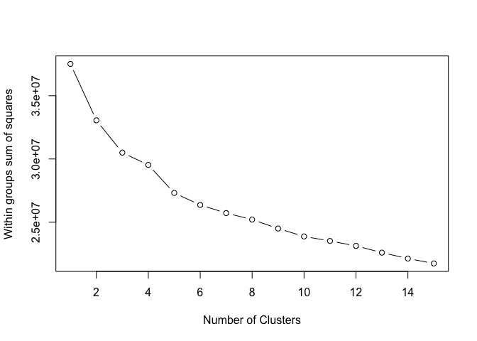

# K-means Clustering for Patient Samples
Eva Y  
March 18, 2015  

### Analysis goal: 
To evaluate our dataset for sample swaps, I will be performing K-means cluster analysis on patient samples.


### Step 1: Attach packages for analysis

```r
library(cluster)
library(fpc)
```


### Step 2: Load data and explore the datasets. 

```r
# load raw data, methyl_data_raw = beta value for all probes
load("../../data/GSE48684_raw.Rdata")

# load filtered data, raw_data_filter = beta value for CGI and non chrX probes
load("../../data/GSE48684_raw_filtered.Rdata")

# load normalized filtered data, 
load("../../data/GSE48684_raw_filtered.beta.norm.Rdata")

# load metadata
load("../../data/metadata.Rdata")
```

> Perform some exploratory analysis: 

**What is the flavour of the raw data?**

```r
str(methyl_data_raw, max.level=0)
```

```
##  num [1:485577, 1:147] 0.346 0.951 0.899 0.249 0.842 ...
##  - attr(*, "dimnames")=List of 2
```

**What is the flavour of the filtered data?**

```r
str(raw_data_filter, max.level=0)
```

```
##  num [1:301208, 1:147] 0.8715 0.8977 0.7028 0.0625 0.7799 ...
##  - attr(*, "dimnames")=List of 2
```

**What is the flavour of the normalized filtered data?**

```r
str(beta.norm, max.level=0)
```

```
##  num [1:301208, 1:147] 0.901 0.922 0.759 0.066 0.821 ...
##  - attr(*, "dimnames")=List of 2
```

**What is the flavour of the metadata?**

```r
str(metadata, max.level=0)
```

```
## 'data.frame':	147 obs. of  7 variables:
```

This sanity check confirmed that there are 147 patient samples. While the raw dataset has 485577 probes, the filtered dataset which has been filtered for CGI probes consists of 301208 probes. 

**Are the column names of the raw and filtered datasets the same with the geo_accession of the metadata?**

```r
identical(colnames(methyl_data_raw), as.character(metadata$geo_accession))
```

```
## [1] TRUE
```

```r
identical(colnames(raw_data_filter), as.character(metadata$geo_accession))
```

```
## [1] TRUE
```

```r
identical(colnames(beta.norm), as.character(metadata$geo_accession))
```

```
## [1] TRUE
```

Yes! 

> Rename sample labels:


```r
# write a function for future use
rename_samples <- function(data){
  paste(metadata$group, gsub("GSM", "", colnames(data)), sep="_")
}

# rename sample labels for all datasets
colnames(methyl_data_raw) <- rename_samples(methyl_data_raw)
colnames(raw_data_filter) <- rename_samples(raw_data_filter)
colnames(beta.norm) <- rename_samples(beta.norm)

# check if sample labelling are the same
all.equal(colnames(methyl_data_raw), colnames(raw_data_filter), colnames(beta.norm))
```

```
## [1] TRUE
```

> Perform data cleaning by removing probes with NA:


```r
raw_data_na <- methyl_data_raw[complete.cases(methyl_data_raw), ]
str(raw_data_na, max.level=0)
```

```
##  num [1:422687, 1:147] 0.346 0.951 0.899 0.249 0.842 ...
##  - attr(*, "dimnames")=List of 2
```

```r
raw_data_filter_na <- raw_data_filter[complete.cases(raw_data_filter), ]
str(raw_data_filter_na, max.level=0)
```

```
##  num [1:256981, 1:147] 0.8715 0.8977 0.0625 0.0272 0.2117 ...
##  - attr(*, "dimnames")=List of 2
```

```r
beta_norm_na <- beta.norm[complete.cases(beta.norm), ]
str(beta_norm_na, max.level=0)
```

```
##  num [1:256981, 1:147] 0.9006 0.9215 0.066 0.0311 0.2849 ...
##  - attr(*, "dimnames")=List of 2
```

I cross-check the number of probes after removing NA values with Santina's analysis. It is the same. Now I'm good to go!

> Save the results with removed `NA` for future use. 


```r
save(raw_data_na, file="raw.beta.na.Rdata")
save(raw_data_filter_na, file="raw.filter.beta.na.Rdata")
save(beta_norm_na, file="norm.filter.beta.na.Rdata")
```


### Step 3: Perform sample clustering using K-means method
> 3.1 Scale the data (specifically, the rows)


```r
# start with raw data, then analyze filtered raw data and normalized data later on. 
# scale the raw data
sdat <- t(scale(t(raw_data_na)))

# smell test, make sure that each row corresponds to one probe and now has a mean=0 and variance=1
str(sdat, max.level=0, give.attr=FALSE)
```

```
##  num [1:422687, 1:147] -0.618 -0.577 -0.411 -1.083 -1.75 ...
```

```r
round(data.frame(avg_before=rowMeans(head(raw_data_na)),
                 avg_after=rowMeans(head(sdat)),
                 var_before=apply(head(raw_data_na), 1, var),
                 var_after = apply(head(sdat), 1, var)), 2)
```

```
##            avg_before avg_after var_before var_after
## cg00000029       0.41         0       0.01         1
## cg00000108       0.96         0       0.00         1
## cg00000109       0.91         0       0.00         1
## cg00000165       0.46         0       0.04         1
## cg00000236       0.89         0       0.00         1
## cg00000289       0.73         0       0.00         1
```

> 3.2 K-means clustering by determining k based on prior knowledge of dataset

There are multiple ways to determine number of clusters (k). One of which is through prior knowledge (STAT540, lecture 16). As there are four groups of samples, namely normal-H, normal-C, adenoma, and cancer, I shall assign k=4.

It should also be noted that k number of clusters are randomly chosen for K-means cluster analysis. As such, a different output is generated each time. To ensure reproducibility, I used `set.seed()`. 

```r
# number of clusters
k=4

# set.seed() so that the results are reproducible
set.seed(1234)

# K-means clustering
km_dat <- kmeans(t(sdat), centers=k, nstart=50)

# within sum of squares of each cluster
km_dat$withinss
```

```
## [1] 14461984 15670511  6452703  8973537
```

```r
# composition of each cluster
raw <- data.frame(group=metadata$group, cluster=km_dat$cluster)
addmargins(with(raw, table(group, cluster)))
```

```
##           cluster
## group        1   2   3   4 Sum
##   adenoma   28   8   4   2  42
##   cancer     7  33  10  14  64
##   normal-C   0   0   3  21  24
##   normal-H   0   0   6  11  17
##   Sum       35  41  23  48 147
```

```r
# save the data.frame for future use
save(raw, file="km_raw.Rdata")
```

Based on this cluster analysis, it can be observed that majority of samples from the same group are clustered together, except for normal tissues from patients with colorectal cancer (normal-C) and healthy patients (normal-H). While 28/42 adenoma samples are in cluster 1 and 33/64 colorectal cancer samples are in cluster 2, 21/24 normal-C and 11/17 normal-H are in cluster 4. 

**Write a function for the above steps and perform similar analysis for `raw_data_filter_na` (filtered pre-normalization) and `beta_norm_na` (filtered post-normalization)**


```r
# scale the other two datasets
# raw_data_filter_na
sdat_raw_filter <- t(scale(t(raw_data_filter_na)))
sdat_norm <- t(scale(t(beta_norm_na)))

km <- function(data, sdat){
  # smell test, make sure each row corresponds to one probe and mean=0 and var=1
  str(sdat, max.level=0, give.attr=FALSE)
  round(data.frame(avg_before=rowMeans(head(data)),
                 avg_after=rowMeans(head(sdat)),
                 var_before=apply(head(data), 1, var),
                 var_after = apply(head(sdat), 1, var)), 2)
  
  # number of clusters
  k=4
  
  # set.seed() so that the results are reproducible
  set.seed(1234)
  
  # K-means clustering
  km_dat <- kmeans(t(sdat), centers=k, nstart=50)
  
  # within sum of squares of each cluster
  km_dat$withinss
  
  # composition of each cluster
  data.frame(group=metadata$group, cluster=km_dat$cluster)
}
```

Perform the analysis for `raw_data_filter_na`:

```r
raw_filter <- km(raw_data_filter_na, sdat_raw_filter)
```

```
##  num [1:256981, 1:147] 1.239 1.052 -1.301 -1.214 -0.877 ...
```

```r
addmargins(with(raw_filter, table(group, cluster)))
```

```
##           cluster
## group        1   2   3   4 Sum
##   adenoma    9  28   2   3  42
##   cancer    33   5  17   9  64
##   normal-C   0   0  21   3  24
##   normal-H   0   0  11   6  17
##   Sum       42  33  51  21 147
```

```r
# save the data.frame for future use
save(raw_filter, file="km_raw_filter.Rdata")
```

Perform the analysis for `beta_norm_na`:

```r
norm_filter <- km(beta_norm_na, sdat_norm)
```

```
##  num [1:256981, 1:147] 1.322 1.129 -1.226 -1.154 -0.575 ...
```

```r
addmargins(with(norm_filter, table(group, cluster)))
```

```
##           cluster
## group        1   2   3   4 Sum
##   adenoma    8  31   1   2  42
##   cancer    20  24   8  12  64
##   normal-C  19   0   5   0  24
##   normal-H  17   0   0   0  17
##   Sum       64  55  14  14 147
```

```r
# save the data.frame for future use
save(norm_filter, file="km_norm_filter.Rdata")
```

While the output of `raw_data_filter_na` (filtered pre-normalization) are similar with with cluster analysis of `raw_data_na` (unfiltered pre-normalization), this is not the same for `beta_norm_na` (filtered post-normalization). For `beta_norm_na`, 31/42 adenoma samples are in cluster 2 and 24/64 colorectal cancer samples are in cluster 2, 19/24 normal-C and 17/17 normal-H are in cluster 1. It can be observed that majority of adenoma and cancer samples are in the same cluster whereas majority normal-C and all of normal-H are in the same cluster. 


### Step 4: Determine the number of clusters
> 4.1 K-means clustering by determining k using within groups sum of squares

K-means clustering works by achieving the minimum sum of squares between objects and the assigned cluster centers. By plotting total within groups sums of squares vs. number of clusters generated by K-means clustering, the number of clusters can be determined. 

The funcion below is modified from this [tutorial](http://www.r-statistics.com/2013/08/k-means-clustering-from-r-in-action/).

```r
wssplot <- function(sdat, nc=15, seed=1234){
  # calculate wss
  wss <- (ncol(sdat)-1)*sum(apply(sdat,1,var))
  
  # for loop to get wss for each cluster
  for (i in 2:nc){
    set.seed(seed)
    wss[i] <- sum(kmeans(t(sdat), centers=i)$withinss)
    }
  
  # plot
  plot(1:nc, wss, type="b", xlab="Number of Clusters",
                     ylab="Within groups sum of squares")
  }
```

Plot for `raw_data_na`:

```r
# raw_data_na (unfiltered pre-normalization)
wssplot(sdat)
```

 

Plot for `raw_data_filter_na`:

```r
# raw_data_filter_na (filtered pre-normalization)
wssplot(sdat_raw_filter)
```

 

Plot for `beta_norm_na`:

```r
# beta_norm_na (filtered post-normalization)
wssplot(sdat_norm)
```

 

Based on the plots, a distinct drop can be observed from k=1 to 3 for pre-normalized datasets whereas only a distinct drop between k=1 and 2 was observed for the normalized dataset. 
