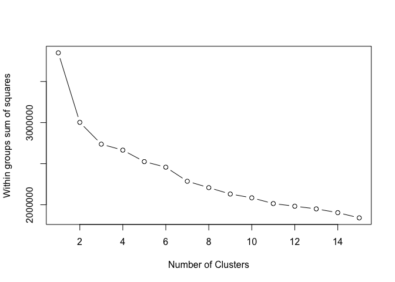

# K-means Clustering for Patient Samples - Using CGI
Eva Y  
April 4, 2015  

### Analysis goal: 
To evaluate our dataset for sample swaps, I will be performing K-means cluster analysis on patient samples but this time I will be clustering using CGIs which were generated by aggregation of probes from the platform to their respective CGI annotations.


### Step 1: Include some useful functions

```r
# 01 rename sample labels
rename_samples <- function(data){
  paste(metadata$group, gsub("GSM", "", colnames(data)), sep="_")
}

# 02 perform K-means clustering and save data frame for each cluster

km <- function(data, sdat, k){
  # smell test, make sure each row corresponds to one probe and mean=0 and var=1
  str(sdat, max.level=0, give.attr=FALSE)
  round(data.frame(avg_before=rowMeans(head(data)),
                 avg_after=rowMeans(head(sdat)),
                 var_before=apply(head(data), 1, var),
                 var_after = apply(head(sdat), 1, var)), 2)
  
  # set.seed() so that the results are reproducible
  set.seed(1234)
  
  # K-means clustering
  km_dat <- kmeans(t(sdat), centers=k, nstart=50)
  
  # within sum of squares of each cluster
  km_dat$withinss
  
  # composition of each cluster
  data.frame(group=metadata$group, cluster=km_dat$cluster)
}

# 03 plot wss

wssplot <- function(sdat, nc=15, seed=1234){
  # calculate wss
  wss <- (ncol(sdat)-1)*sum(apply(sdat,1,var))
  
  # for loop to get wss for each cluster
  for (i in 2:nc){
    set.seed(seed)
    wss[i] <- sum(kmeans(t(sdat), centers=i)$withinss)
    }
  
  # plot
  plot(1:nc, wss, type="b", xlab="Number of Clusters",
                     ylab="Within groups sum of squares")
  }
```


### Step 2: Load and explore the dataset

```r
# load filtered and normalized beta values that have been aggregated to respective CGI
load("../../data/GSE48684_raw_filtered.beta.norm.cgi.Rdata")

# load metadata
load("../../data/metadata.Rdata")
```

> Perform some exploratory analysis: 

**What is the flavour of the filtered-normalized-aggregated beta values?**

```r
str(beta.norm.CGI, max.level=0)
```

```
## 'data.frame':	26403 obs. of  147 variables:
##   [list output truncated]
```

**Are the column names of the filtered-normalized-aggregated dataset the same with the geo_accession of the metadata?**

```r
identical(colnames(beta.norm.CGI), as.character(metadata$geo_accession))
```

```
## [1] TRUE
```

> Rename sample labels:


```r
# rename sample labels for the dataset
colnames(beta.norm.CGI) <- rename_samples(beta.norm.CGI)
```

> Perform data cleaning by removing probes with NA:


```r
norm_beta_filter_cgi <- beta.norm.CGI[complete.cases(beta.norm.CGI), ]
str(norm_beta_filter_cgi, max.level=0)
```

```
## 'data.frame':	26363 obs. of  147 variables:
##   [list output truncated]
```

> Save the results with removed `NA` for future use. 


```r
save(norm_beta_filter_cgi, file="beta.norm.cgi.rmna.Rdata")
```


### Step 3: Perform sample clustering using K-means method
> 3.1 Scale the data (specifically, the rows)

> 3.2 K-means clustering by determining k based on prior knowledge of dataset

As there are four groups of samples, namely normal-H, normal-C, adenoma, and cancer, I shall assign k=4.

```r
# scale the norm.beta.cgi.rmna dataset
sdat <- t(scale(t(norm_beta_filter_cgi)))

# use km() function
km_norm_beta_cgi <- km(norm_beta_filter_cgi, sdat, 4)
```

```
##  num [1:26363, 1:147] -0.3058 0.0609 1.083 0.397 0.4193 ...
```

```r
addmargins(with(km_norm_beta_cgi, table(group, cluster)))
```

```
##           cluster
## group        1   2   3   4 Sum
##   adenoma   14  21   1   6  42
##   cancer    14  28  17   5  64
##   normal-C   0   0   5  19  24
##   normal-H   0   0   0  17  17
##   Sum       28  49  23  47 147
```

```r
# save the data.frame for future use
save(km_norm_beta_cgi, file="km.norm.beta.cgi.Rdata")
```

For `norm_beta_filter_cgi`, 21/42 adenoma samples are in cluster 2 and 28/64 colorectal cancer samples are in cluster 2, 19/24 normal-C and 17/17 normal-H are in cluster 4. It can be observed that majority of adenoma and cancer samples are in the same cluster whereas majority normal-C and all of normal-H are in the same cluster. 

Interestingly, there are subsets of adenoma (14/42) and colorectal cancer (14/64) samples clustered together in cluster 1. It is also interesting that there are subsets of normal-C (5/24) and colorectal cancer (17/64) samples clustered together in cluster 3. 

### Step 4: Determine the number of clusters

> K-means clustering by determining k using within groups sum of squares

K-means clustering works by achieving the minimum sum of squares between objects and the assigned cluster centers. By plotting total within groups sums of squares vs. number of clusters generated by K-means clustering, the number of clusters can be determined. 

Plot for `norm_beta_filter_cgi`:

```r
# plot wss for norm_beta_filter_cgi
wssplot(sdat)
```

 

Based on the plot, a distinct drop can be observed from k=1 to 3. 

Let's try rerun K-means clustering with k=3.

```r
# use km() function
km3_norm_beta_cgi <- km(norm_beta_filter_cgi, sdat, 3)
```

```
##  num [1:26363, 1:147] -0.3058 0.0609 1.083 0.397 0.4193 ...
```

```r
addmargins(with(km3_norm_beta_cgi, table(group, cluster)))
```

```
##           cluster
## group        1   2   3 Sum
##   adenoma   15   4  23  42
##   cancer    14  22  28  64
##   normal-C   0  24   0  24
##   normal-H   0  17   0  17
##   Sum       29  67  51 147
```

```r
# save the data.frame for future use
save(km3_norm_beta_cgi, file="km3.norm.beta.cgi.Rdata")
```

We can observe that all normal-C and normal-H are clustered together in cluster 2 whereas majority of adenoma (23/42) and colorectal cancer (28/64) samples are clustred together in cluster 3. It is also observed that subsets of adenoma (15/42) and colorectal cancer (14/64) samples are clustered together in cluster 1. The weird thing (perhaps not that weird) is that 22/64 colorectal cancer samples are clustered together with normal-C and normal-H in cluster 2. 

## Summary
In this case, K-means clustering using k = 4 makes more sense. Perhaps K-means is not the best clustering method for these samples.
