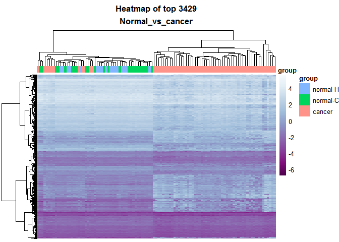

# LIMMA_analysis: (normal-C+normal-H) vs cancer
Beryl Zhuang  
Sunday, April 05, 2015  


#### Differential methylation analysis comparing normal (normal-c and normal-H) and cancer


*LIMMA codes are writen by Ka Ming. The codes are modified for this analysis.


```r
library(dplyr)
```

```
## 
## Attaching package: 'dplyr'
## 
## The following object is masked from 'package:stats':
## 
##     filter
## 
## The following objects are masked from 'package:base':
## 
##     intersect, setdiff, setequal, union
```

```r
library(limma)
library(ggplot2)
```


```r
source("../../rscripts/helper_functions.R")
```


```r
# codes from Ka Ming

# loading the norm. CGI.
M.norm.CGI.path <- "../../data/GSE48684_raw_filtered.m.norm.cgi.Rdata"
load(M.norm.CGI.path)
M.norm.CGI<- na.omit(M.norm.CGI)

# load the metadata
metadata.path <- "../../data/metadata.Rdata"
load(metadata.path)

# sanity check
head(M.norm.CGI)
```

```
##                          GSM1183439  GSM1183440 GSM1183441 GSM1183442
## chr1:10003165-10003585   -2.6552923 -2.59856415 -2.5445386 -2.5589572
## chr1:1002663-1005318     -0.4691256 -0.09143954 -0.2533638 -0.2153825
## chr1:100315420-100316009 -3.2051837 -3.28066606 -3.1908783 -3.3171275
## chr1:100435297-100436070 -2.6509063 -2.53842308 -2.3740902 -2.6930074
## chr1:100503482-100504404 -2.5912106 -2.61793251 -2.5333289 -2.6985588
## chr1:10057121-10058108   -1.8793069 -1.60397303 -1.9452079 -1.4107345
##                           GSM1183443 GSM1183444 GSM1183445 GSM1183446
## chr1:10003165-10003585   -2.55737653 -2.5826043 -2.4911736  -2.554945
## chr1:1002663-1005318     -0.09556418 -0.1394251 -0.9472826  -0.156273
## chr1:100315420-100316009 -3.44138495 -3.2638314 -3.5903340  -3.175695
## chr1:100435297-100436070 -2.58548225 -2.6448828 -2.8978879  -2.530715
## chr1:100503482-100504404 -2.77076081 -2.7414266 -2.8660505  -2.676452
## chr1:10057121-10058108   -1.89517507 -2.1822275 -2.7476044  -1.366660
##                          GSM1183447 GSM1183448 GSM1183449 GSM1183450
## chr1:10003165-10003585   -2.8167373 -2.6015900 -2.7326851  -2.687569
## chr1:1002663-1005318     -0.9355684 -0.5594806 -0.9262892  -1.276605
## chr1:100315420-100316009 -3.7200904 -3.4311690 -3.5356330  -3.462461
## chr1:100435297-100436070 -2.9591127 -2.7513380 -2.9045330  -2.883730
## chr1:100503482-100504404 -2.7442432 -2.7249048 -2.7322991  -2.698558
## chr1:10057121-10058108   -2.7962893 -1.6385844 -2.9030710  -3.324011
##                          GSM1183451 GSM1183452 GSM1183453 GSM1183454
## chr1:10003165-10003585    -2.739601 -2.3145316 -2.4420093 -2.5683021
## chr1:1002663-1005318      -0.547058  0.2199845  0.1354862 -0.1364899
## chr1:100315420-100316009  -3.476851 -3.2057071 -3.1883463 -3.4435985
## chr1:100435297-100436070  -3.013518 -1.7599024 -1.9642126 -2.5990879
## chr1:100503482-100504404  -2.841048 -2.3777453 -2.4337830 -2.5278606
## chr1:10057121-10058108    -2.548544 -1.3898947 -1.7715518 -2.2878826
##                          GSM1183455 GSM1183456 GSM1183457 GSM1183458
## chr1:10003165-10003585   -2.5611068 -2.6112883 -2.9289910 -2.5701139
## chr1:1002663-1005318      0.0855106 -0.1495479 -0.2503045 -0.8035391
## chr1:100315420-100316009 -3.5442221 -3.3321487 -3.4719609 -3.3151074
## chr1:100435297-100436070 -2.9532561 -2.5944388 -2.7733070 -2.8305448
## chr1:100503482-100504404 -2.7577497 -2.6674068 -2.7293921 -2.6465480
## chr1:10057121-10058108   -1.8906351 -2.2961952 -0.7416368 -2.7446878
##                          GSM1183459 GSM1183460 GSM1183461 GSM1183462
## chr1:10003165-10003585   -2.5928901 -2.3889526 -2.6460887 -2.7231261
## chr1:1002663-1005318     -0.0978623 -0.5153299 -0.1302912 -0.2164913
## chr1:100315420-100316009 -3.1202442 -3.1034921 -3.3016168 -3.4521085
## chr1:100435297-100436070 -2.3362214 -2.3185678 -2.5481766 -2.5349049
## chr1:100503482-100504404 -2.6162707 -2.3970941 -2.7532512 -2.7130206
## chr1:10057121-10058108   -2.2802288 -2.7551910 -2.5061829 -0.4842863
##                          GSM1183463 GSM1183464 GSM1183465 GSM1183466
## chr1:10003165-10003585   -2.5491017 -2.4576876 -2.6634236 -2.6269710
## chr1:1002663-1005318      0.1777277  0.2527131  0.1042947 -0.4701124
## chr1:100315420-100316009 -3.2860087 -3.2898758 -3.2739430 -3.3949594
## chr1:100435297-100436070 -2.4025642 -2.3717973 -2.2822308 -2.6972064
## chr1:100503482-100504404 -2.6531850 -2.6213044 -2.6589155 -2.8621837
## chr1:10057121-10058108   -1.7501278 -0.9031143 -1.4175589 -2.5515072
##                          GSM1183467 GSM1183468 GSM1183469 GSM1183470
## chr1:10003165-10003585   -2.5975998 -2.5412295 -2.4850925 -2.4145797
## chr1:1002663-1005318     -0.1106584 -0.3974871 -0.1186928 -0.4646606
## chr1:100315420-100316009 -3.3165319 -3.2531491 -3.0885286 -3.3201661
## chr1:100435297-100436070 -2.7201684 -2.6577729 -2.6383212 -2.6271861
## chr1:100503482-100504404 -2.7140042 -2.6688105 -2.6891018 -2.5954421
## chr1:10057121-10058108   -1.9689749 -2.1921074 -2.1734550 -2.1911826
##                          GSM1183471 GSM1183472  GSM1183473 GSM1183474
## chr1:10003165-10003585   -2.5213979  -2.466313 -2.55134704 -2.4765215
## chr1:1002663-1005318     -0.2727839  -0.204244  0.04854337 -0.3592211
## chr1:100315420-100316009 -3.2953992  -3.218619 -3.28942467 -3.4000418
## chr1:100435297-100436070 -2.5079133  -2.562802 -2.69858064 -2.6323302
## chr1:100503482-100504404 -2.6814858  -2.463127 -2.67413839 -2.8827299
## chr1:10057121-10058108   -1.9749580  -2.118518 -1.98687058 -1.6137291
##                          GSM1183475 GSM1183476 GSM1183477 GSM1183478
## chr1:10003165-10003585   -2.5553456 -2.5007390 -2.5346772 -2.5382355
## chr1:1002663-1005318     -0.2639951 -0.3881833 -0.1877652 -0.2008505
## chr1:100315420-100316009 -3.3787453 -3.3049143 -3.2620533 -3.2547827
## chr1:100435297-100436070 -2.6092785 -2.6791712 -2.6729198 -2.6679753
## chr1:100503482-100504404 -2.7651728 -2.7097997 -2.7011483 -2.6685389
## chr1:10057121-10058108   -1.9800005 -2.2907397 -1.6842134 -2.2742424
##                           GSM1183479 GSM1183480 GSM1183481 GSM1183482
## chr1:10003165-10003585   -2.78934539 -2.4393726  -2.470685 -2.4599626
## chr1:1002663-1005318      0.03098998 -0.3446402  -0.356047 -0.2735848
## chr1:100315420-100316009 -3.22150296 -3.2752470  -3.283137 -3.2123623
## chr1:100435297-100436070 -2.49583434 -2.6676062  -2.679606 -2.6550079
## chr1:100503482-100504404 -2.66726367 -2.8328728  -2.624475 -2.7429252
## chr1:10057121-10058108   -1.90776652 -2.5284930  -2.390040 -2.4086346
##                          GSM1183483  GSM1183484 GSM1183485 GSM1183486
## chr1:10003165-10003585   -2.6406160 -2.70045313 -2.7033185 -2.6432762
## chr1:1002663-1005318      0.1419676  0.02287766 -0.2400202 -0.0466823
## chr1:100315420-100316009 -3.2889347 -3.48242760 -3.2918360 -3.3131523
## chr1:100435297-100436070 -2.4959864 -2.78518605 -2.5886347 -2.5103397
## chr1:100503482-100504404 -2.8480882 -2.70227145 -2.8255920 -2.5938201
## chr1:10057121-10058108   -2.1335111 -2.58234107 -1.7365505 -2.1008323
##                          GSM1183487 GSM1183488 GSM1183489 GSM1183490
## chr1:10003165-10003585   -2.1723282 -2.4762976 -2.7209445 -2.6450045
## chr1:1002663-1005318      0.3671142 -0.2484297  0.1206241  0.1053612
## chr1:100315420-100316009 -2.8700148 -3.1976002 -3.0185030 -2.9115272
## chr1:100435297-100436070 -2.0898900 -2.6466377 -2.3003844 -2.3822229
## chr1:100503482-100504404 -2.3997197 -2.7176038 -2.5165885 -2.6060197
## chr1:10057121-10058108   -1.7340586 -2.0591488 -2.0783172 -1.6675826
##                          GSM1183491 GSM1183492 GSM1183493 GSM1183494
## chr1:10003165-10003585   -2.6654612 -2.3219709 -2.4483201 -2.5511022
## chr1:1002663-1005318      0.3462601  0.4469207  0.1254926 -0.5048053
## chr1:100315420-100316009 -3.1088263 -2.9417798 -3.4914174 -3.3202710
## chr1:100435297-100436070 -2.3348525 -2.0809495 -2.4237925 -2.4554246
## chr1:100503482-100504404 -2.6348955 -2.4477740 -2.7663400 -2.9570593
## chr1:10057121-10058108   -2.0751118 -1.8962422 -1.7759178 -2.1877155
##                           GSM1183495  GSM1183496  GSM1183497  GSM1183498
## chr1:10003165-10003585   -2.63486408 -2.48162177 -2.47640016 -2.58026479
## chr1:1002663-1005318     -0.06303079 -0.02946225 -0.09298967 -0.08300383
## chr1:100315420-100316009 -3.30801504 -3.18349564 -3.32868542 -3.30487740
## chr1:100435297-100436070 -2.55596834 -2.52263929 -2.71459787 -2.58571296
## chr1:100503482-100504404 -2.68080449 -2.76371740 -2.82548106 -2.97470935
## chr1:10057121-10058108   -1.83718920 -2.17762440 -2.30781157 -2.10909408
##                           GSM1183499 GSM1183500 GSM1183501 GSM1183502
## chr1:10003165-10003585   -2.63209567 -2.4744933 -2.4949798 -2.5833351
## chr1:1002663-1005318     -0.03106036 -0.3583119 -0.3324479 -0.2687182
## chr1:100315420-100316009 -3.34801905 -3.3203624 -3.2989031 -3.2702818
## chr1:100435297-100436070 -2.73638456 -2.6032170 -2.6614142 -2.7622146
## chr1:100503482-100504404 -2.73326044 -2.7836071 -2.6894563 -2.7985445
## chr1:10057121-10058108   -2.27761366 -2.0391860 -2.5430220 -2.3298607
##                          GSM1183503 GSM1183504 GSM1183505 GSM1183506
## chr1:10003165-10003585   -2.3760920 -2.5018222 -2.5406260 -2.6798983
## chr1:1002663-1005318     -0.5727622 -0.5142741 -0.3024174 -0.7474327
## chr1:100315420-100316009 -3.5542411 -3.2108034 -3.3840248 -3.5504974
## chr1:100435297-100436070 -2.6699468 -2.6373828 -2.6761145 -2.9711555
## chr1:100503482-100504404 -2.6357915 -2.6687809 -2.7204119 -2.8171362
## chr1:10057121-10058108   -2.4608661 -2.5729041 -2.3695044 -2.8156203
##                          GSM1183507 GSM1183508 GSM1183509 GSM1183510
## chr1:10003165-10003585   -2.4892827 -2.8071124 -2.6441459 -2.5450091
## chr1:1002663-1005318     -0.6555263 -0.6368511 -0.5938308 -0.5133373
## chr1:100315420-100316009 -3.5385598 -3.6574768 -3.4092673 -3.3552417
## chr1:100435297-100436070 -3.0219965 -3.0268029 -2.7734492 -2.6306042
## chr1:100503482-100504404 -2.8428973 -2.8916099 -2.7695231 -2.5695898
## chr1:10057121-10058108   -2.5254960 -2.3954471 -2.8763173 -2.8564190
##                          GSM1183511 GSM1183512 GSM1183513   GSM1183514
## chr1:10003165-10003585   -2.3345401 -2.4611793 -2.5232826 -2.794565724
## chr1:1002663-1005318     -0.5646612 -0.6593965 -0.3996432 -0.893026075
## chr1:100315420-100316009 -3.3974549 -3.4518730 -3.3672605 -3.590974285
## chr1:100435297-100436070 -2.6486824 -3.0160474 -2.5688085 -2.871634800
## chr1:100503482-100504404 -2.8023253 -2.8171447 -2.6757521 -2.839093719
## chr1:10057121-10058108   -2.1076040 -2.8274641 -2.5582427 -0.004961779
##                          GSM1183515 GSM1183516  GSM1183517 GSM1183518
## chr1:10003165-10003585   -2.5574941 -2.4817320 -2.70980738 -2.4192976
## chr1:1002663-1005318      0.1908337 -0.3539109 -1.25742650 -0.2876498
## chr1:100315420-100316009 -3.1601333 -3.3948670 -3.39826153 -3.1621329
## chr1:100435297-100436070 -2.6326338 -2.8575446 -2.81982492 -2.5290203
## chr1:100503482-100504404 -2.7675520 -2.7245740 -2.86439386 -2.5466905
## chr1:10057121-10058108   -2.7167976 -2.4120587  0.02238012 -2.2057753
##                          GSM1183519 GSM1183520 GSM1183521 GSM1183522
## chr1:10003165-10003585   -2.8827217  -2.516365 -2.4537406 -2.6946777
## chr1:1002663-1005318     -0.3800922   0.487411 -0.1899291 -0.6922016
## chr1:100315420-100316009 -3.4278863  -3.180156 -3.3113328 -3.2982204
## chr1:100435297-100436070 -2.7879821  -2.160308 -2.7512474 -2.8967630
## chr1:100503482-100504404 -2.5341330  -2.466457 -2.7391940 -2.9843558
## chr1:10057121-10058108   -2.7943131  -1.627597 -2.6084962 -2.7768410
##                          GSM1183523 GSM1183524 GSM1183525 GSM1183526
## chr1:10003165-10003585   -2.4622112 -2.5451917 -2.6681450 -2.8270665
## chr1:1002663-1005318     -0.3450193 -0.4116018  0.1524643 -0.9742143
## chr1:100315420-100316009 -3.5347077 -3.3356859 -3.2475622 -3.6032944
## chr1:100435297-100436070 -2.7015844 -2.6075023 -2.4573471 -2.9766122
## chr1:100503482-100504404 -2.7011248 -2.5565389 -2.7428883 -2.8149033
## chr1:10057121-10058108   -2.3584792 -2.3597911 -1.9721684 -3.0843057
##                          GSM1183527  GSM1183528 GSM1183529  GSM1183530
## chr1:10003165-10003585    -2.715084 -2.51442884 -2.5722132 -2.51044935
## chr1:1002663-1005318      -1.052124 -0.07902266 -0.1090344 -0.08058042
## chr1:100315420-100316009  -3.577829 -3.25446329 -3.3411582 -3.40226436
## chr1:100435297-100436070  -3.096443 -2.51894210 -2.5145817 -2.78800177
## chr1:100503482-100504404  -2.786104 -2.52975089 -2.6832643 -2.61647446
## chr1:10057121-10058108    -2.856401 -2.35051733 -2.0999465 -2.45045802
##                          GSM1183531 GSM1183532 GSM1183533 GSM1183534
## chr1:10003165-10003585   -2.5230189 -2.4772421 -2.5054475 -2.5991168
## chr1:1002663-1005318     -0.7695092 -0.9591101 -0.5369419 -0.5766602
## chr1:100315420-100316009 -3.3759884 -3.5681969 -3.2956107 -3.3664893
## chr1:100435297-100436070 -2.7818569 -2.8156503 -2.5494621 -2.6290269
## chr1:100503482-100504404 -2.6662381 -2.7690945 -2.5586073 -2.7199332
## chr1:10057121-10058108   -2.6505661 -2.6469958 -2.2942003 -2.6646535
##                          GSM1183535 GSM1183536 GSM1183537 GSM1183538
## chr1:10003165-10003585    -2.363892  -2.666929  -2.616571 -2.5416443
## chr1:1002663-1005318      -0.154614  -1.045520  -1.254954 -0.8628501
## chr1:100315420-100316009  -3.383797  -3.531605  -3.549230 -3.4468167
## chr1:100435297-100436070  -2.777329  -2.977179  -2.886160 -2.7070430
## chr1:100503482-100504404  -2.684621  -2.946696  -2.937330 -2.7255946
## chr1:10057121-10058108    -2.439123  -1.864672  -2.005083 -2.9946131
##                          GSM1183539 GSM1183540 GSM1183541 GSM1183542
## chr1:10003165-10003585   -2.8752842 -2.4306625 -2.5951367  -2.676305
## chr1:1002663-1005318     -0.5308050  0.2092777 -0.1439707  -1.074767
## chr1:100315420-100316009 -3.5223805 -3.2474810 -3.1633167  -3.499562
## chr1:100435297-100436070 -2.7828174 -2.6042976 -2.3120103  -2.978451
## chr1:100503482-100504404 -2.9606268 -2.6586909 -2.6340278  -3.017156
## chr1:10057121-10058108   -0.8160312 -1.7308273 -2.5610825  -2.911221
##                          GSM1183543  GSM1183544 GSM1183545 GSM1183546
## chr1:10003165-10003585   -2.4328712 -2.68895993 -2.4035817 -2.7173873
## chr1:1002663-1005318     -0.5943623 -0.04813778  0.3884715 -0.3234209
## chr1:100315420-100316009 -3.3082008 -3.19362168 -3.1150482 -3.4909309
## chr1:100435297-100436070 -2.7679585 -2.45400458 -2.1515453 -2.6983911
## chr1:100503482-100504404 -2.5032138 -2.69788563 -2.6480267 -2.9672095
## chr1:10057121-10058108   -2.8442728 -1.89665624 -1.8706002 -2.0210757
##                          GSM1183547  GSM1183548 GSM1183549 GSM1183550
## chr1:10003165-10003585   -2.4708077 -2.67047241  -2.873039  -2.902766
## chr1:1002663-1005318     -0.1919004 -0.05228926  -1.225704  -1.020126
## chr1:100315420-100316009 -3.4013430 -3.30489431  -3.534048  -3.648111
## chr1:100435297-100436070 -2.6156074 -2.37281582  -3.085966  -2.986475
## chr1:100503482-100504404 -2.7828367 -2.67066895  -3.019369  -2.945886
## chr1:10057121-10058108   -2.2382613 -2.38875900  -2.206652  -2.058766
##                          GSM1183551 GSM1183552 GSM1183553  GSM1183554
## chr1:10003165-10003585   -2.6086813 -2.2954377 -2.4534002 -2.59945570
## chr1:1002663-1005318     -0.4032427  0.3948961  0.1173246  0.01771181
## chr1:100315420-100316009 -3.4765112 -3.0633456 -3.2935863 -3.26522873
## chr1:100435297-100436070 -2.6783351 -2.0686436 -2.4689794 -2.49531811
## chr1:100503482-100504404 -2.9638341 -2.4317759 -2.6365286 -2.67921463
## chr1:10057121-10058108   -2.3911001 -2.0523751 -1.7506630 -2.19764846
##                          GSM1183555  GSM1183556 GSM1183557   GSM1183558
## chr1:10003165-10003585   -2.7170612 -2.47360455 -2.7437807 -2.793726717
## chr1:1002663-1005318      0.0363121  0.02016923 -0.5060306 -1.417894319
## chr1:100315420-100316009 -3.5089492 -3.36980796 -3.3420403 -3.535314747
## chr1:100435297-100436070 -2.5036881 -2.75306404 -2.7442860 -3.275508203
## chr1:100503482-100504404 -2.6449797 -2.76934714 -2.6517998 -2.940411823
## chr1:10057121-10058108   -2.1389980 -2.56401695 -2.8584225 -0.001879325
##                           GSM1183559 GSM1183560 GSM1183561 GSM1235135
## chr1:10003165-10003585   -2.57914633 -2.8330552 -2.7309010 -2.6811757
## chr1:1002663-1005318     -0.04596533 -1.1547271 -0.8737399 -0.8261102
## chr1:100315420-100316009 -3.32159900 -3.7492971 -3.5794866 -3.4431519
## chr1:100435297-100436070 -2.52344354 -2.9957279 -2.7698383 -2.7759642
## chr1:100503482-100504404 -2.64300275 -3.0614550 -2.7066204 -2.8489858
## chr1:10057121-10058108   -1.96268277 -0.5575545 -1.7797307 -2.4014718
##                          GSM1235136 GSM1235137 GSM1235138 GSM1235139
## chr1:10003165-10003585   -2.6477766  -2.702564 -2.8023263 -2.4478487
## chr1:1002663-1005318     -0.3844503  -0.483281 -0.8482104 -0.3493395
## chr1:100315420-100316009 -3.4730226  -3.451509 -3.5055528 -3.3486040
## chr1:100435297-100436070 -2.7160374  -2.808582 -2.9682315 -2.6851538
## chr1:100503482-100504404 -2.8288185  -2.773447 -2.8228641 -2.7326488
## chr1:10057121-10058108   -1.7369457  -2.186193 -2.3280194 -2.2730317
##                          GSM1235140 GSM1235141 GSM1235142  GSM1235143
## chr1:10003165-10003585    -2.828660  -2.676493  -2.692334 -2.90152090
## chr1:1002663-1005318      -1.018976  -0.542397  -0.819848 -0.03415505
## chr1:100315420-100316009  -3.536803  -3.498916  -3.517102 -3.66291211
## chr1:100435297-100436070  -2.844221  -2.951094  -2.949362 -2.93604861
## chr1:100503482-100504404  -2.736433  -2.908117  -2.776179 -3.05398469
## chr1:10057121-10058108    -2.728394  -2.462111  -2.916486 -2.08641546
##                          GSM1235144 GSM1235145 GSM1235146 GSM1235147
## chr1:10003165-10003585    -2.862507 -2.5671695 -2.7707534 -2.6113458
## chr1:1002663-1005318      -1.429965 -0.3208506 -0.6404117 -0.7149859
## chr1:100315420-100316009  -3.735792 -3.5761870 -3.6200129 -3.4897598
## chr1:100435297-100436070  -3.105051 -2.6148847 -2.7674711 -2.5894137
## chr1:100503482-100504404  -2.908989 -2.8832492 -2.9253187 -2.7715724
## chr1:10057121-10058108    -1.103073 -2.0376414 -2.7294505 -2.3116782
##                          GSM1235148 GSM1235149 GSM1235150 GSM1235151
## chr1:10003165-10003585    -2.794790 -2.5643987  -2.626196 -2.3914945
## chr1:1002663-1005318      -0.195880 -0.8946123  -0.499279 -0.3712183
## chr1:100315420-100316009  -3.571170 -3.4136682  -3.344802 -3.6347130
## chr1:100435297-100436070  -2.791283 -2.8516547  -2.659318 -2.8817924
## chr1:100503482-100504404  -2.864650 -2.8154332  -2.801233 -2.7130548
## chr1:10057121-10058108    -2.507433 -2.3902709  -2.394794 -2.2583082
##                          GSM1235152 GSM1235153 GSM1235154 GSM1235155
## chr1:10003165-10003585   -2.6829868 -2.5431050 -2.6734087 -2.8229434
## chr1:1002663-1005318     -0.6720619 -0.3095247 -0.3535083 -0.9630747
## chr1:100315420-100316009 -3.6281184 -3.3301228 -3.3366841 -3.2905880
## chr1:100435297-100436070 -2.9513623 -2.6508038 -2.9213792 -2.8662826
## chr1:100503482-100504404 -2.7519088 -2.7644744 -2.8670847 -2.9335138
## chr1:10057121-10058108   -2.9960025 -2.3454842 -2.5402733 -2.8436313
##                          GSM1235156 GSM1235157 GSM1235158
## chr1:10003165-10003585   -2.5337367  -2.632813  -2.607099
## chr1:1002663-1005318     -0.6739876  -1.352517  -1.108535
## chr1:100315420-100316009 -3.4911129  -3.388591  -3.493868
## chr1:100435297-100436070 -2.6590959  -3.047235  -3.056798
## chr1:100503482-100504404 -2.7005638  -2.850698  -2.891250
## chr1:10057121-10058108   -2.5902250  -3.121232  -2.849576
```

```r
head(metadata)
```

```
##               group                                title geo_accession
## GSM1183439 normal-H Genomic DNA from normal individual 1    GSM1183439
## GSM1183440 normal-H Genomic DNA from normal individual 2    GSM1183440
## GSM1183441 normal-H Genomic DNA from normal individual 3    GSM1183441
## GSM1183442 normal-H Genomic DNA from normal individual 4    GSM1183442
## GSM1183443 normal-H Genomic DNA from normal individual 5    GSM1183443
## GSM1183444 normal-H Genomic DNA from normal individual 6    GSM1183444
##                       tissue colon_region gender stage
## GSM1183439 colorectal mucosa        colon   male  <NA>
## GSM1183440 colorectal mucosa        colon   male  <NA>
## GSM1183441 colorectal mucosa        colon female  <NA>
## GSM1183442 colorectal mucosa        colon   male  <NA>
## GSM1183443 colorectal mucosa        colon   male  <NA>
## GSM1183444 colorectal mucosa        colon   male  <NA>
```

```r
# function to perform limma to generate top table
limmaTopTables <- function(dat, des, file_name){
	myFit <- lmFit(dat, des)
	myEbFit <- eBayes(myFit)
	
	for (coeff in colnames(myEbFit$coefficients)[-1]){
		myTopTable <- topTable(myEbFit, number=nrow(dat), coef=c(coeff))
		
		save(myTopTable, file=file_name)
	}
}

# reorder factor level for `group`
metadata$group <- factor(metadata$group, levels=c("normal-H", "normal-C", "cancer", "adenoma"))
```


Subset the data 

```r
goal <- "Normal_vs_cancer"

group_names <- c("normal-H","normal-C", "cancer")
# design matrix for limma on group
des <- metadata[which(metadata$group %in% group_names), ] %>% droplevels()
# group normal-H and normal-C together
des$new_group <- "normal"
des$new_group[which(des$group == "cancer")] <- "cancer"
des$new_group <- factor(des$new_group, levels=c("normal", "cancer"))

desMat.group <- model.matrix(~new_group, des)
desMat.group
```

```
##            (Intercept) new_groupcancer
## GSM1183439           1               0
## GSM1183440           1               0
## GSM1183441           1               0
## GSM1183442           1               0
## GSM1183443           1               0
## GSM1183444           1               0
## GSM1183453           1               1
## GSM1183454           1               1
## GSM1183455           1               1
## GSM1183456           1               1
## GSM1183457           1               1
## GSM1183458           1               1
## GSM1183459           1               1
## GSM1183460           1               1
## GSM1183461           1               1
## GSM1183462           1               1
## GSM1183463           1               1
## GSM1183464           1               1
## GSM1183465           1               1
## GSM1183466           1               1
## GSM1183467           1               0
## GSM1183468           1               0
## GSM1183469           1               0
## GSM1183470           1               0
## GSM1183471           1               0
## GSM1183472           1               0
## GSM1183473           1               0
## GSM1183474           1               0
## GSM1183475           1               0
## GSM1183476           1               0
## GSM1183477           1               0
## GSM1183478           1               0
## GSM1183479           1               0
## GSM1183480           1               0
## GSM1183481           1               0
## GSM1183482           1               0
## GSM1183483           1               0
## GSM1183484           1               0
## GSM1183485           1               0
## GSM1183486           1               0
## GSM1183487           1               0
## GSM1183488           1               0
## GSM1183489           1               0
## GSM1183490           1               0
## GSM1183491           1               0
## GSM1183492           1               0
## GSM1183493           1               0
## GSM1183494           1               0
## GSM1183495           1               0
## GSM1183496           1               0
## GSM1183497           1               0
## GSM1183498           1               0
## GSM1183499           1               0
## GSM1183500           1               0
## GSM1183501           1               0
## GSM1183512           1               1
## GSM1183513           1               1
## GSM1183514           1               1
## GSM1183515           1               1
## GSM1183516           1               1
## GSM1183517           1               1
## GSM1183518           1               1
## GSM1183519           1               1
## GSM1183520           1               1
## GSM1183521           1               1
## GSM1183522           1               1
## GSM1183523           1               1
## GSM1183524           1               1
## GSM1183525           1               1
## GSM1183526           1               1
## GSM1183527           1               1
## GSM1183528           1               1
## GSM1183529           1               1
## GSM1183530           1               1
## GSM1183531           1               1
## GSM1183532           1               1
## GSM1183533           1               1
## GSM1183534           1               1
## GSM1183535           1               1
## GSM1183536           1               1
## GSM1183537           1               1
## GSM1183538           1               1
## GSM1183539           1               1
## GSM1183540           1               1
## GSM1183541           1               1
## GSM1183542           1               1
## GSM1183543           1               1
## GSM1183544           1               1
## GSM1183545           1               1
## GSM1183546           1               1
## GSM1183547           1               1
## GSM1183548           1               1
## GSM1183549           1               1
## GSM1183550           1               1
## GSM1183551           1               1
## GSM1183552           1               1
## GSM1183553           1               1
## GSM1183554           1               1
## GSM1183555           1               1
## GSM1183556           1               1
## GSM1183557           1               1
## GSM1183558           1               1
## GSM1183559           1               1
## GSM1183560           1               1
## GSM1183561           1               1
## attr(,"assign")
## [1] 0 1
## attr(,"contrasts")
## attr(,"contrasts")$new_group
## [1] "contr.treatment"
```

```r
group_subset <- as.character(metadata$geo_accession
														 [which(metadata$group %in% group_names)])
group_subset
```

```
##   [1] "GSM1183439" "GSM1183440" "GSM1183441" "GSM1183442" "GSM1183443"
##   [6] "GSM1183444" "GSM1183453" "GSM1183454" "GSM1183455" "GSM1183456"
##  [11] "GSM1183457" "GSM1183458" "GSM1183459" "GSM1183460" "GSM1183461"
##  [16] "GSM1183462" "GSM1183463" "GSM1183464" "GSM1183465" "GSM1183466"
##  [21] "GSM1183467" "GSM1183468" "GSM1183469" "GSM1183470" "GSM1183471"
##  [26] "GSM1183472" "GSM1183473" "GSM1183474" "GSM1183475" "GSM1183476"
##  [31] "GSM1183477" "GSM1183478" "GSM1183479" "GSM1183480" "GSM1183481"
##  [36] "GSM1183482" "GSM1183483" "GSM1183484" "GSM1183485" "GSM1183486"
##  [41] "GSM1183487" "GSM1183488" "GSM1183489" "GSM1183490" "GSM1183491"
##  [46] "GSM1183492" "GSM1183493" "GSM1183494" "GSM1183495" "GSM1183496"
##  [51] "GSM1183497" "GSM1183498" "GSM1183499" "GSM1183500" "GSM1183501"
##  [56] "GSM1183512" "GSM1183513" "GSM1183514" "GSM1183515" "GSM1183516"
##  [61] "GSM1183517" "GSM1183518" "GSM1183519" "GSM1183520" "GSM1183521"
##  [66] "GSM1183522" "GSM1183523" "GSM1183524" "GSM1183525" "GSM1183526"
##  [71] "GSM1183527" "GSM1183528" "GSM1183529" "GSM1183530" "GSM1183531"
##  [76] "GSM1183532" "GSM1183533" "GSM1183534" "GSM1183535" "GSM1183536"
##  [81] "GSM1183537" "GSM1183538" "GSM1183539" "GSM1183540" "GSM1183541"
##  [86] "GSM1183542" "GSM1183543" "GSM1183544" "GSM1183545" "GSM1183546"
##  [91] "GSM1183547" "GSM1183548" "GSM1183549" "GSM1183550" "GSM1183551"
##  [96] "GSM1183552" "GSM1183553" "GSM1183554" "GSM1183555" "GSM1183556"
## [101] "GSM1183557" "GSM1183558" "GSM1183559" "GSM1183560" "GSM1183561"
```

```r
length(group_subset)
```

```
## [1] 105
```

```r
dat <- M.norm.CGI[, group_subset] %>% droplevels()

head(dat)
```

```
##                          GSM1183439  GSM1183440 GSM1183441 GSM1183442
## chr1:10003165-10003585   -2.6552923 -2.59856415 -2.5445386 -2.5589572
## chr1:1002663-1005318     -0.4691256 -0.09143954 -0.2533638 -0.2153825
## chr1:100315420-100316009 -3.2051837 -3.28066606 -3.1908783 -3.3171275
## chr1:100435297-100436070 -2.6509063 -2.53842308 -2.3740902 -2.6930074
## chr1:100503482-100504404 -2.5912106 -2.61793251 -2.5333289 -2.6985588
## chr1:10057121-10058108   -1.8793069 -1.60397303 -1.9452079 -1.4107345
##                           GSM1183443 GSM1183444 GSM1183453 GSM1183454
## chr1:10003165-10003585   -2.55737653 -2.5826043 -2.4420093 -2.5683021
## chr1:1002663-1005318     -0.09556418 -0.1394251  0.1354862 -0.1364899
## chr1:100315420-100316009 -3.44138495 -3.2638314 -3.1883463 -3.4435985
## chr1:100435297-100436070 -2.58548225 -2.6448828 -1.9642126 -2.5990879
## chr1:100503482-100504404 -2.77076081 -2.7414266 -2.4337830 -2.5278606
## chr1:10057121-10058108   -1.89517507 -2.1822275 -1.7715518 -2.2878826
##                          GSM1183455 GSM1183456 GSM1183457 GSM1183458
## chr1:10003165-10003585   -2.5611068 -2.6112883 -2.9289910 -2.5701139
## chr1:1002663-1005318      0.0855106 -0.1495479 -0.2503045 -0.8035391
## chr1:100315420-100316009 -3.5442221 -3.3321487 -3.4719609 -3.3151074
## chr1:100435297-100436070 -2.9532561 -2.5944388 -2.7733070 -2.8305448
## chr1:100503482-100504404 -2.7577497 -2.6674068 -2.7293921 -2.6465480
## chr1:10057121-10058108   -1.8906351 -2.2961952 -0.7416368 -2.7446878
##                          GSM1183459 GSM1183460 GSM1183461 GSM1183462
## chr1:10003165-10003585   -2.5928901 -2.3889526 -2.6460887 -2.7231261
## chr1:1002663-1005318     -0.0978623 -0.5153299 -0.1302912 -0.2164913
## chr1:100315420-100316009 -3.1202442 -3.1034921 -3.3016168 -3.4521085
## chr1:100435297-100436070 -2.3362214 -2.3185678 -2.5481766 -2.5349049
## chr1:100503482-100504404 -2.6162707 -2.3970941 -2.7532512 -2.7130206
## chr1:10057121-10058108   -2.2802288 -2.7551910 -2.5061829 -0.4842863
##                          GSM1183463 GSM1183464 GSM1183465 GSM1183466
## chr1:10003165-10003585   -2.5491017 -2.4576876 -2.6634236 -2.6269710
## chr1:1002663-1005318      0.1777277  0.2527131  0.1042947 -0.4701124
## chr1:100315420-100316009 -3.2860087 -3.2898758 -3.2739430 -3.3949594
## chr1:100435297-100436070 -2.4025642 -2.3717973 -2.2822308 -2.6972064
## chr1:100503482-100504404 -2.6531850 -2.6213044 -2.6589155 -2.8621837
## chr1:10057121-10058108   -1.7501278 -0.9031143 -1.4175589 -2.5515072
##                          GSM1183467 GSM1183468 GSM1183469 GSM1183470
## chr1:10003165-10003585   -2.5975998 -2.5412295 -2.4850925 -2.4145797
## chr1:1002663-1005318     -0.1106584 -0.3974871 -0.1186928 -0.4646606
## chr1:100315420-100316009 -3.3165319 -3.2531491 -3.0885286 -3.3201661
## chr1:100435297-100436070 -2.7201684 -2.6577729 -2.6383212 -2.6271861
## chr1:100503482-100504404 -2.7140042 -2.6688105 -2.6891018 -2.5954421
## chr1:10057121-10058108   -1.9689749 -2.1921074 -2.1734550 -2.1911826
##                          GSM1183471 GSM1183472  GSM1183473 GSM1183474
## chr1:10003165-10003585   -2.5213979  -2.466313 -2.55134704 -2.4765215
## chr1:1002663-1005318     -0.2727839  -0.204244  0.04854337 -0.3592211
## chr1:100315420-100316009 -3.2953992  -3.218619 -3.28942467 -3.4000418
## chr1:100435297-100436070 -2.5079133  -2.562802 -2.69858064 -2.6323302
## chr1:100503482-100504404 -2.6814858  -2.463127 -2.67413839 -2.8827299
## chr1:10057121-10058108   -1.9749580  -2.118518 -1.98687058 -1.6137291
##                          GSM1183475 GSM1183476 GSM1183477 GSM1183478
## chr1:10003165-10003585   -2.5553456 -2.5007390 -2.5346772 -2.5382355
## chr1:1002663-1005318     -0.2639951 -0.3881833 -0.1877652 -0.2008505
## chr1:100315420-100316009 -3.3787453 -3.3049143 -3.2620533 -3.2547827
## chr1:100435297-100436070 -2.6092785 -2.6791712 -2.6729198 -2.6679753
## chr1:100503482-100504404 -2.7651728 -2.7097997 -2.7011483 -2.6685389
## chr1:10057121-10058108   -1.9800005 -2.2907397 -1.6842134 -2.2742424
##                           GSM1183479 GSM1183480 GSM1183481 GSM1183482
## chr1:10003165-10003585   -2.78934539 -2.4393726  -2.470685 -2.4599626
## chr1:1002663-1005318      0.03098998 -0.3446402  -0.356047 -0.2735848
## chr1:100315420-100316009 -3.22150296 -3.2752470  -3.283137 -3.2123623
## chr1:100435297-100436070 -2.49583434 -2.6676062  -2.679606 -2.6550079
## chr1:100503482-100504404 -2.66726367 -2.8328728  -2.624475 -2.7429252
## chr1:10057121-10058108   -1.90776652 -2.5284930  -2.390040 -2.4086346
##                          GSM1183483  GSM1183484 GSM1183485 GSM1183486
## chr1:10003165-10003585   -2.6406160 -2.70045313 -2.7033185 -2.6432762
## chr1:1002663-1005318      0.1419676  0.02287766 -0.2400202 -0.0466823
## chr1:100315420-100316009 -3.2889347 -3.48242760 -3.2918360 -3.3131523
## chr1:100435297-100436070 -2.4959864 -2.78518605 -2.5886347 -2.5103397
## chr1:100503482-100504404 -2.8480882 -2.70227145 -2.8255920 -2.5938201
## chr1:10057121-10058108   -2.1335111 -2.58234107 -1.7365505 -2.1008323
##                          GSM1183487 GSM1183488 GSM1183489 GSM1183490
## chr1:10003165-10003585   -2.1723282 -2.4762976 -2.7209445 -2.6450045
## chr1:1002663-1005318      0.3671142 -0.2484297  0.1206241  0.1053612
## chr1:100315420-100316009 -2.8700148 -3.1976002 -3.0185030 -2.9115272
## chr1:100435297-100436070 -2.0898900 -2.6466377 -2.3003844 -2.3822229
## chr1:100503482-100504404 -2.3997197 -2.7176038 -2.5165885 -2.6060197
## chr1:10057121-10058108   -1.7340586 -2.0591488 -2.0783172 -1.6675826
##                          GSM1183491 GSM1183492 GSM1183493 GSM1183494
## chr1:10003165-10003585   -2.6654612 -2.3219709 -2.4483201 -2.5511022
## chr1:1002663-1005318      0.3462601  0.4469207  0.1254926 -0.5048053
## chr1:100315420-100316009 -3.1088263 -2.9417798 -3.4914174 -3.3202710
## chr1:100435297-100436070 -2.3348525 -2.0809495 -2.4237925 -2.4554246
## chr1:100503482-100504404 -2.6348955 -2.4477740 -2.7663400 -2.9570593
## chr1:10057121-10058108   -2.0751118 -1.8962422 -1.7759178 -2.1877155
##                           GSM1183495  GSM1183496  GSM1183497  GSM1183498
## chr1:10003165-10003585   -2.63486408 -2.48162177 -2.47640016 -2.58026479
## chr1:1002663-1005318     -0.06303079 -0.02946225 -0.09298967 -0.08300383
## chr1:100315420-100316009 -3.30801504 -3.18349564 -3.32868542 -3.30487740
## chr1:100435297-100436070 -2.55596834 -2.52263929 -2.71459787 -2.58571296
## chr1:100503482-100504404 -2.68080449 -2.76371740 -2.82548106 -2.97470935
## chr1:10057121-10058108   -1.83718920 -2.17762440 -2.30781157 -2.10909408
##                           GSM1183499 GSM1183500 GSM1183501 GSM1183512
## chr1:10003165-10003585   -2.63209567 -2.4744933 -2.4949798 -2.4611793
## chr1:1002663-1005318     -0.03106036 -0.3583119 -0.3324479 -0.6593965
## chr1:100315420-100316009 -3.34801905 -3.3203624 -3.2989031 -3.4518730
## chr1:100435297-100436070 -2.73638456 -2.6032170 -2.6614142 -3.0160474
## chr1:100503482-100504404 -2.73326044 -2.7836071 -2.6894563 -2.8171447
## chr1:10057121-10058108   -2.27761366 -2.0391860 -2.5430220 -2.8274641
##                          GSM1183513   GSM1183514 GSM1183515 GSM1183516
## chr1:10003165-10003585   -2.5232826 -2.794565724 -2.5574941 -2.4817320
## chr1:1002663-1005318     -0.3996432 -0.893026075  0.1908337 -0.3539109
## chr1:100315420-100316009 -3.3672605 -3.590974285 -3.1601333 -3.3948670
## chr1:100435297-100436070 -2.5688085 -2.871634800 -2.6326338 -2.8575446
## chr1:100503482-100504404 -2.6757521 -2.839093719 -2.7675520 -2.7245740
## chr1:10057121-10058108   -2.5582427 -0.004961779 -2.7167976 -2.4120587
##                           GSM1183517 GSM1183518 GSM1183519 GSM1183520
## chr1:10003165-10003585   -2.70980738 -2.4192976 -2.8827217  -2.516365
## chr1:1002663-1005318     -1.25742650 -0.2876498 -0.3800922   0.487411
## chr1:100315420-100316009 -3.39826153 -3.1621329 -3.4278863  -3.180156
## chr1:100435297-100436070 -2.81982492 -2.5290203 -2.7879821  -2.160308
## chr1:100503482-100504404 -2.86439386 -2.5466905 -2.5341330  -2.466457
## chr1:10057121-10058108    0.02238012 -2.2057753 -2.7943131  -1.627597
##                          GSM1183521 GSM1183522 GSM1183523 GSM1183524
## chr1:10003165-10003585   -2.4537406 -2.6946777 -2.4622112 -2.5451917
## chr1:1002663-1005318     -0.1899291 -0.6922016 -0.3450193 -0.4116018
## chr1:100315420-100316009 -3.3113328 -3.2982204 -3.5347077 -3.3356859
## chr1:100435297-100436070 -2.7512474 -2.8967630 -2.7015844 -2.6075023
## chr1:100503482-100504404 -2.7391940 -2.9843558 -2.7011248 -2.5565389
## chr1:10057121-10058108   -2.6084962 -2.7768410 -2.3584792 -2.3597911
##                          GSM1183525 GSM1183526 GSM1183527  GSM1183528
## chr1:10003165-10003585   -2.6681450 -2.8270665  -2.715084 -2.51442884
## chr1:1002663-1005318      0.1524643 -0.9742143  -1.052124 -0.07902266
## chr1:100315420-100316009 -3.2475622 -3.6032944  -3.577829 -3.25446329
## chr1:100435297-100436070 -2.4573471 -2.9766122  -3.096443 -2.51894210
## chr1:100503482-100504404 -2.7428883 -2.8149033  -2.786104 -2.52975089
## chr1:10057121-10058108   -1.9721684 -3.0843057  -2.856401 -2.35051733
##                          GSM1183529  GSM1183530 GSM1183531 GSM1183532
## chr1:10003165-10003585   -2.5722132 -2.51044935 -2.5230189 -2.4772421
## chr1:1002663-1005318     -0.1090344 -0.08058042 -0.7695092 -0.9591101
## chr1:100315420-100316009 -3.3411582 -3.40226436 -3.3759884 -3.5681969
## chr1:100435297-100436070 -2.5145817 -2.78800177 -2.7818569 -2.8156503
## chr1:100503482-100504404 -2.6832643 -2.61647446 -2.6662381 -2.7690945
## chr1:10057121-10058108   -2.0999465 -2.45045802 -2.6505661 -2.6469958
##                          GSM1183533 GSM1183534 GSM1183535 GSM1183536
## chr1:10003165-10003585   -2.5054475 -2.5991168  -2.363892  -2.666929
## chr1:1002663-1005318     -0.5369419 -0.5766602  -0.154614  -1.045520
## chr1:100315420-100316009 -3.2956107 -3.3664893  -3.383797  -3.531605
## chr1:100435297-100436070 -2.5494621 -2.6290269  -2.777329  -2.977179
## chr1:100503482-100504404 -2.5586073 -2.7199332  -2.684621  -2.946696
## chr1:10057121-10058108   -2.2942003 -2.6646535  -2.439123  -1.864672
##                          GSM1183537 GSM1183538 GSM1183539 GSM1183540
## chr1:10003165-10003585    -2.616571 -2.5416443 -2.8752842 -2.4306625
## chr1:1002663-1005318      -1.254954 -0.8628501 -0.5308050  0.2092777
## chr1:100315420-100316009  -3.549230 -3.4468167 -3.5223805 -3.2474810
## chr1:100435297-100436070  -2.886160 -2.7070430 -2.7828174 -2.6042976
## chr1:100503482-100504404  -2.937330 -2.7255946 -2.9606268 -2.6586909
## chr1:10057121-10058108    -2.005083 -2.9946131 -0.8160312 -1.7308273
##                          GSM1183541 GSM1183542 GSM1183543  GSM1183544
## chr1:10003165-10003585   -2.5951367  -2.676305 -2.4328712 -2.68895993
## chr1:1002663-1005318     -0.1439707  -1.074767 -0.5943623 -0.04813778
## chr1:100315420-100316009 -3.1633167  -3.499562 -3.3082008 -3.19362168
## chr1:100435297-100436070 -2.3120103  -2.978451 -2.7679585 -2.45400458
## chr1:100503482-100504404 -2.6340278  -3.017156 -2.5032138 -2.69788563
## chr1:10057121-10058108   -2.5610825  -2.911221 -2.8442728 -1.89665624
##                          GSM1183545 GSM1183546 GSM1183547  GSM1183548
## chr1:10003165-10003585   -2.4035817 -2.7173873 -2.4708077 -2.67047241
## chr1:1002663-1005318      0.3884715 -0.3234209 -0.1919004 -0.05228926
## chr1:100315420-100316009 -3.1150482 -3.4909309 -3.4013430 -3.30489431
## chr1:100435297-100436070 -2.1515453 -2.6983911 -2.6156074 -2.37281582
## chr1:100503482-100504404 -2.6480267 -2.9672095 -2.7828367 -2.67066895
## chr1:10057121-10058108   -1.8706002 -2.0210757 -2.2382613 -2.38875900
##                          GSM1183549 GSM1183550 GSM1183551 GSM1183552
## chr1:10003165-10003585    -2.873039  -2.902766 -2.6086813 -2.2954377
## chr1:1002663-1005318      -1.225704  -1.020126 -0.4032427  0.3948961
## chr1:100315420-100316009  -3.534048  -3.648111 -3.4765112 -3.0633456
## chr1:100435297-100436070  -3.085966  -2.986475 -2.6783351 -2.0686436
## chr1:100503482-100504404  -3.019369  -2.945886 -2.9638341 -2.4317759
## chr1:10057121-10058108    -2.206652  -2.058766 -2.3911001 -2.0523751
##                          GSM1183553  GSM1183554 GSM1183555  GSM1183556
## chr1:10003165-10003585   -2.4534002 -2.59945570 -2.7170612 -2.47360455
## chr1:1002663-1005318      0.1173246  0.01771181  0.0363121  0.02016923
## chr1:100315420-100316009 -3.2935863 -3.26522873 -3.5089492 -3.36980796
## chr1:100435297-100436070 -2.4689794 -2.49531811 -2.5036881 -2.75306404
## chr1:100503482-100504404 -2.6365286 -2.67921463 -2.6449797 -2.76934714
## chr1:10057121-10058108   -1.7506630 -2.19764846 -2.1389980 -2.56401695
##                          GSM1183557   GSM1183558  GSM1183559 GSM1183560
## chr1:10003165-10003585   -2.7437807 -2.793726717 -2.57914633 -2.8330552
## chr1:1002663-1005318     -0.5060306 -1.417894319 -0.04596533 -1.1547271
## chr1:100315420-100316009 -3.3420403 -3.535314747 -3.32159900 -3.7492971
## chr1:100435297-100436070 -2.7442860 -3.275508203 -2.52344354 -2.9957279
## chr1:100503482-100504404 -2.6517998 -2.940411823 -2.64300275 -3.0614550
## chr1:10057121-10058108   -2.8584225 -0.001879325 -1.96268277 -0.5575545
##                          GSM1183561
## chr1:10003165-10003585   -2.7309010
## chr1:1002663-1005318     -0.8737399
## chr1:100315420-100316009 -3.5794866
## chr1:100435297-100436070 -2.7698383
## chr1:100503482-100504404 -2.7066204
## chr1:10057121-10058108   -1.7797307
```

```r
ncol(dat)
```

```
## [1] 105
```

```r
file_name <- paste0("../../data/limma/topTable_", goal, ".Rdata")
limmaTopTables(dat, desMat.group, file_name)

load(file_name)

head(myTopTable)
```

```
##                               logFC    AveExpr         t      P.Value
## chr8:145103285-145108027  1.8737262 -0.9755083  17.59280 3.728479e-33
## chr17:27939298-27940770   1.2733401  2.3219560  15.08262 4.321435e-28
## chr1:1476093-1476669      1.4322686  1.1098149  14.96468 7.617829e-28
## chr8:67344497-67344989    2.2061031 -0.2268103  14.61699 4.091114e-27
## chr2:210010093-210010367 -0.8659652  1.1148044 -14.41516 1.092432e-26
## chr21:10884732-10885087  -0.6808281  1.1380020 -14.11448 4.759600e-26
##                             adj.P.Val        B
## chr8:145103285-145108027 9.829389e-29 64.59205
## chr17:27939298-27940770  5.696299e-24 53.23239
## chr1:1476093-1476669     6.694294e-24 52.67854
## chr8:67344497-67344989   2.696351e-23 51.03558
## chr2:210010093-210010367 5.759957e-23 50.07509
## chr21:10884732-10885087  2.091289e-22 48.63518
```


```r
## plot density
ggplot(myTopTable, aes(adj.P.Val)) + 
	stat_density(geom = "line", position = "identity") +
	ggtitle("FDR density")
```

 

```r
ggplot(myTopTable, aes(adj.P.Val)) + 
	geom_histogram(position="identity") +
	ggtitle("FDR density")
```

```
## stat_bin: binwidth defaulted to range/30. Use 'binwidth = x' to adjust this.
```

 


Setting cutoffs


```r
cutoff <- 1e-7
length(which(myTopTable$adj.P.Val < cutoff))
```

```
## [1] 3429
```


```r
top <- length(which(myTopTable$adj.P.Val < cutoff))
top_genes <-as.character(rownames(myTopTable)[1:top]) 
head(top_genes)
```

```
## [1] "chr8:145103285-145108027" "chr17:27939298-27940770" 
## [3] "chr1:1476093-1476669"     "chr8:67344497-67344989"  
## [5] "chr2:210010093-210010367" "chr21:10884732-10885087"
```

```r
top_matrix <- subsetData(M.norm.CGI, top_genes, design = metadata)

#subset to the groups
top_matrix <- top_matrix[, group_subset]
head(top_matrix)	
```

```
##                          GSM1183439 GSM1183440  GSM1183441  GSM1183442
## chr1:101004471-101005885  0.1934226  0.2205404  0.01254285 -0.09443836
## chr1:106623393-106623854  1.4282933  1.4989609  1.43041339  1.43156742
## chr1:107682889-107684463 -2.3172171 -2.5051422 -2.36797845 -2.46203822
## chr1:108507251-108507841 -1.9246721 -1.8309146 -1.68681816 -2.01952676
## chr1:109102538-109103212 -1.7416179 -1.6039672 -1.49712608 -1.44797716
## chr1:109203593-109204378  0.4527285  0.5759718  0.54980736  0.24135083
##                          GSM1183443 GSM1183444 GSM1183453 GSM1183454
## chr1:101004471-101005885  0.4050230 -0.1085183 -0.2047227  0.5951251
## chr1:106623393-106623854  1.6157343  1.4191484  0.9889200  1.4873204
## chr1:107682889-107684463 -2.3160711 -2.3101029 -2.3892354 -2.0792382
## chr1:108507251-108507841 -0.9905158 -2.1579145 -1.6813366 -0.7700704
## chr1:109102538-109103212 -1.6207148 -1.4524046 -1.4259816 -1.6106232
## chr1:109203593-109204378  0.4557912  0.9109708 -0.2082046  0.6768225
##                           GSM1183455 GSM1183456 GSM1183457 GSM1183458
## chr1:101004471-101005885  0.40610526 -0.5418404  1.3357608  1.4532275
## chr1:106623393-106623854 -0.08246728  0.6879795  0.1721469  1.0092334
## chr1:107682889-107684463  0.03829726 -1.9272640 -0.4164491 -1.0065164
## chr1:108507251-108507841  0.22665677 -1.4003438 -0.4315453  0.5872134
## chr1:109102538-109103212 -1.86097996 -1.3602250 -2.0862644 -1.8701885
## chr1:109203593-109204378 -0.80389774 -0.6598277  0.3338824 -0.3895601
##                          GSM1183459 GSM1183460 GSM1183461 GSM1183462
## chr1:101004471-101005885  0.6732099  0.4295538  0.8335591  0.9155575
## chr1:106623393-106623854  0.8421042  0.6291032  0.5807429  0.6862250
## chr1:107682889-107684463 -2.2701950 -2.3609533 -0.9944802 -0.5338293
## chr1:108507251-108507841 -1.0544446  1.2150015 -0.5670654 -0.6281263
## chr1:109102538-109103212 -1.5390487 -1.2186822 -1.9144761 -1.9623230
## chr1:109203593-109204378  0.1480183 -0.7592304 -0.8648887  0.3882054
##                          GSM1183463 GSM1183464 GSM1183465  GSM1183466
## chr1:101004471-101005885  0.8604810  0.5877002  0.9408646  1.19167635
## chr1:106623393-106623854  0.7986211  1.0023482  1.1121598  0.13536183
## chr1:107682889-107684463 -0.5830724 -2.3645171 -1.2963797  0.02668599
## chr1:108507251-108507841 -0.4384427 -1.8765479 -1.2238704  0.49408353
## chr1:109102538-109103212 -1.5529255 -1.5706913 -1.5700212 -1.57473245
## chr1:109203593-109204378  0.3672445 -0.4791158  0.1093945 -0.93537079
##                          GSM1183467  GSM1183468  GSM1183469  GSM1183470
## chr1:101004471-101005885 -0.1415446  0.04248716 -0.07260053  0.07848687
## chr1:106623393-106623854  1.4557855  1.80241869  1.45965847  1.71093957
## chr1:107682889-107684463 -2.1796171 -2.26633913 -2.30240244 -2.16872584
## chr1:108507251-108507841 -1.4871337 -1.38709475 -1.61172550 -1.09418772
## chr1:109102538-109103212 -1.2986664 -1.38271373 -1.08773912 -1.27470573
## chr1:109203593-109204378  0.7079284  0.68764572  0.54323314  0.47140111
##                           GSM1183471 GSM1183472  GSM1183473 GSM1183474
## chr1:101004471-101005885 -0.09915888 -0.1140693  0.08770596 -0.0509076
## chr1:106623393-106623854  1.42260466  1.4048387  1.48148469  1.5263007
## chr1:107682889-107684463 -2.17235926 -2.1481218 -2.11926702 -2.2395313
## chr1:108507251-108507841 -1.96069715 -1.8654372 -1.89481064 -1.5494793
## chr1:109102538-109103212 -1.31467897 -1.5382693 -1.27772965 -1.5088429
## chr1:109203593-109204378  0.68914187  0.5470284  0.56795376  0.5549450
##                           GSM1183475 GSM1183476 GSM1183477 GSM1183478
## chr1:101004471-101005885 -0.05674383  0.1165213 -0.3018392  -0.088378
## chr1:106623393-106623854  1.51627489  1.8403248  1.2384193   1.336715
## chr1:107682889-107684463 -2.17301299 -2.2250112 -2.3542671  -2.147001
## chr1:108507251-108507841 -2.56279288 -0.9919532 -1.8690790  -1.273018
## chr1:109102538-109103212 -1.35342884 -1.4224422 -1.4802656  -1.217135
## chr1:109203593-109204378  0.52082716  0.4524239  0.1319032   0.639707
##                          GSM1183479 GSM1183480 GSM1183481 GSM1183482
## chr1:101004471-101005885 -0.3206666  0.2335531 -0.1380234 -0.1201977
## chr1:106623393-106623854  1.3227888  1.4834169  1.4531098  1.5068328
## chr1:107682889-107684463 -2.2413362 -2.1823635 -2.3172178 -2.2817929
## chr1:108507251-108507841 -2.3015524 -1.0766567 -1.5694302 -1.2691765
## chr1:109102538-109103212 -1.4722819 -1.4315004 -1.1732015 -1.2148799
## chr1:109203593-109204378 -0.1056497  0.6491847  0.5191469  1.0093926
##                          GSM1183483 GSM1183484  GSM1183485   GSM1183486
## chr1:101004471-101005885 -0.1838817  0.1331555 -0.04136354 -0.009145921
## chr1:106623393-106623854  1.4596557  1.4188214  1.29155467  1.626437346
## chr1:107682889-107684463 -1.9299440 -2.0724570 -2.38453637 -2.261722834
## chr1:108507251-108507841 -1.8047911 -1.2619337 -1.87546844 -2.257114729
## chr1:109102538-109103212 -1.2371754 -1.4776319 -1.28676013 -1.374941588
## chr1:109203593-109204378  0.4414356  0.4631718  0.67464121 -0.126058243
##                          GSM1183487  GSM1183488   GSM1183489 GSM1183490
## chr1:101004471-101005885 -0.1746608 -0.05326452 -0.005314451 -0.2548346
## chr1:106623393-106623854  1.1372144  1.41313464  1.377280743  0.8576068
## chr1:107682889-107684463 -2.1231296 -2.27361440 -1.822262713 -2.1907053
## chr1:108507251-108507841 -1.8260884 -1.50072889 -1.623814984 -2.3546485
## chr1:109102538-109103212 -0.7815193 -1.28281357 -1.150695864 -1.4763444
## chr1:109203593-109204378  0.1456808  0.71288260 -0.137306228 -0.4461890
##                          GSM1183491  GSM1183492 GSM1183493 GSM1183494
## chr1:101004471-101005885  0.2402319 -0.43126667 -0.1053052  0.1032393
## chr1:106623393-106623854  1.1901150  1.09332926  1.4413225  1.5605257
## chr1:107682889-107684463 -2.1922079 -2.20485804 -2.3251054 -2.3135708
## chr1:108507251-108507841 -1.4793185 -2.09201670 -1.9417866 -1.5302948
## chr1:109102538-109103212 -1.2973816 -0.93886225 -1.3575378 -1.3610580
## chr1:109203593-109204378  0.2357925  0.09671669  0.4089469  0.6476940
##                          GSM1183495  GSM1183496 GSM1183497    GSM1183498
## chr1:101004471-101005885 -0.1701401 -0.19939571  0.3062086 -0.0002271574
## chr1:106623393-106623854  1.3609497  1.17943670  1.4592689  1.4275799453
## chr1:107682889-107684463 -2.4127008 -2.19647793 -2.1117881 -2.1988741799
## chr1:108507251-108507841 -1.6914370 -1.64150827 -1.2541861 -1.5462991622
## chr1:109102538-109103212 -1.5055083 -1.44757635 -1.4438180 -1.5082264880
## chr1:109203593-109204378  0.5981546  0.05066155  0.9469937  0.5572953943
##                          GSM1183499 GSM1183500 GSM1183501 GSM1183512
## chr1:101004471-101005885 -0.0251888 -0.1504986  0.5102253  1.0570511
## chr1:106623393-106623854  1.2625389  1.5303400  1.6627340  1.5475662
## chr1:107682889-107684463 -2.0102676 -2.3033715 -2.2224388 -1.7551441
## chr1:108507251-108507841 -1.6261851 -1.7448182 -1.3126027  0.2405333
## chr1:109102538-109103212 -1.3255204 -1.2709619 -1.3692205 -1.5667747
## chr1:109203593-109204378  0.9585527  0.6063731  1.0321613  0.3596560
##                          GSM1183513 GSM1183514 GSM1183515 GSM1183516
## chr1:101004471-101005885 -0.3908778  1.0363370  -0.533926  0.4174549
## chr1:106623393-106623854  1.3256154  0.3654700   1.598577  1.1774804
## chr1:107682889-107684463 -1.8812309 -0.0836244  -1.968247 -1.1424982
## chr1:108507251-108507841 -0.7812656  0.1601395  -1.325120 -0.3793037
## chr1:109102538-109103212 -1.3665279 -1.7741896  -1.330331 -1.6804890
## chr1:109203593-109204378 -0.5966949 -1.1627150  -1.314405  0.8747707
##                          GSM1183517 GSM1183518 GSM1183519  GSM1183520
## chr1:101004471-101005885  1.5064078  1.5195762 -0.3171923 -0.07189812
## chr1:106623393-106623854  1.7114210  1.1364045  0.2886326  1.37965639
## chr1:107682889-107684463  0.6515854 -0.3169127 -1.8131869 -1.35832521
## chr1:108507251-108507841  0.7902009  0.6283052 -0.4305911 -1.72453877
## chr1:109102538-109103212 -1.8418350 -1.3603213 -1.5030601 -1.05234646
## chr1:109203593-109204378  0.9405844 -0.2321094 -1.1491178 -0.07327394
##                          GSM1183521 GSM1183522 GSM1183523 GSM1183524
## chr1:101004471-101005885  1.4566354  1.1215757  0.9740272  0.5771825
## chr1:106623393-106623854  1.0547049  0.3569388  1.2459608  0.6238380
## chr1:107682889-107684463 -2.3042525  0.6015112 -1.5615665 -1.2802377
## chr1:108507251-108507841  0.5494454  0.9758804 -0.9755680 -0.1081057
## chr1:109102538-109103212 -1.5205456 -1.6802077 -1.4765119 -1.3171828
## chr1:109203593-109204378 -1.1023949 -1.2713797 -0.2969470 -0.8734429
##                          GSM1183525 GSM1183526   GSM1183527 GSM1183528
## chr1:101004471-101005885  1.1654268  2.1086082  0.007391619  0.4558055
## chr1:106623393-106623854  0.8829968  0.2318216  0.775678689  0.9589213
## chr1:107682889-107684463 -0.3449188  1.2696610  0.401584642 -1.9525052
## chr1:108507251-108507841 -0.1808595  1.3434454  0.942138378 -0.8552309
## chr1:109102538-109103212 -1.5537213 -1.8899417 -1.881658923 -1.5023615
## chr1:109203593-109204378 -0.6498015 -0.8618656 -1.686584589 -0.9943320
##                          GSM1183529 GSM1183530 GSM1183531 GSM1183532
## chr1:101004471-101005885  0.1525974   1.216056  0.4304932  1.6446841
## chr1:106623393-106623854  1.1018820   1.127099  0.8451267  0.2866487
## chr1:107682889-107684463 -1.9044557  -1.999056 -2.1917683 -2.3502434
## chr1:108507251-108507841 -0.8576982  -1.671882  0.4647629  1.0630723
## chr1:109102538-109103212 -1.5197071  -1.385245 -1.6881257 -1.7568102
## chr1:109203593-109204378  0.5196279   1.740601 -0.9178705 -1.1317706
##                           GSM1183533 GSM1183534 GSM1183535 GSM1183536
## chr1:101004471-101005885  0.18841388  1.6621523  0.6220541  1.2239672
## chr1:106623393-106623854  0.63447964  0.9375939  0.2458873  0.3501663
## chr1:107682889-107684463 -2.45772648 -0.7777367 -2.1032491  0.5605468
## chr1:108507251-108507841  0.04765195  0.9999132 -0.5468280  0.8123080
## chr1:109102538-109103212 -1.51912242 -1.5130713 -1.3276410 -1.3285693
## chr1:109203593-109204378 -0.82884975 -0.6762923 -0.7295042 -0.9180316
##                          GSM1183537 GSM1183538 GSM1183539 GSM1183540
## chr1:101004471-101005885  1.8544535  0.9774079  0.9416084  0.6236751
## chr1:106623393-106623854  0.8025199  0.5646767  0.9073907  1.1251372
## chr1:107682889-107684463  1.1353601 -1.5634952 -0.4876940 -2.5350113
## chr1:108507251-108507841  1.3623711  1.3560248 -0.4994406 -0.4678813
## chr1:109102538-109103212 -1.6981261 -1.4151707 -2.0344033 -1.4772477
## chr1:109203593-109204378 -1.1287543 -0.9619778  0.4606982 -0.6518041
##                          GSM1183541  GSM1183542 GSM1183543 GSM1183544
## chr1:101004471-101005885  1.0792301  1.89913529  0.7642321  0.8224525
## chr1:106623393-106623854  0.5805803  0.04405356  0.9809428  1.0548470
## chr1:107682889-107684463 -0.8763323  1.06820721 -2.0879287 -2.4711277
## chr1:108507251-108507841 -0.2304553  1.44035903  0.5322490 -0.3692886
## chr1:109102538-109103212 -1.5339821 -1.99473977 -1.5770410 -1.4802429
## chr1:109203593-109204378 -0.4392893 -1.24364921 -0.6491090 -0.1046379
##                          GSM1183545  GSM1183546 GSM1183547   GSM1183548
## chr1:101004471-101005885  0.2425311  1.07287775  0.4461597  0.316027102
## chr1:106623393-106623854  0.8029905  0.71088468  0.9753463  0.628669977
## chr1:107682889-107684463 -1.4112279 -0.28817856 -1.7523705 -0.996769076
## chr1:108507251-108507841 -1.9811972  0.01942194 -0.3073374 -0.007484356
## chr1:109102538-109103212 -1.3687788 -1.73861074 -1.6718314 -1.623267516
## chr1:109203593-109204378 -0.6938901  0.17167642  0.1049675 -0.835895343
##                          GSM1183549 GSM1183550 GSM1183551  GSM1183552
## chr1:101004471-101005885  0.9101036  1.3102469  1.1864370  0.06162337
## chr1:106623393-106623854  0.4637650  0.6436409  0.7305601  0.73758269
## chr1:107682889-107684463  0.6360005  0.6708342 -1.8195268 -1.79028199
## chr1:108507251-108507841  0.6734166  0.5576882  0.3192022 -1.63085644
## chr1:109102538-109103212 -1.9596511 -2.1006178 -1.9035923 -1.56535859
## chr1:109203593-109204378 -0.5522622 -1.0548707 -0.7952485 -0.44381134
##                          GSM1183553 GSM1183554 GSM1183555  GSM1183556
## chr1:101004471-101005885  0.3314186  0.9191377  0.9012555 -0.09443593
## chr1:106623393-106623854  0.8629294  0.7995681  0.5411297  0.52670746
## chr1:107682889-107684463 -2.1896021 -0.4769712 -0.3060390 -2.42887768
## chr1:108507251-108507841 -1.3736944 -0.2726624 -0.5444700 -1.51619725
## chr1:109102538-109103212 -1.4426648 -1.5189365 -1.6655133 -1.60485477
## chr1:109203593-109204378 -0.1199646 -0.5313519 -0.8777762 -0.27938236
##                          GSM1183557 GSM1183558 GSM1183559 GSM1183560
## chr1:101004471-101005885  1.0842674  1.0146504  1.2475155  1.1769542
## chr1:106623393-106623854  0.5222706  0.8912510  0.6322514  0.6638228
## chr1:107682889-107684463 -1.5570652  0.4912722 -0.1902810  0.4087996
## chr1:108507251-108507841 -0.3778623  0.2629271 -0.5190666  0.7102743
## chr1:109102538-109103212 -1.8510173 -2.0338362 -1.7230181 -1.8764153
## chr1:109203593-109204378 -0.8817627  0.1255410 -0.7989136  1.1019585
##                           GSM1183561
## chr1:101004471-101005885  1.41246892
## chr1:106623393-106623854  0.28889193
## chr1:107682889-107684463 -0.03211411
## chr1:108507251-108507841  0.47171279
## chr1:109102538-109103212 -1.94547108
## chr1:109203593-109204378  0.21922603
```

```r
ncol(top_matrix)
```

```
## [1] 105
```

```r
plotHeatmap(top_matrix, title = paste0("Heatmap of top ", top, "\n", goal),
						col_dendrogram = T, row_dendrogram = T)
```

 
