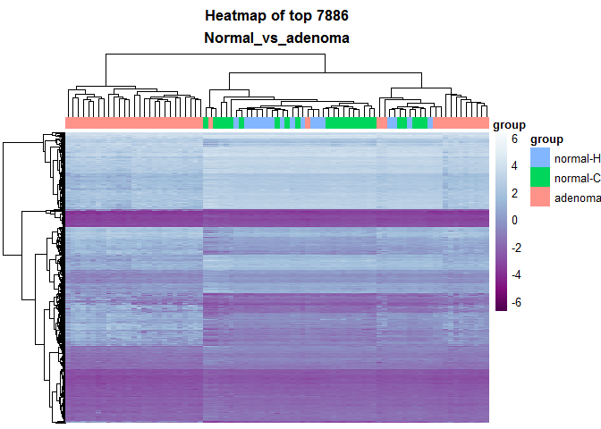

# LIMMA_analysis: (normal-C+normal-H) vs adenoma
Beryl Zhuang  
Sunday, April 05, 2015  


#### Differential methylation analysis comparing normal (normal-c and normal-H) and adenoma


*LIMMA codes are writen by Ka Ming. The codes are modified for this analysis.


```r
library(dplyr)
```

```
## 
## Attaching package: 'dplyr'
## 
## The following object is masked from 'package:stats':
## 
##     filter
## 
## The following objects are masked from 'package:base':
## 
##     intersect, setdiff, setequal, union
```

```r
library(limma)
library(ggplot2)
```


```r
source("../../rscripts/helper_functions.R")
```


```r
# codes from Ka Ming

# loading the norm. CGI.
M.norm.CGI.path <- "../../data/GSE48684_raw_filtered.m.norm.cgi.Rdata"
load(M.norm.CGI.path)
M.norm.CGI <- na.omit(M.norm.CGI)

# load the metadata
metadata.path <- "../../data/metadata.Rdata"
load(metadata.path)

# sanity check
head(M.norm.CGI)
```

```
##                          GSM1183439  GSM1183440 GSM1183441 GSM1183442
## chr1:10003165-10003585   -2.6552923 -2.59856415 -2.5445386 -2.5589572
## chr1:1002663-1005318     -0.4691256 -0.09143954 -0.2533638 -0.2153825
## chr1:100315420-100316009 -3.2051837 -3.28066606 -3.1908783 -3.3171275
## chr1:100435297-100436070 -2.6509063 -2.53842308 -2.3740902 -2.6930074
## chr1:100503482-100504404 -2.5912106 -2.61793251 -2.5333289 -2.6985588
## chr1:10057121-10058108   -1.8793069 -1.60397303 -1.9452079 -1.4107345
##                           GSM1183443 GSM1183444 GSM1183445 GSM1183446
## chr1:10003165-10003585   -2.55737653 -2.5826043 -2.4911736  -2.554945
## chr1:1002663-1005318     -0.09556418 -0.1394251 -0.9472826  -0.156273
## chr1:100315420-100316009 -3.44138495 -3.2638314 -3.5903340  -3.175695
## chr1:100435297-100436070 -2.58548225 -2.6448828 -2.8978879  -2.530715
## chr1:100503482-100504404 -2.77076081 -2.7414266 -2.8660505  -2.676452
## chr1:10057121-10058108   -1.89517507 -2.1822275 -2.7476044  -1.366660
##                          GSM1183447 GSM1183448 GSM1183449 GSM1183450
## chr1:10003165-10003585   -2.8167373 -2.6015900 -2.7326851  -2.687569
## chr1:1002663-1005318     -0.9355684 -0.5594806 -0.9262892  -1.276605
## chr1:100315420-100316009 -3.7200904 -3.4311690 -3.5356330  -3.462461
## chr1:100435297-100436070 -2.9591127 -2.7513380 -2.9045330  -2.883730
## chr1:100503482-100504404 -2.7442432 -2.7249048 -2.7322991  -2.698558
## chr1:10057121-10058108   -2.7962893 -1.6385844 -2.9030710  -3.324011
##                          GSM1183451 GSM1183452 GSM1183453 GSM1183454
## chr1:10003165-10003585    -2.739601 -2.3145316 -2.4420093 -2.5683021
## chr1:1002663-1005318      -0.547058  0.2199845  0.1354862 -0.1364899
## chr1:100315420-100316009  -3.476851 -3.2057071 -3.1883463 -3.4435985
## chr1:100435297-100436070  -3.013518 -1.7599024 -1.9642126 -2.5990879
## chr1:100503482-100504404  -2.841048 -2.3777453 -2.4337830 -2.5278606
## chr1:10057121-10058108    -2.548544 -1.3898947 -1.7715518 -2.2878826
##                          GSM1183455 GSM1183456 GSM1183457 GSM1183458
## chr1:10003165-10003585   -2.5611068 -2.6112883 -2.9289910 -2.5701139
## chr1:1002663-1005318      0.0855106 -0.1495479 -0.2503045 -0.8035391
## chr1:100315420-100316009 -3.5442221 -3.3321487 -3.4719609 -3.3151074
## chr1:100435297-100436070 -2.9532561 -2.5944388 -2.7733070 -2.8305448
## chr1:100503482-100504404 -2.7577497 -2.6674068 -2.7293921 -2.6465480
## chr1:10057121-10058108   -1.8906351 -2.2961952 -0.7416368 -2.7446878
##                          GSM1183459 GSM1183460 GSM1183461 GSM1183462
## chr1:10003165-10003585   -2.5928901 -2.3889526 -2.6460887 -2.7231261
## chr1:1002663-1005318     -0.0978623 -0.5153299 -0.1302912 -0.2164913
## chr1:100315420-100316009 -3.1202442 -3.1034921 -3.3016168 -3.4521085
## chr1:100435297-100436070 -2.3362214 -2.3185678 -2.5481766 -2.5349049
## chr1:100503482-100504404 -2.6162707 -2.3970941 -2.7532512 -2.7130206
## chr1:10057121-10058108   -2.2802288 -2.7551910 -2.5061829 -0.4842863
##                          GSM1183463 GSM1183464 GSM1183465 GSM1183466
## chr1:10003165-10003585   -2.5491017 -2.4576876 -2.6634236 -2.6269710
## chr1:1002663-1005318      0.1777277  0.2527131  0.1042947 -0.4701124
## chr1:100315420-100316009 -3.2860087 -3.2898758 -3.2739430 -3.3949594
## chr1:100435297-100436070 -2.4025642 -2.3717973 -2.2822308 -2.6972064
## chr1:100503482-100504404 -2.6531850 -2.6213044 -2.6589155 -2.8621837
## chr1:10057121-10058108   -1.7501278 -0.9031143 -1.4175589 -2.5515072
##                          GSM1183467 GSM1183468 GSM1183469 GSM1183470
## chr1:10003165-10003585   -2.5975998 -2.5412295 -2.4850925 -2.4145797
## chr1:1002663-1005318     -0.1106584 -0.3974871 -0.1186928 -0.4646606
## chr1:100315420-100316009 -3.3165319 -3.2531491 -3.0885286 -3.3201661
## chr1:100435297-100436070 -2.7201684 -2.6577729 -2.6383212 -2.6271861
## chr1:100503482-100504404 -2.7140042 -2.6688105 -2.6891018 -2.5954421
## chr1:10057121-10058108   -1.9689749 -2.1921074 -2.1734550 -2.1911826
##                          GSM1183471 GSM1183472  GSM1183473 GSM1183474
## chr1:10003165-10003585   -2.5213979  -2.466313 -2.55134704 -2.4765215
## chr1:1002663-1005318     -0.2727839  -0.204244  0.04854337 -0.3592211
## chr1:100315420-100316009 -3.2953992  -3.218619 -3.28942467 -3.4000418
## chr1:100435297-100436070 -2.5079133  -2.562802 -2.69858064 -2.6323302
## chr1:100503482-100504404 -2.6814858  -2.463127 -2.67413839 -2.8827299
## chr1:10057121-10058108   -1.9749580  -2.118518 -1.98687058 -1.6137291
##                          GSM1183475 GSM1183476 GSM1183477 GSM1183478
## chr1:10003165-10003585   -2.5553456 -2.5007390 -2.5346772 -2.5382355
## chr1:1002663-1005318     -0.2639951 -0.3881833 -0.1877652 -0.2008505
## chr1:100315420-100316009 -3.3787453 -3.3049143 -3.2620533 -3.2547827
## chr1:100435297-100436070 -2.6092785 -2.6791712 -2.6729198 -2.6679753
## chr1:100503482-100504404 -2.7651728 -2.7097997 -2.7011483 -2.6685389
## chr1:10057121-10058108   -1.9800005 -2.2907397 -1.6842134 -2.2742424
##                           GSM1183479 GSM1183480 GSM1183481 GSM1183482
## chr1:10003165-10003585   -2.78934539 -2.4393726  -2.470685 -2.4599626
## chr1:1002663-1005318      0.03098998 -0.3446402  -0.356047 -0.2735848
## chr1:100315420-100316009 -3.22150296 -3.2752470  -3.283137 -3.2123623
## chr1:100435297-100436070 -2.49583434 -2.6676062  -2.679606 -2.6550079
## chr1:100503482-100504404 -2.66726367 -2.8328728  -2.624475 -2.7429252
## chr1:10057121-10058108   -1.90776652 -2.5284930  -2.390040 -2.4086346
##                          GSM1183483  GSM1183484 GSM1183485 GSM1183486
## chr1:10003165-10003585   -2.6406160 -2.70045313 -2.7033185 -2.6432762
## chr1:1002663-1005318      0.1419676  0.02287766 -0.2400202 -0.0466823
## chr1:100315420-100316009 -3.2889347 -3.48242760 -3.2918360 -3.3131523
## chr1:100435297-100436070 -2.4959864 -2.78518605 -2.5886347 -2.5103397
## chr1:100503482-100504404 -2.8480882 -2.70227145 -2.8255920 -2.5938201
## chr1:10057121-10058108   -2.1335111 -2.58234107 -1.7365505 -2.1008323
##                          GSM1183487 GSM1183488 GSM1183489 GSM1183490
## chr1:10003165-10003585   -2.1723282 -2.4762976 -2.7209445 -2.6450045
## chr1:1002663-1005318      0.3671142 -0.2484297  0.1206241  0.1053612
## chr1:100315420-100316009 -2.8700148 -3.1976002 -3.0185030 -2.9115272
## chr1:100435297-100436070 -2.0898900 -2.6466377 -2.3003844 -2.3822229
## chr1:100503482-100504404 -2.3997197 -2.7176038 -2.5165885 -2.6060197
## chr1:10057121-10058108   -1.7340586 -2.0591488 -2.0783172 -1.6675826
##                          GSM1183491 GSM1183492 GSM1183493 GSM1183494
## chr1:10003165-10003585   -2.6654612 -2.3219709 -2.4483201 -2.5511022
## chr1:1002663-1005318      0.3462601  0.4469207  0.1254926 -0.5048053
## chr1:100315420-100316009 -3.1088263 -2.9417798 -3.4914174 -3.3202710
## chr1:100435297-100436070 -2.3348525 -2.0809495 -2.4237925 -2.4554246
## chr1:100503482-100504404 -2.6348955 -2.4477740 -2.7663400 -2.9570593
## chr1:10057121-10058108   -2.0751118 -1.8962422 -1.7759178 -2.1877155
##                           GSM1183495  GSM1183496  GSM1183497  GSM1183498
## chr1:10003165-10003585   -2.63486408 -2.48162177 -2.47640016 -2.58026479
## chr1:1002663-1005318     -0.06303079 -0.02946225 -0.09298967 -0.08300383
## chr1:100315420-100316009 -3.30801504 -3.18349564 -3.32868542 -3.30487740
## chr1:100435297-100436070 -2.55596834 -2.52263929 -2.71459787 -2.58571296
## chr1:100503482-100504404 -2.68080449 -2.76371740 -2.82548106 -2.97470935
## chr1:10057121-10058108   -1.83718920 -2.17762440 -2.30781157 -2.10909408
##                           GSM1183499 GSM1183500 GSM1183501 GSM1183502
## chr1:10003165-10003585   -2.63209567 -2.4744933 -2.4949798 -2.5833351
## chr1:1002663-1005318     -0.03106036 -0.3583119 -0.3324479 -0.2687182
## chr1:100315420-100316009 -3.34801905 -3.3203624 -3.2989031 -3.2702818
## chr1:100435297-100436070 -2.73638456 -2.6032170 -2.6614142 -2.7622146
## chr1:100503482-100504404 -2.73326044 -2.7836071 -2.6894563 -2.7985445
## chr1:10057121-10058108   -2.27761366 -2.0391860 -2.5430220 -2.3298607
##                          GSM1183503 GSM1183504 GSM1183505 GSM1183506
## chr1:10003165-10003585   -2.3760920 -2.5018222 -2.5406260 -2.6798983
## chr1:1002663-1005318     -0.5727622 -0.5142741 -0.3024174 -0.7474327
## chr1:100315420-100316009 -3.5542411 -3.2108034 -3.3840248 -3.5504974
## chr1:100435297-100436070 -2.6699468 -2.6373828 -2.6761145 -2.9711555
## chr1:100503482-100504404 -2.6357915 -2.6687809 -2.7204119 -2.8171362
## chr1:10057121-10058108   -2.4608661 -2.5729041 -2.3695044 -2.8156203
##                          GSM1183507 GSM1183508 GSM1183509 GSM1183510
## chr1:10003165-10003585   -2.4892827 -2.8071124 -2.6441459 -2.5450091
## chr1:1002663-1005318     -0.6555263 -0.6368511 -0.5938308 -0.5133373
## chr1:100315420-100316009 -3.5385598 -3.6574768 -3.4092673 -3.3552417
## chr1:100435297-100436070 -3.0219965 -3.0268029 -2.7734492 -2.6306042
## chr1:100503482-100504404 -2.8428973 -2.8916099 -2.7695231 -2.5695898
## chr1:10057121-10058108   -2.5254960 -2.3954471 -2.8763173 -2.8564190
##                          GSM1183511 GSM1183512 GSM1183513   GSM1183514
## chr1:10003165-10003585   -2.3345401 -2.4611793 -2.5232826 -2.794565724
## chr1:1002663-1005318     -0.5646612 -0.6593965 -0.3996432 -0.893026075
## chr1:100315420-100316009 -3.3974549 -3.4518730 -3.3672605 -3.590974285
## chr1:100435297-100436070 -2.6486824 -3.0160474 -2.5688085 -2.871634800
## chr1:100503482-100504404 -2.8023253 -2.8171447 -2.6757521 -2.839093719
## chr1:10057121-10058108   -2.1076040 -2.8274641 -2.5582427 -0.004961779
##                          GSM1183515 GSM1183516  GSM1183517 GSM1183518
## chr1:10003165-10003585   -2.5574941 -2.4817320 -2.70980738 -2.4192976
## chr1:1002663-1005318      0.1908337 -0.3539109 -1.25742650 -0.2876498
## chr1:100315420-100316009 -3.1601333 -3.3948670 -3.39826153 -3.1621329
## chr1:100435297-100436070 -2.6326338 -2.8575446 -2.81982492 -2.5290203
## chr1:100503482-100504404 -2.7675520 -2.7245740 -2.86439386 -2.5466905
## chr1:10057121-10058108   -2.7167976 -2.4120587  0.02238012 -2.2057753
##                          GSM1183519 GSM1183520 GSM1183521 GSM1183522
## chr1:10003165-10003585   -2.8827217  -2.516365 -2.4537406 -2.6946777
## chr1:1002663-1005318     -0.3800922   0.487411 -0.1899291 -0.6922016
## chr1:100315420-100316009 -3.4278863  -3.180156 -3.3113328 -3.2982204
## chr1:100435297-100436070 -2.7879821  -2.160308 -2.7512474 -2.8967630
## chr1:100503482-100504404 -2.5341330  -2.466457 -2.7391940 -2.9843558
## chr1:10057121-10058108   -2.7943131  -1.627597 -2.6084962 -2.7768410
##                          GSM1183523 GSM1183524 GSM1183525 GSM1183526
## chr1:10003165-10003585   -2.4622112 -2.5451917 -2.6681450 -2.8270665
## chr1:1002663-1005318     -0.3450193 -0.4116018  0.1524643 -0.9742143
## chr1:100315420-100316009 -3.5347077 -3.3356859 -3.2475622 -3.6032944
## chr1:100435297-100436070 -2.7015844 -2.6075023 -2.4573471 -2.9766122
## chr1:100503482-100504404 -2.7011248 -2.5565389 -2.7428883 -2.8149033
## chr1:10057121-10058108   -2.3584792 -2.3597911 -1.9721684 -3.0843057
##                          GSM1183527  GSM1183528 GSM1183529  GSM1183530
## chr1:10003165-10003585    -2.715084 -2.51442884 -2.5722132 -2.51044935
## chr1:1002663-1005318      -1.052124 -0.07902266 -0.1090344 -0.08058042
## chr1:100315420-100316009  -3.577829 -3.25446329 -3.3411582 -3.40226436
## chr1:100435297-100436070  -3.096443 -2.51894210 -2.5145817 -2.78800177
## chr1:100503482-100504404  -2.786104 -2.52975089 -2.6832643 -2.61647446
## chr1:10057121-10058108    -2.856401 -2.35051733 -2.0999465 -2.45045802
##                          GSM1183531 GSM1183532 GSM1183533 GSM1183534
## chr1:10003165-10003585   -2.5230189 -2.4772421 -2.5054475 -2.5991168
## chr1:1002663-1005318     -0.7695092 -0.9591101 -0.5369419 -0.5766602
## chr1:100315420-100316009 -3.3759884 -3.5681969 -3.2956107 -3.3664893
## chr1:100435297-100436070 -2.7818569 -2.8156503 -2.5494621 -2.6290269
## chr1:100503482-100504404 -2.6662381 -2.7690945 -2.5586073 -2.7199332
## chr1:10057121-10058108   -2.6505661 -2.6469958 -2.2942003 -2.6646535
##                          GSM1183535 GSM1183536 GSM1183537 GSM1183538
## chr1:10003165-10003585    -2.363892  -2.666929  -2.616571 -2.5416443
## chr1:1002663-1005318      -0.154614  -1.045520  -1.254954 -0.8628501
## chr1:100315420-100316009  -3.383797  -3.531605  -3.549230 -3.4468167
## chr1:100435297-100436070  -2.777329  -2.977179  -2.886160 -2.7070430
## chr1:100503482-100504404  -2.684621  -2.946696  -2.937330 -2.7255946
## chr1:10057121-10058108    -2.439123  -1.864672  -2.005083 -2.9946131
##                          GSM1183539 GSM1183540 GSM1183541 GSM1183542
## chr1:10003165-10003585   -2.8752842 -2.4306625 -2.5951367  -2.676305
## chr1:1002663-1005318     -0.5308050  0.2092777 -0.1439707  -1.074767
## chr1:100315420-100316009 -3.5223805 -3.2474810 -3.1633167  -3.499562
## chr1:100435297-100436070 -2.7828174 -2.6042976 -2.3120103  -2.978451
## chr1:100503482-100504404 -2.9606268 -2.6586909 -2.6340278  -3.017156
## chr1:10057121-10058108   -0.8160312 -1.7308273 -2.5610825  -2.911221
##                          GSM1183543  GSM1183544 GSM1183545 GSM1183546
## chr1:10003165-10003585   -2.4328712 -2.68895993 -2.4035817 -2.7173873
## chr1:1002663-1005318     -0.5943623 -0.04813778  0.3884715 -0.3234209
## chr1:100315420-100316009 -3.3082008 -3.19362168 -3.1150482 -3.4909309
## chr1:100435297-100436070 -2.7679585 -2.45400458 -2.1515453 -2.6983911
## chr1:100503482-100504404 -2.5032138 -2.69788563 -2.6480267 -2.9672095
## chr1:10057121-10058108   -2.8442728 -1.89665624 -1.8706002 -2.0210757
##                          GSM1183547  GSM1183548 GSM1183549 GSM1183550
## chr1:10003165-10003585   -2.4708077 -2.67047241  -2.873039  -2.902766
## chr1:1002663-1005318     -0.1919004 -0.05228926  -1.225704  -1.020126
## chr1:100315420-100316009 -3.4013430 -3.30489431  -3.534048  -3.648111
## chr1:100435297-100436070 -2.6156074 -2.37281582  -3.085966  -2.986475
## chr1:100503482-100504404 -2.7828367 -2.67066895  -3.019369  -2.945886
## chr1:10057121-10058108   -2.2382613 -2.38875900  -2.206652  -2.058766
##                          GSM1183551 GSM1183552 GSM1183553  GSM1183554
## chr1:10003165-10003585   -2.6086813 -2.2954377 -2.4534002 -2.59945570
## chr1:1002663-1005318     -0.4032427  0.3948961  0.1173246  0.01771181
## chr1:100315420-100316009 -3.4765112 -3.0633456 -3.2935863 -3.26522873
## chr1:100435297-100436070 -2.6783351 -2.0686436 -2.4689794 -2.49531811
## chr1:100503482-100504404 -2.9638341 -2.4317759 -2.6365286 -2.67921463
## chr1:10057121-10058108   -2.3911001 -2.0523751 -1.7506630 -2.19764846
##                          GSM1183555  GSM1183556 GSM1183557   GSM1183558
## chr1:10003165-10003585   -2.7170612 -2.47360455 -2.7437807 -2.793726717
## chr1:1002663-1005318      0.0363121  0.02016923 -0.5060306 -1.417894319
## chr1:100315420-100316009 -3.5089492 -3.36980796 -3.3420403 -3.535314747
## chr1:100435297-100436070 -2.5036881 -2.75306404 -2.7442860 -3.275508203
## chr1:100503482-100504404 -2.6449797 -2.76934714 -2.6517998 -2.940411823
## chr1:10057121-10058108   -2.1389980 -2.56401695 -2.8584225 -0.001879325
##                           GSM1183559 GSM1183560 GSM1183561 GSM1235135
## chr1:10003165-10003585   -2.57914633 -2.8330552 -2.7309010 -2.6811757
## chr1:1002663-1005318     -0.04596533 -1.1547271 -0.8737399 -0.8261102
## chr1:100315420-100316009 -3.32159900 -3.7492971 -3.5794866 -3.4431519
## chr1:100435297-100436070 -2.52344354 -2.9957279 -2.7698383 -2.7759642
## chr1:100503482-100504404 -2.64300275 -3.0614550 -2.7066204 -2.8489858
## chr1:10057121-10058108   -1.96268277 -0.5575545 -1.7797307 -2.4014718
##                          GSM1235136 GSM1235137 GSM1235138 GSM1235139
## chr1:10003165-10003585   -2.6477766  -2.702564 -2.8023263 -2.4478487
## chr1:1002663-1005318     -0.3844503  -0.483281 -0.8482104 -0.3493395
## chr1:100315420-100316009 -3.4730226  -3.451509 -3.5055528 -3.3486040
## chr1:100435297-100436070 -2.7160374  -2.808582 -2.9682315 -2.6851538
## chr1:100503482-100504404 -2.8288185  -2.773447 -2.8228641 -2.7326488
## chr1:10057121-10058108   -1.7369457  -2.186193 -2.3280194 -2.2730317
##                          GSM1235140 GSM1235141 GSM1235142  GSM1235143
## chr1:10003165-10003585    -2.828660  -2.676493  -2.692334 -2.90152090
## chr1:1002663-1005318      -1.018976  -0.542397  -0.819848 -0.03415505
## chr1:100315420-100316009  -3.536803  -3.498916  -3.517102 -3.66291211
## chr1:100435297-100436070  -2.844221  -2.951094  -2.949362 -2.93604861
## chr1:100503482-100504404  -2.736433  -2.908117  -2.776179 -3.05398469
## chr1:10057121-10058108    -2.728394  -2.462111  -2.916486 -2.08641546
##                          GSM1235144 GSM1235145 GSM1235146 GSM1235147
## chr1:10003165-10003585    -2.862507 -2.5671695 -2.7707534 -2.6113458
## chr1:1002663-1005318      -1.429965 -0.3208506 -0.6404117 -0.7149859
## chr1:100315420-100316009  -3.735792 -3.5761870 -3.6200129 -3.4897598
## chr1:100435297-100436070  -3.105051 -2.6148847 -2.7674711 -2.5894137
## chr1:100503482-100504404  -2.908989 -2.8832492 -2.9253187 -2.7715724
## chr1:10057121-10058108    -1.103073 -2.0376414 -2.7294505 -2.3116782
##                          GSM1235148 GSM1235149 GSM1235150 GSM1235151
## chr1:10003165-10003585    -2.794790 -2.5643987  -2.626196 -2.3914945
## chr1:1002663-1005318      -0.195880 -0.8946123  -0.499279 -0.3712183
## chr1:100315420-100316009  -3.571170 -3.4136682  -3.344802 -3.6347130
## chr1:100435297-100436070  -2.791283 -2.8516547  -2.659318 -2.8817924
## chr1:100503482-100504404  -2.864650 -2.8154332  -2.801233 -2.7130548
## chr1:10057121-10058108    -2.507433 -2.3902709  -2.394794 -2.2583082
##                          GSM1235152 GSM1235153 GSM1235154 GSM1235155
## chr1:10003165-10003585   -2.6829868 -2.5431050 -2.6734087 -2.8229434
## chr1:1002663-1005318     -0.6720619 -0.3095247 -0.3535083 -0.9630747
## chr1:100315420-100316009 -3.6281184 -3.3301228 -3.3366841 -3.2905880
## chr1:100435297-100436070 -2.9513623 -2.6508038 -2.9213792 -2.8662826
## chr1:100503482-100504404 -2.7519088 -2.7644744 -2.8670847 -2.9335138
## chr1:10057121-10058108   -2.9960025 -2.3454842 -2.5402733 -2.8436313
##                          GSM1235156 GSM1235157 GSM1235158
## chr1:10003165-10003585   -2.5337367  -2.632813  -2.607099
## chr1:1002663-1005318     -0.6739876  -1.352517  -1.108535
## chr1:100315420-100316009 -3.4911129  -3.388591  -3.493868
## chr1:100435297-100436070 -2.6590959  -3.047235  -3.056798
## chr1:100503482-100504404 -2.7005638  -2.850698  -2.891250
## chr1:10057121-10058108   -2.5902250  -3.121232  -2.849576
```

```r
head(metadata)
```

```
##               group                                title geo_accession
## GSM1183439 normal-H Genomic DNA from normal individual 1    GSM1183439
## GSM1183440 normal-H Genomic DNA from normal individual 2    GSM1183440
## GSM1183441 normal-H Genomic DNA from normal individual 3    GSM1183441
## GSM1183442 normal-H Genomic DNA from normal individual 4    GSM1183442
## GSM1183443 normal-H Genomic DNA from normal individual 5    GSM1183443
## GSM1183444 normal-H Genomic DNA from normal individual 6    GSM1183444
##                       tissue colon_region gender stage
## GSM1183439 colorectal mucosa        colon   male  <NA>
## GSM1183440 colorectal mucosa        colon   male  <NA>
## GSM1183441 colorectal mucosa        colon female  <NA>
## GSM1183442 colorectal mucosa        colon   male  <NA>
## GSM1183443 colorectal mucosa        colon   male  <NA>
## GSM1183444 colorectal mucosa        colon   male  <NA>
```

```r
# function to perform limma to generate top table
limmaTopTables <- function(dat, des, file_name){
	myFit <- lmFit(dat, des)
	myEbFit <- eBayes(myFit)
	
	for (coeff in colnames(myEbFit$coefficients)[-1]){
		myTopTable <- topTable(myEbFit, number=nrow(dat), coef=c(coeff))
		
		save(myTopTable, file=file_name)
	}
}

# reorder factor level for `group`
metadata$group <- factor(metadata$group, levels=c("normal-H", "normal-C", "cancer", "adenoma"))
```


```r
goal <- "Normal_vs_adenoma"

group_names <- c("normal-H","normal-C", "adenoma")
# design matrix for limma on group
des <- metadata[which(metadata$group %in% group_names), ] %>% droplevels()
# group normal-H and normal-C together
des$new_group <- "normal"
des$new_group[which(des$group == "adenoma")] <- "adenoma"

desMat.group <- model.matrix(~new_group, des)
desMat.group
```

```
##            (Intercept) new_groupnormal
## GSM1183439           1               1
## GSM1183440           1               1
## GSM1183441           1               1
## GSM1183442           1               1
## GSM1183443           1               1
## GSM1183444           1               1
## GSM1183445           1               0
## GSM1183446           1               0
## GSM1183447           1               0
## GSM1183448           1               0
## GSM1183449           1               0
## GSM1183450           1               0
## GSM1183451           1               0
## GSM1183452           1               0
## GSM1183467           1               1
## GSM1183468           1               1
## GSM1183469           1               1
## GSM1183470           1               1
## GSM1183471           1               1
## GSM1183472           1               1
## GSM1183473           1               1
## GSM1183474           1               1
## GSM1183475           1               1
## GSM1183476           1               1
## GSM1183477           1               1
## GSM1183478           1               1
## GSM1183479           1               1
## GSM1183480           1               1
## GSM1183481           1               1
## GSM1183482           1               1
## GSM1183483           1               1
## GSM1183484           1               1
## GSM1183485           1               1
## GSM1183486           1               1
## GSM1183487           1               1
## GSM1183488           1               1
## GSM1183489           1               1
## GSM1183490           1               1
## GSM1183491           1               1
## GSM1183492           1               1
## GSM1183493           1               1
## GSM1183494           1               1
## GSM1183495           1               1
## GSM1183496           1               1
## GSM1183497           1               1
## GSM1183498           1               1
## GSM1183499           1               1
## GSM1183500           1               1
## GSM1183501           1               1
## GSM1183502           1               0
## GSM1183503           1               0
## GSM1183504           1               0
## GSM1183505           1               0
## GSM1183506           1               0
## GSM1183507           1               0
## GSM1183508           1               0
## GSM1183509           1               0
## GSM1183510           1               0
## GSM1183511           1               0
## GSM1235135           1               0
## GSM1235136           1               0
## GSM1235137           1               0
## GSM1235138           1               0
## GSM1235139           1               0
## GSM1235140           1               0
## GSM1235141           1               0
## GSM1235142           1               0
## GSM1235143           1               0
## GSM1235144           1               0
## GSM1235145           1               0
## GSM1235146           1               0
## GSM1235147           1               0
## GSM1235148           1               0
## GSM1235149           1               0
## GSM1235150           1               0
## GSM1235151           1               0
## GSM1235152           1               0
## GSM1235153           1               0
## GSM1235154           1               0
## GSM1235155           1               0
## GSM1235156           1               0
## GSM1235157           1               0
## GSM1235158           1               0
## attr(,"assign")
## [1] 0 1
## attr(,"contrasts")
## attr(,"contrasts")$new_group
## [1] "contr.treatment"
```

```r
group_subset <- as.character(metadata$geo_accession
														 [which(metadata$group %in% group_names)])
group_subset
```

```
##  [1] "GSM1183439" "GSM1183440" "GSM1183441" "GSM1183442" "GSM1183443"
##  [6] "GSM1183444" "GSM1183445" "GSM1183446" "GSM1183447" "GSM1183448"
## [11] "GSM1183449" "GSM1183450" "GSM1183451" "GSM1183452" "GSM1183467"
## [16] "GSM1183468" "GSM1183469" "GSM1183470" "GSM1183471" "GSM1183472"
## [21] "GSM1183473" "GSM1183474" "GSM1183475" "GSM1183476" "GSM1183477"
## [26] "GSM1183478" "GSM1183479" "GSM1183480" "GSM1183481" "GSM1183482"
## [31] "GSM1183483" "GSM1183484" "GSM1183485" "GSM1183486" "GSM1183487"
## [36] "GSM1183488" "GSM1183489" "GSM1183490" "GSM1183491" "GSM1183492"
## [41] "GSM1183493" "GSM1183494" "GSM1183495" "GSM1183496" "GSM1183497"
## [46] "GSM1183498" "GSM1183499" "GSM1183500" "GSM1183501" "GSM1183502"
## [51] "GSM1183503" "GSM1183504" "GSM1183505" "GSM1183506" "GSM1183507"
## [56] "GSM1183508" "GSM1183509" "GSM1183510" "GSM1183511" "GSM1235135"
## [61] "GSM1235136" "GSM1235137" "GSM1235138" "GSM1235139" "GSM1235140"
## [66] "GSM1235141" "GSM1235142" "GSM1235143" "GSM1235144" "GSM1235145"
## [71] "GSM1235146" "GSM1235147" "GSM1235148" "GSM1235149" "GSM1235150"
## [76] "GSM1235151" "GSM1235152" "GSM1235153" "GSM1235154" "GSM1235155"
## [81] "GSM1235156" "GSM1235157" "GSM1235158"
```

```r
length(group_subset)
```

```
## [1] 83
```

```r
dat <- M.norm.CGI[, group_subset] %>% droplevels()

head(dat)
```

```
##                          GSM1183439  GSM1183440 GSM1183441 GSM1183442
## chr1:10003165-10003585   -2.6552923 -2.59856415 -2.5445386 -2.5589572
## chr1:1002663-1005318     -0.4691256 -0.09143954 -0.2533638 -0.2153825
## chr1:100315420-100316009 -3.2051837 -3.28066606 -3.1908783 -3.3171275
## chr1:100435297-100436070 -2.6509063 -2.53842308 -2.3740902 -2.6930074
## chr1:100503482-100504404 -2.5912106 -2.61793251 -2.5333289 -2.6985588
## chr1:10057121-10058108   -1.8793069 -1.60397303 -1.9452079 -1.4107345
##                           GSM1183443 GSM1183444 GSM1183445 GSM1183446
## chr1:10003165-10003585   -2.55737653 -2.5826043 -2.4911736  -2.554945
## chr1:1002663-1005318     -0.09556418 -0.1394251 -0.9472826  -0.156273
## chr1:100315420-100316009 -3.44138495 -3.2638314 -3.5903340  -3.175695
## chr1:100435297-100436070 -2.58548225 -2.6448828 -2.8978879  -2.530715
## chr1:100503482-100504404 -2.77076081 -2.7414266 -2.8660505  -2.676452
## chr1:10057121-10058108   -1.89517507 -2.1822275 -2.7476044  -1.366660
##                          GSM1183447 GSM1183448 GSM1183449 GSM1183450
## chr1:10003165-10003585   -2.8167373 -2.6015900 -2.7326851  -2.687569
## chr1:1002663-1005318     -0.9355684 -0.5594806 -0.9262892  -1.276605
## chr1:100315420-100316009 -3.7200904 -3.4311690 -3.5356330  -3.462461
## chr1:100435297-100436070 -2.9591127 -2.7513380 -2.9045330  -2.883730
## chr1:100503482-100504404 -2.7442432 -2.7249048 -2.7322991  -2.698558
## chr1:10057121-10058108   -2.7962893 -1.6385844 -2.9030710  -3.324011
##                          GSM1183451 GSM1183452 GSM1183467 GSM1183468
## chr1:10003165-10003585    -2.739601 -2.3145316 -2.5975998 -2.5412295
## chr1:1002663-1005318      -0.547058  0.2199845 -0.1106584 -0.3974871
## chr1:100315420-100316009  -3.476851 -3.2057071 -3.3165319 -3.2531491
## chr1:100435297-100436070  -3.013518 -1.7599024 -2.7201684 -2.6577729
## chr1:100503482-100504404  -2.841048 -2.3777453 -2.7140042 -2.6688105
## chr1:10057121-10058108    -2.548544 -1.3898947 -1.9689749 -2.1921074
##                          GSM1183469 GSM1183470 GSM1183471 GSM1183472
## chr1:10003165-10003585   -2.4850925 -2.4145797 -2.5213979  -2.466313
## chr1:1002663-1005318     -0.1186928 -0.4646606 -0.2727839  -0.204244
## chr1:100315420-100316009 -3.0885286 -3.3201661 -3.2953992  -3.218619
## chr1:100435297-100436070 -2.6383212 -2.6271861 -2.5079133  -2.562802
## chr1:100503482-100504404 -2.6891018 -2.5954421 -2.6814858  -2.463127
## chr1:10057121-10058108   -2.1734550 -2.1911826 -1.9749580  -2.118518
##                           GSM1183473 GSM1183474 GSM1183475 GSM1183476
## chr1:10003165-10003585   -2.55134704 -2.4765215 -2.5553456 -2.5007390
## chr1:1002663-1005318      0.04854337 -0.3592211 -0.2639951 -0.3881833
## chr1:100315420-100316009 -3.28942467 -3.4000418 -3.3787453 -3.3049143
## chr1:100435297-100436070 -2.69858064 -2.6323302 -2.6092785 -2.6791712
## chr1:100503482-100504404 -2.67413839 -2.8827299 -2.7651728 -2.7097997
## chr1:10057121-10058108   -1.98687058 -1.6137291 -1.9800005 -2.2907397
##                          GSM1183477 GSM1183478  GSM1183479 GSM1183480
## chr1:10003165-10003585   -2.5346772 -2.5382355 -2.78934539 -2.4393726
## chr1:1002663-1005318     -0.1877652 -0.2008505  0.03098998 -0.3446402
## chr1:100315420-100316009 -3.2620533 -3.2547827 -3.22150296 -3.2752470
## chr1:100435297-100436070 -2.6729198 -2.6679753 -2.49583434 -2.6676062
## chr1:100503482-100504404 -2.7011483 -2.6685389 -2.66726367 -2.8328728
## chr1:10057121-10058108   -1.6842134 -2.2742424 -1.90776652 -2.5284930
##                          GSM1183481 GSM1183482 GSM1183483  GSM1183484
## chr1:10003165-10003585    -2.470685 -2.4599626 -2.6406160 -2.70045313
## chr1:1002663-1005318      -0.356047 -0.2735848  0.1419676  0.02287766
## chr1:100315420-100316009  -3.283137 -3.2123623 -3.2889347 -3.48242760
## chr1:100435297-100436070  -2.679606 -2.6550079 -2.4959864 -2.78518605
## chr1:100503482-100504404  -2.624475 -2.7429252 -2.8480882 -2.70227145
## chr1:10057121-10058108    -2.390040 -2.4086346 -2.1335111 -2.58234107
##                          GSM1183485 GSM1183486 GSM1183487 GSM1183488
## chr1:10003165-10003585   -2.7033185 -2.6432762 -2.1723282 -2.4762976
## chr1:1002663-1005318     -0.2400202 -0.0466823  0.3671142 -0.2484297
## chr1:100315420-100316009 -3.2918360 -3.3131523 -2.8700148 -3.1976002
## chr1:100435297-100436070 -2.5886347 -2.5103397 -2.0898900 -2.6466377
## chr1:100503482-100504404 -2.8255920 -2.5938201 -2.3997197 -2.7176038
## chr1:10057121-10058108   -1.7365505 -2.1008323 -1.7340586 -2.0591488
##                          GSM1183489 GSM1183490 GSM1183491 GSM1183492
## chr1:10003165-10003585   -2.7209445 -2.6450045 -2.6654612 -2.3219709
## chr1:1002663-1005318      0.1206241  0.1053612  0.3462601  0.4469207
## chr1:100315420-100316009 -3.0185030 -2.9115272 -3.1088263 -2.9417798
## chr1:100435297-100436070 -2.3003844 -2.3822229 -2.3348525 -2.0809495
## chr1:100503482-100504404 -2.5165885 -2.6060197 -2.6348955 -2.4477740
## chr1:10057121-10058108   -2.0783172 -1.6675826 -2.0751118 -1.8962422
##                          GSM1183493 GSM1183494  GSM1183495  GSM1183496
## chr1:10003165-10003585   -2.4483201 -2.5511022 -2.63486408 -2.48162177
## chr1:1002663-1005318      0.1254926 -0.5048053 -0.06303079 -0.02946225
## chr1:100315420-100316009 -3.4914174 -3.3202710 -3.30801504 -3.18349564
## chr1:100435297-100436070 -2.4237925 -2.4554246 -2.55596834 -2.52263929
## chr1:100503482-100504404 -2.7663400 -2.9570593 -2.68080449 -2.76371740
## chr1:10057121-10058108   -1.7759178 -2.1877155 -1.83718920 -2.17762440
##                           GSM1183497  GSM1183498  GSM1183499 GSM1183500
## chr1:10003165-10003585   -2.47640016 -2.58026479 -2.63209567 -2.4744933
## chr1:1002663-1005318     -0.09298967 -0.08300383 -0.03106036 -0.3583119
## chr1:100315420-100316009 -3.32868542 -3.30487740 -3.34801905 -3.3203624
## chr1:100435297-100436070 -2.71459787 -2.58571296 -2.73638456 -2.6032170
## chr1:100503482-100504404 -2.82548106 -2.97470935 -2.73326044 -2.7836071
## chr1:10057121-10058108   -2.30781157 -2.10909408 -2.27761366 -2.0391860
##                          GSM1183501 GSM1183502 GSM1183503 GSM1183504
## chr1:10003165-10003585   -2.4949798 -2.5833351 -2.3760920 -2.5018222
## chr1:1002663-1005318     -0.3324479 -0.2687182 -0.5727622 -0.5142741
## chr1:100315420-100316009 -3.2989031 -3.2702818 -3.5542411 -3.2108034
## chr1:100435297-100436070 -2.6614142 -2.7622146 -2.6699468 -2.6373828
## chr1:100503482-100504404 -2.6894563 -2.7985445 -2.6357915 -2.6687809
## chr1:10057121-10058108   -2.5430220 -2.3298607 -2.4608661 -2.5729041
##                          GSM1183505 GSM1183506 GSM1183507 GSM1183508
## chr1:10003165-10003585   -2.5406260 -2.6798983 -2.4892827 -2.8071124
## chr1:1002663-1005318     -0.3024174 -0.7474327 -0.6555263 -0.6368511
## chr1:100315420-100316009 -3.3840248 -3.5504974 -3.5385598 -3.6574768
## chr1:100435297-100436070 -2.6761145 -2.9711555 -3.0219965 -3.0268029
## chr1:100503482-100504404 -2.7204119 -2.8171362 -2.8428973 -2.8916099
## chr1:10057121-10058108   -2.3695044 -2.8156203 -2.5254960 -2.3954471
##                          GSM1183509 GSM1183510 GSM1183511 GSM1235135
## chr1:10003165-10003585   -2.6441459 -2.5450091 -2.3345401 -2.6811757
## chr1:1002663-1005318     -0.5938308 -0.5133373 -0.5646612 -0.8261102
## chr1:100315420-100316009 -3.4092673 -3.3552417 -3.3974549 -3.4431519
## chr1:100435297-100436070 -2.7734492 -2.6306042 -2.6486824 -2.7759642
## chr1:100503482-100504404 -2.7695231 -2.5695898 -2.8023253 -2.8489858
## chr1:10057121-10058108   -2.8763173 -2.8564190 -2.1076040 -2.4014718
##                          GSM1235136 GSM1235137 GSM1235138 GSM1235139
## chr1:10003165-10003585   -2.6477766  -2.702564 -2.8023263 -2.4478487
## chr1:1002663-1005318     -0.3844503  -0.483281 -0.8482104 -0.3493395
## chr1:100315420-100316009 -3.4730226  -3.451509 -3.5055528 -3.3486040
## chr1:100435297-100436070 -2.7160374  -2.808582 -2.9682315 -2.6851538
## chr1:100503482-100504404 -2.8288185  -2.773447 -2.8228641 -2.7326488
## chr1:10057121-10058108   -1.7369457  -2.186193 -2.3280194 -2.2730317
##                          GSM1235140 GSM1235141 GSM1235142  GSM1235143
## chr1:10003165-10003585    -2.828660  -2.676493  -2.692334 -2.90152090
## chr1:1002663-1005318      -1.018976  -0.542397  -0.819848 -0.03415505
## chr1:100315420-100316009  -3.536803  -3.498916  -3.517102 -3.66291211
## chr1:100435297-100436070  -2.844221  -2.951094  -2.949362 -2.93604861
## chr1:100503482-100504404  -2.736433  -2.908117  -2.776179 -3.05398469
## chr1:10057121-10058108    -2.728394  -2.462111  -2.916486 -2.08641546
##                          GSM1235144 GSM1235145 GSM1235146 GSM1235147
## chr1:10003165-10003585    -2.862507 -2.5671695 -2.7707534 -2.6113458
## chr1:1002663-1005318      -1.429965 -0.3208506 -0.6404117 -0.7149859
## chr1:100315420-100316009  -3.735792 -3.5761870 -3.6200129 -3.4897598
## chr1:100435297-100436070  -3.105051 -2.6148847 -2.7674711 -2.5894137
## chr1:100503482-100504404  -2.908989 -2.8832492 -2.9253187 -2.7715724
## chr1:10057121-10058108    -1.103073 -2.0376414 -2.7294505 -2.3116782
##                          GSM1235148 GSM1235149 GSM1235150 GSM1235151
## chr1:10003165-10003585    -2.794790 -2.5643987  -2.626196 -2.3914945
## chr1:1002663-1005318      -0.195880 -0.8946123  -0.499279 -0.3712183
## chr1:100315420-100316009  -3.571170 -3.4136682  -3.344802 -3.6347130
## chr1:100435297-100436070  -2.791283 -2.8516547  -2.659318 -2.8817924
## chr1:100503482-100504404  -2.864650 -2.8154332  -2.801233 -2.7130548
## chr1:10057121-10058108    -2.507433 -2.3902709  -2.394794 -2.2583082
##                          GSM1235152 GSM1235153 GSM1235154 GSM1235155
## chr1:10003165-10003585   -2.6829868 -2.5431050 -2.6734087 -2.8229434
## chr1:1002663-1005318     -0.6720619 -0.3095247 -0.3535083 -0.9630747
## chr1:100315420-100316009 -3.6281184 -3.3301228 -3.3366841 -3.2905880
## chr1:100435297-100436070 -2.9513623 -2.6508038 -2.9213792 -2.8662826
## chr1:100503482-100504404 -2.7519088 -2.7644744 -2.8670847 -2.9335138
## chr1:10057121-10058108   -2.9960025 -2.3454842 -2.5402733 -2.8436313
##                          GSM1235156 GSM1235157 GSM1235158
## chr1:10003165-10003585   -2.5337367  -2.632813  -2.607099
## chr1:1002663-1005318     -0.6739876  -1.352517  -1.108535
## chr1:100315420-100316009 -3.4911129  -3.388591  -3.493868
## chr1:100435297-100436070 -2.6590959  -3.047235  -3.056798
## chr1:100503482-100504404 -2.7005638  -2.850698  -2.891250
## chr1:10057121-10058108   -2.5902250  -3.121232  -2.849576
```

```r
ncol(dat)
```

```
## [1] 83
```

```r
file_name <- paste0("../../data/limma/topTable_", goal, ".Rdata")
limmaTopTables(dat, desMat.group, file_name)

load(file_name)

head(myTopTable)
```

```
##                              logFC     AveExpr         t      P.Value
## chr2:54086776-54087266   -1.835744  2.05006281 -18.04813 1.424190e-30
## chr6:110679417-110679833 -3.027747 -0.88110053 -16.36605 8.516025e-28
## chr7:750788-751237       -1.298062  1.91610892 -16.29993 1.102926e-27
## chr4:110222970-110224257 -2.065120 -0.77392997 -15.83411 6.927166e-27
## chr2:139537692-139538650 -1.733921 -0.01003989 -15.77991 8.593808e-27
## chr8:145103285-145108027 -1.930883 -1.14051585 -15.43909 3.362713e-26
##                             adj.P.Val        B
## chr2:54086776-54087266   3.754591e-26 59.01431
## chr6:110679417-110679833 9.692149e-24 52.75240
## chr7:750788-751237       9.692149e-24 52.49864
## chr4:110222970-110224257 4.531171e-23 50.69460
## chr2:139537692-139538650 4.531171e-23 50.48283
## chr8:145103285-145108027 1.477520e-22 49.14218
```


```r
## plot density
ggplot(myTopTable, aes(adj.P.Val)) + 
	stat_density(geom = "line", position = "identity") +
	ggtitle("FDR density")
```

 

```r
ggplot(myTopTable, aes(adj.P.Val)) + 
	geom_histogram(position="identity") +
	ggtitle("FDR density")
```

```
## stat_bin: binwidth defaulted to range/30. Use 'binwidth = x' to adjust this.
```

 


Setting cutoffs


```r
cutoff <- 1e-7
length(which(myTopTable$adj.P.Val < cutoff))
```

```
## [1] 7886
```


plotHeatmap <- function(x, title = "", legend = "group", 
												size = 2, names = F, 
												row_dendrogram = F, col_dendrogram = F)


```r
top <- length(which(myTopTable$adj.P.Val < cutoff))
top_genes <-as.character(rownames(myTopTable)[1:top]) 
head(top_genes)
```

```
## [1] "chr2:54086776-54087266"   "chr6:110679417-110679833"
## [3] "chr7:750788-751237"       "chr4:110222970-110224257"
## [5] "chr2:139537692-139538650" "chr8:145103285-145108027"
```

```r
top_matrix <- subsetData(M.norm.CGI, top_genes, design = metadata)

#subset to the groups
top_matrix <- top_matrix[, group_subset]
head(top_matrix)	
```

```
##                          GSM1183439  GSM1183440  GSM1183441  GSM1183442
## chr1:1002663-1005318     -0.4691256 -0.09143954 -0.25336378 -0.21538254
## chr1:100315420-100316009 -3.2051837 -3.28066606 -3.19087826 -3.31712752
## chr1:10092532-10093404   -2.3570311 -2.31565547 -2.36184751 -2.29364114
## chr1:101004471-101005885  0.1934226  0.22054041  0.01254285 -0.09443836
## chr1:101360588-101360832 -2.1477230 -2.14146933 -2.06203114 -2.00875535
## chr1:101702445-101702745 -3.2096262 -3.15729997 -3.24308701 -2.88629661
##                           GSM1183443 GSM1183444 GSM1183445 GSM1183446
## chr1:1002663-1005318     -0.09556418 -0.1394251 -0.9472826 -0.1562730
## chr1:100315420-100316009 -3.44138495 -3.2638314 -3.5903340 -3.1756947
## chr1:10092532-10093404   -2.38205649 -2.3604274 -2.4818949 -2.4906832
## chr1:101004471-101005885  0.40502299 -0.1085183  1.4095632  0.3181748
## chr1:101360588-101360832 -2.35225904 -2.0743261 -2.2348245 -2.2535221
## chr1:101702445-101702745 -2.47566075 -3.0640664 -0.8494149 -3.0232305
##                          GSM1183447 GSM1183448 GSM1183449  GSM1183450
## chr1:1002663-1005318     -0.9355684 -0.5594806 -0.9262892 -1.27660506
## chr1:100315420-100316009 -3.7200904 -3.4311690 -3.5356330 -3.46246136
## chr1:10092532-10093404   -2.6362992 -2.5557277 -2.6840487 -2.56155408
## chr1:101004471-101005885  1.5044422  0.3538056  1.1185794  0.99356259
## chr1:101360588-101360832 -2.3650462 -2.1176463 -2.0857759 -1.96494404
## chr1:101702445-101702745 -0.6203486 -2.5604811 -1.2112504  0.01269088
##                           GSM1183451 GSM1183452 GSM1183467  GSM1183468
## chr1:1002663-1005318     -0.54705797  0.2199845 -0.1106584 -0.39748712
## chr1:100315420-100316009 -3.47685133 -3.2057071 -3.3165319 -3.25314914
## chr1:10092532-10093404   -2.69475257 -1.9408583 -2.1750333 -2.15138320
## chr1:101004471-101005885  1.59034350 -0.3662363 -0.1415446  0.04248716
## chr1:101360588-101360832 -2.26022062 -1.9724098 -1.8301476 -1.91318574
## chr1:101702445-101702745 -0.04152044 -3.1076840 -2.5487284 -2.49517575
##                           GSM1183469  GSM1183470  GSM1183471 GSM1183472
## chr1:1002663-1005318     -0.11869281 -0.46466060 -0.27278393 -0.2042440
## chr1:100315420-100316009 -3.08852861 -3.32016614 -3.29539919 -3.2186189
## chr1:10092532-10093404   -2.15002005 -2.19091443 -2.11934395 -2.0175880
## chr1:101004471-101005885 -0.07260053  0.07848687 -0.09915888 -0.1140693
## chr1:101360588-101360832 -1.89840225 -1.82018338 -1.79112151 -1.6936440
## chr1:101702445-101702745 -2.94205589 -2.34343866 -2.68018177 -2.6715139
##                           GSM1183473 GSM1183474  GSM1183475 GSM1183476
## chr1:1002663-1005318      0.04854337 -0.3592211 -0.26399507 -0.3881833
## chr1:100315420-100316009 -3.28942467 -3.4000418 -3.37874527 -3.3049143
## chr1:10092532-10093404   -2.32179665 -2.0009216 -2.04253923 -2.0632025
## chr1:101004471-101005885  0.08770596 -0.0509076 -0.05674383  0.1165213
## chr1:101360588-101360832 -1.81414568 -1.8275677 -1.77489060 -1.6352125
## chr1:101702445-101702745 -2.49937683 -2.8946249 -2.71415145 -2.5393953
##                          GSM1183477 GSM1183478  GSM1183479 GSM1183480
## chr1:1002663-1005318     -0.1877652 -0.2008505  0.03098998 -0.3446402
## chr1:100315420-100316009 -3.2620533 -3.2547827 -3.22150296 -3.2752470
## chr1:10092532-10093404   -2.2108366 -2.1861564 -1.95821407 -2.2258785
## chr1:101004471-101005885 -0.3018392 -0.0883780 -0.32066662  0.2335531
## chr1:101360588-101360832 -1.8144009 -1.6988251 -1.59851257 -1.6841937
## chr1:101702445-101702745 -2.8548055 -2.4151597 -2.79416674 -2.0620615
##                          GSM1183481 GSM1183482 GSM1183483  GSM1183484
## chr1:1002663-1005318     -0.3560470 -0.2735848  0.1419676  0.02287766
## chr1:100315420-100316009 -3.2831370 -3.2123623 -3.2889347 -3.48242760
## chr1:10092532-10093404   -2.0260373 -2.1569839 -2.0729508 -2.43878571
## chr1:101004471-101005885 -0.1380234 -0.1201977 -0.1838817  0.13315552
## chr1:101360588-101360832 -1.7680406 -1.6938970 -1.6425746 -1.76250646
## chr1:101702445-101702745 -2.3071152 -2.1139905 -2.4937769 -2.14174332
##                           GSM1183485   GSM1183486 GSM1183487  GSM1183488
## chr1:1002663-1005318     -0.24002016 -0.046682300  0.3671142 -0.24842969
## chr1:100315420-100316009 -3.29183604 -3.313152333 -2.8700148 -3.19760022
## chr1:10092532-10093404   -2.27174634 -1.940353345 -1.7824093 -2.07249212
## chr1:101004471-101005885 -0.04136354 -0.009145921 -0.1746608 -0.05326452
## chr1:101360588-101360832 -1.87002683 -1.794097811 -1.7202375 -1.73829700
## chr1:101702445-101702745 -2.89161072 -2.767893907 -2.6395373 -2.79654620
##                            GSM1183489 GSM1183490 GSM1183491 GSM1183492
## chr1:1002663-1005318      0.120624074  0.1053612  0.3462601  0.4469207
## chr1:100315420-100316009 -3.018503008 -2.9115272 -3.1088263 -2.9417798
## chr1:10092532-10093404   -1.994557629 -1.9673313 -1.9759063 -1.8206156
## chr1:101004471-101005885 -0.005314451 -0.2548346  0.2402319 -0.4312667
## chr1:101360588-101360832 -1.711964416 -1.7839576 -1.7622897 -1.7527875
## chr1:101702445-101702745 -2.732264779 -3.0224378 -2.7914815 -2.9747033
##                          GSM1183493 GSM1183494  GSM1183495  GSM1183496
## chr1:1002663-1005318      0.1254926 -0.5048053 -0.06303079 -0.02946225
## chr1:100315420-100316009 -3.4914174 -3.3202710 -3.30801504 -3.18349564
## chr1:10092532-10093404   -2.2301692 -2.1898843 -2.17208583 -2.17296522
## chr1:101004471-101005885 -0.1053052  0.1032393 -0.17014015 -0.19939571
## chr1:101360588-101360832 -1.9023950 -1.9670139 -1.97745212 -1.75790617
## chr1:101702445-101702745 -2.7118270 -2.7198459 -2.91250538 -2.45456976
##                           GSM1183497    GSM1183498  GSM1183499 GSM1183500
## chr1:1002663-1005318     -0.09298967 -0.0830038331 -0.03106036 -0.3583119
## chr1:100315420-100316009 -3.32868542 -3.3048774030 -3.34801905 -3.3203624
## chr1:10092532-10093404   -2.26264608 -2.2291013659 -2.09363456 -2.1797602
## chr1:101004471-101005885  0.30620858 -0.0002271574 -0.02518880 -0.1504986
## chr1:101360588-101360832 -1.95515819 -1.8549578620 -2.03731765 -1.8150546
## chr1:101702445-101702745 -2.24124254 -2.8615433801 -2.97455061 -2.7529504
##                          GSM1183501 GSM1183502 GSM1183503 GSM1183504
## chr1:1002663-1005318     -0.3324479 -0.2687182 -0.5727622 -0.5142741
## chr1:100315420-100316009 -3.2989031 -3.2702818 -3.5542411 -3.2108034
## chr1:10092532-10093404   -2.1792289 -2.3842877 -2.5083306 -2.2927713
## chr1:101004471-101005885  0.5102253  0.3305093  0.7206854  0.5151806
## chr1:101360588-101360832 -1.8495705 -2.0069422 -1.9838571 -1.7660107
## chr1:101702445-101702745 -1.9059151 -2.8587317 -3.2632473 -2.9084133
##                          GSM1183505 GSM1183506 GSM1183507 GSM1183508
## chr1:1002663-1005318     -0.3024174 -0.7474327 -0.6555263 -0.6368511
## chr1:100315420-100316009 -3.3840248 -3.5504974 -3.5385598 -3.6574768
## chr1:10092532-10093404   -2.4772157 -2.4406909 -2.3697218 -2.4526905
## chr1:101004471-101005885  1.4991227  1.2885505  1.5563433  1.3201621
## chr1:101360588-101360832 -1.9488603 -1.8848000 -1.8451103 -1.9623397
## chr1:101702445-101702745 -1.6073168 -1.2254181 -2.9493789 -1.2091029
##                          GSM1183509  GSM1183510  GSM1183511 GSM1235135
## chr1:1002663-1005318     -0.5938308 -0.51333733 -0.56466121 -0.8261102
## chr1:100315420-100316009 -3.4092673 -3.35524167 -3.39745486 -3.4431519
## chr1:10092532-10093404   -2.4938769 -2.18909114 -2.08597709 -2.4121473
## chr1:101004471-101005885  1.2200726 -0.06755262 -0.07473693  1.4239116
## chr1:101360588-101360832 -1.9361052 -1.76357038 -2.02053420 -2.1576901
## chr1:101702445-101702745 -0.1851827 -2.05360957 -2.98174340 -1.6480566
##                           GSM1235136 GSM1235137 GSM1235138 GSM1235139
## chr1:1002663-1005318     -0.38445027  -0.483281 -0.8482104 -0.3493395
## chr1:100315420-100316009 -3.47302260  -3.451509 -3.5055528 -3.3486040
## chr1:10092532-10093404   -2.60118137  -2.511800 -2.4601581 -2.3788777
## chr1:101004471-101005885 -0.03587266   1.385170  1.3598211  0.2930504
## chr1:101360588-101360832 -2.01237905  -2.299847 -2.1237276 -2.0791046
## chr1:101702445-101702745 -1.76431663  -2.025747 -1.5643581 -2.6862354
##                          GSM1235140 GSM1235141 GSM1235142  GSM1235143
## chr1:1002663-1005318     -1.0189759 -0.5423970  -0.819848 -0.03415505
## chr1:100315420-100316009 -3.5368032 -3.4989162  -3.517102 -3.66291211
## chr1:10092532-10093404   -2.4738300 -2.5209596  -2.485120 -2.45240832
## chr1:101004471-101005885  1.9087996  0.6102484   1.207397  1.38759638
## chr1:101360588-101360832 -2.0694761 -2.0995908  -2.137276 -2.40013070
## chr1:101702445-101702745 -0.7615157 -1.5058566  -3.030226 -1.01308504
##                          GSM1235144 GSM1235145 GSM1235146 GSM1235147
## chr1:1002663-1005318      -1.429965 -0.3208506 -0.6404117 -0.7149859
## chr1:100315420-100316009  -3.735792 -3.5761870 -3.6200129 -3.4897598
## chr1:10092532-10093404    -2.877053 -2.3185517 -2.5037681 -2.5619127
## chr1:101004471-101005885   1.309415  0.5301615  1.6177466  0.1486977
## chr1:101360588-101360832  -2.269359 -2.1155584 -2.1153349 -2.0704777
## chr1:101702445-101702745  -1.048255 -2.1220794 -0.5941446 -1.5364536
##                          GSM1235148 GSM1235149  GSM1235150  GSM1235151
## chr1:1002663-1005318      -0.195880 -0.8946123 -0.49927898 -0.37121833
## chr1:100315420-100316009  -3.571170 -3.4136682 -3.34480238 -3.63471304
## chr1:10092532-10093404    -2.459211 -2.4059830 -2.31970126 -2.36777466
## chr1:101004471-101005885   1.079864  0.6781623  0.01193192 -0.09035032
## chr1:101360588-101360832  -2.407123 -2.2123237 -1.99715996 -1.76096540
## chr1:101702445-101702745  -1.465590 -1.3366635 -0.62621166 -2.07356708
##                          GSM1235152 GSM1235153 GSM1235154 GSM1235155
## chr1:1002663-1005318     -0.6720619 -0.3095247 -0.3535083 -0.9630747
## chr1:100315420-100316009 -3.6281184 -3.3301228 -3.3366841 -3.2905880
## chr1:10092532-10093404   -2.5014322 -2.3772057 -2.4592032 -2.4685076
## chr1:101004471-101005885  0.8270953  0.5155387 -0.1108559  1.7619287
## chr1:101360588-101360832 -2.0001881 -2.0931021 -2.1102230 -2.1582819
## chr1:101702445-101702745 -2.0044009 -2.1864631 -1.4115682 -0.8527273
##                          GSM1235156 GSM1235157 GSM1235158
## chr1:1002663-1005318     -0.6739876 -1.3525173 -1.1085354
## chr1:100315420-100316009 -3.4911129 -3.3885911 -3.4938676
## chr1:10092532-10093404   -2.6250197 -2.5751134 -2.6207034
## chr1:101004471-101005885  1.5004570  1.3688163  1.1611459
## chr1:101360588-101360832 -1.9705085 -2.1689161 -2.1617270
## chr1:101702445-101702745 -0.3774701 -0.2283105 -0.7089541
```

```r
ncol(top_matrix)
```

```
## [1] 83
```

```r
plotHeatmap(top_matrix, title = paste0("Heatmap of top ", top, "\n", goal),
						col_dendrogram = T, row_dendrogram = T)
```

 
