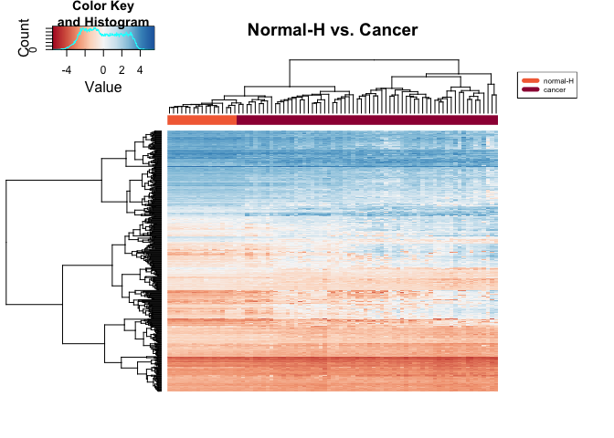
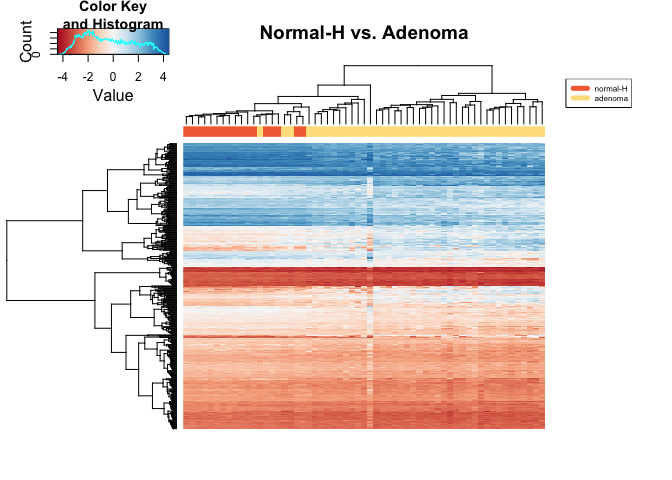
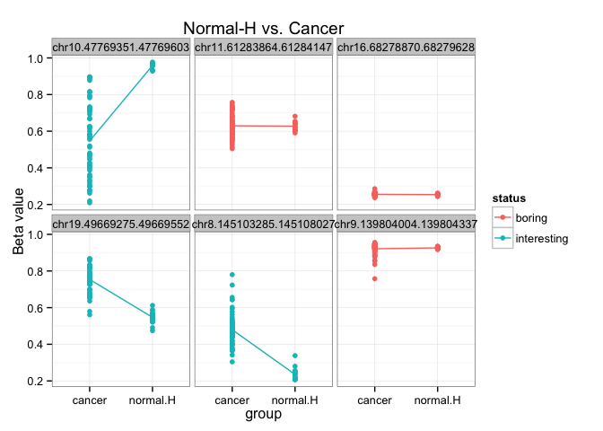

# Identifying DMR using limma
Eva Y  
April 4, 2015  

### Analysis goal: 
Get DMR between normal healthy samples and normal cancer, adenoma, and colorectal cancer samples. 


### Step 1: Attach packages for analysis

```r
library(ggplot2)
library(gplots)
library(limma)
library(RColorBrewer)
library(reshape2)
library(VennDiagram)
```


### Step 2: Useful functions

```r
# 01 rename sample labels
rename_samples <- function(data, metadata){
  paste(metadata$group, gsub("GSM", "", colnames(data)), sep="_")
}

# 02 make methylation data with only normal-H and normal-C/adenoma/cancer samples
prep_data <- function(data, metadata, sample1="", sample2="", 
                      sample3="", three.samples=FALSE){
  if (three.samples){
  d <- t(data)
  d <- data.frame(sample.id=rep(row.names(d)), 
                                metadata$group, d)
  d <- subset(d, 
              d$metadata.group %in% 
                c(sample1, sample2, sample3))
  
  d <- d[ ,-(2), drop=FALSE]
  row.names(d) <- d$sample.id
  d <- d[ ,-(1), drop=FALSE]
  d <- t(d)
  d  
  } else {
  d <- t(data)
  d <- data.frame(sample.id=rep(row.names(d)), 
                                metadata$group, d)
  d <- subset(d, 
              d$metadata.group %in% 
                c(sample1, sample2))
  
  d <- d[ ,-(2), drop=FALSE]
  row.names(d) <- d$sample.id
  d <- d[ ,-(1), drop=FALSE]
  d <- t(d)
  d
  }
}

# 03 make metadata
prep_metadata <- function(metadata, sample1="", sample2="", sample3="", 
                          level1="", level2="", level3="", regexp="", 
                          three.samples=FALSE, three.levels=FALSE){
  
  if (three.samples){
    metadata_subset <- subset(metadata, 
                               group %in% 
                                 c(sample1, sample2, sample3))
    metadata_subset$group <- gsub(regexp, "", metadata_subset$group)
    } else {
      metadata_subset <- subset(metadata, 
                               group %in% 
                                 c(sample1, sample2))
      metadata_subset$group <- gsub(regexp, "", metadata_subset$group)
    }
  
  if (three.levels){
    metadata_subset$group <- factor(metadata_subset$group, 
                                      levels=c(level1, level2, level3))
    } else {
      metadata_subset$group <- factor(metadata_subset$group, 
                                      levels=c(level1, level2))
    }
  metadata_subset
  }

# 04 perform limma DMA
do.limma <- function(data, design){
  # fit linear model
  fit <- lmFit(data, design)
  
  # apply eBayes() to moderate the estimated error variances
  ebfit <- eBayes(fit)
  
  # get output of the linear model
  top <- topTable(ebfit, number=Inf)
}

# 05 prepare design matrix for different sample pairs
prep_design <- function(metadata="", sample1="", sample2=""){
  metadata$group <- factor(metadata$group, levels=c(sample1, sample2))
  model.matrix(~group, metadata)
}

# 06 plot heatmap for DMR
plot_heatmap <- function(data, palette, labels, metadata, x=""){
  heatmap.2(as.matrix(data), col=palette, 
          trace="none", labRow=NA, labCol=NA,
          ColSideColors=labels[unclass(metadata$group)],
          main=x,
          margin=c(4,10))
  
  # add legend
  legend("topright", legend = levels(metadata$group),
       col=labels, ncol=1, lty=1, lwd=5, cex=0.5)
}

# 07 when given a list of cgi, returns a tall&skinny data frame
get_cgi <- function(data, metadata, int.list, bor.list){
  # get interesting hits
  int <- subset(data, row.names(data) %in% int.list)
  
  # get boring hits
  bor <- subset(data, row.names(data) %in% bor.list)
  
  # make tall and skinny data frame
  df <- rbind(int, bor)
  
  colnames(df) <- rename_samples(df, metadata) # rename colnames
  
  df <- data.frame(cgi=rep(row.names(df)), 
              status=rep(c("interesting", "boring"), each=3), df)
  df <- melt(df, id.vars=c("cgi", "status"), 
             variable.name="sample", value.name="MValue")
  df <- data.frame(df, group=df$sample)
  
  # get rid of "_\\d"
  df$group <- sub("[_]\\d+", "", df$group)
  df
}
```


### Step 3: Load and explore data

```r
# load m values and remove NAs
load("../../data/GSE48684_raw_filtered.m.norm.cgi.Rdata")
str(M.norm.CGI, max.level=0)
```

```
## 'data.frame':	26403 obs. of  147 variables:
##   [list output truncated]
```

```r
M.norm.CGI.rmna <- M.norm.CGI[complete.cases(M.norm.CGI), ]
str(M.norm.CGI.rmna, max.level=0)
```

```
## 'data.frame':	26363 obs. of  147 variables:
##   [list output truncated]
```

```r
# save this
save(M.norm.CGI.rmna, file="M.norm.CGI.rmna.Rdata")

# load beta values and remove NAs
load("../../data/GSE48684_raw_filtered.beta.norm.cgi.Rdata")
str(beta.norm.CGI, max.level=0)
```

```
## 'data.frame':	26403 obs. of  147 variables:
##   [list output truncated]
```

```r
B.norm.CGI.rmna <- beta.norm.CGI[complete.cases(beta.norm.CGI), ]
str(B.norm.CGI.rmna, max.level=0)
```

```
## 'data.frame':	26363 obs. of  147 variables:
##   [list output truncated]
```

```r
# save this
save(B.norm.CGI.rmna, file="B.norm.CGI.rmna.Rdata")

# load metadata
load("../../data/metadata.Rdata")
str(metadata, max.level=0)
```

```
## 'data.frame':	147 obs. of  7 variables:
```


### Step 4: Data preparation
We want to get DMR between normal healthy samples and normal cancer, adenoma, and colorectal cancer samples. Let's prepare the datasets for that.

```r
## normal-H vs. cancer
# make expression data with only normal-H and cancer samples
normH_cancer <- prep_data (M.norm.CGI.rmna, metadata, sample1="normal-H", 
                sample2="cancer", three.samples=FALSE)
  
# make metadata with only normal-H and cancer samples
metadata_normH_cancer <- prep_metadata(metadata, sample1="normal-H", 
                                       sample2="cancer", level1="normal-H", 
                                       level2="cancer", regexp="", 
                                       three.samples=FALSE, three.levels=FALSE)
                      
## normal-H vs. normal-C
# make expression data with only normal-H and normal-C samples
normH_normC <- prep_data (M.norm.CGI.rmna, metadata, sample1="normal-H", 
                sample2="normal-C", three.samples=FALSE)

# make metadata with only normal-H and normal-C samples
metadata_normH_normC <- prep_metadata(metadata, sample1="normal-H", 
                                       sample2="normal-C", level1="normal-H", 
                                       level2="normal-C", regexp="", 
                                       three.samples=FALSE, three.levels=FALSE)

## normal-H vs. adenoma
# make expression data with only normal-H and adenoma samples
normH_adenoma <- prep_data (M.norm.CGI.rmna, metadata, sample1="normal-H", 
                sample2="adenoma", three.samples=FALSE)

# make metadata with only normal-H and normal-C samples
metadata_normH_adenoma <- prep_metadata(metadata, sample1="normal-H", 
                                       sample2="adenoma", level1="normal-H", 
                                       level2="adenoma", regexp="", 
                                       three.samples=FALSE, three.levels=FALSE)
```


### Step 5: Perform DMA using `limma`

Make design matrix for different sample pairs.

```r
# normal-H vs. cancer
design_normH_cancer <- prep_design(metadata=metadata_normH_cancer, 
                                   sample1="normal-H", sample2="cancer")

# normal-H vs. normal-C
design_normH_normC <- prep_design(metadata=metadata_normH_normC, 
                                   sample1="normal-H", sample2="normal-C")

# normal-H vs. adenoma
design_normH_adenoma <- prep_design(metadata=metadata_normH_adenoma,
                                   sample1="normal-H", sample2="adenoma")
```

Perform DMA using `limma`.

```r
# normal-H vs. cancer
normH_cancer_dma <- do.limma(normH_cancer, design_normH_cancer)

# normal-H vs. normal-C
normH_normC_dma <- do.limma(normH_normC, design_normH_normC)

# normal-H vs. adenoma
normH_adenoma_dma <- do.limma(normH_adenoma, design_normH_adenoma)

# save DMA results
save(normH_cancer_dma, file="normH_cancer_dma.Rdata")
save(normH_normC_dma, file="normH_normC_dma.Rdata")
save(normH_adenoma_dma, file="normH_adenoma_dma.Rdata")
```


### Step 6: Pick differentially methylated regions at FDR < 1e-04

```r
# how many DMR are there at FDR < 1e-05?
normH_cancer_dmr <- subset(normH_cancer_dma, adj.P.Val < 1e-03)
nrow(normH_cancer_dmr)
```

```
## [1] 3934
```

```r
normH_normC_dmr <- subset(normH_normC_dma, adj.P.Val < 1e-03)
nrow(normH_normC_dmr)
```

```
## [1] 50
```

```r
normH_adenoma_dmr <- subset(normH_adenoma_dma, adj.P.Val < 1e-03)
nrow(normH_adenoma_dmr) 
```

```
## [1] 9392
```


### Step 7: Explore DMA and visualize DMR

What are the shared DMR between these different sample pairs analyses?

```r
# assign names to the lists for plotting
dmr <- list(normal.cancer=row.names(normH_normC_dmr), 
            adenoma=row.names(normH_adenoma_dmr), 
            cancer=row.names(normH_cancer_dmr))

# start a new plot
plot.new()

# draw the Venn diagram
venn.plot <- venn.diagram(dmr, filename = NULL, 
                          fill = c("red", "blue", "green"))

# draw the plot on the screen
grid.draw(venn.plot)
```

 

Plot heatmap for each DMR list.

```r
# color palette 
jRdBu <- colorRampPalette(brewer.pal(n=9, "RdBu"))
palette.size <- 256
jRdBu.palette <- jRdBu(palette.size)

# specify color labels for different samples
sample.cancer <- brewer.pal(11, "Spectral")[c(3,1)]
sample.normC <- brewer.pal(11, "Spectral")[c(3,9)]
sample.adenoma <- brewer.pal(11, "Spectral")[c(3,5)]

# create data frame for heatmap.2
# normH vs. cancer
hmap_normHcancer <- subset(normH_cancer, 
                           row.names(normH_cancer) %in% 
                             row.names(normH_cancer_dmr))
hmap_normHcancer <- hmap_normHcancer[1:450, ]

# normH vs. normC
hmap_normHnormC <- subset(normH_normC, 
                           row.names(normH_normC) %in% 
                             row.names(normH_normC_dmr))

# normH vs. adenoma
hmap_normHadenoma <- subset(normH_adenoma, 
                           row.names(normH_adenoma) %in% 
                             row.names(normH_adenoma_dmr))
hmap_normHadenoma <- hmap_normHadenoma[1:450, ]

# plot heatmaps
plot_heatmap(hmap_normHcancer, jRdBu.palette, sample.cancer, 
             metadata_normH_cancer, x="Normal-H vs. Cancer")
```

 

```r
plot_heatmap(hmap_normHnormC, jRdBu.palette, sample.normC, 
             metadata_normH_normC, x="Normal-H vs. Normal-C")
```

 

```r
plot_heatmap(hmap_normHadenoma, jRdBu.palette, sample.adenoma, 
             metadata_normH_adenoma, x="Normal-H vs. Adenoma")
```

 

Plot some interesting and boring hits for each DMA. 

```r
# normal-H vs. cancer
int.list <- head(row.names(normH_cancer_dma), 3)
bor.list <- tail(row.names(normH_cancer_dma), 3)
normH_cancer_cgi <- get_cgi(normH_cancer, metadata_normH_cancer, 
                            int.list, bor.list)

# plot
ggplot(normH_cancer_cgi, aes(x=group, y=MValue, color=status)) +
  geom_point() + 
  facet_wrap(~cgi) +
  theme_bw() +
  stat_summary(aes(group=1), fun.y=mean, geom="line") +
  ggtitle("Normal-H vs. Cancer")
```

 

```r
ggsave(file="normH_cancer_cgi.png", dpi=300)
```

```
## Saving 7 x 5 in image
```

```r
# normal-H vs. normal-C
int.list <- head(row.names(normH_normC_dma), 3)
bor.list <- tail(row.names(normH_normC_dma), 3)
normH_normC_cgi <- get_cgi(normH_normC, metadata_normH_normC,
                           int.list, bor.list)

# plot
ggplot(normH_normC_cgi, aes(x=group, y=MValue, color=status)) +
  geom_point() + 
  facet_wrap(~cgi) +
  theme_bw() +
  stat_summary(aes(group=1), fun.y=mean, geom="line") +
  ggtitle("Normal-H vs. Normal-C")
```

 

```r
ggsave(file="normH_normC_cgi.png", dpi=300)
```

```
## Saving 7 x 5 in image
```

```r
# normal-H vs. adenoma
int.list <- head(row.names(normH_adenoma_dma), 3)
bor.list <- tail(row.names(normH_adenoma_dma), 3)
normH_adenoma_cgi <- get_cgi(normH_adenoma, metadata_normH_adenoma,
                             int.list, bor.list)

# plot
ggplot(normH_adenoma_cgi, aes(x=group, y=MValue, color=status)) +
  geom_point() + 
  facet_wrap(~cgi) +
  theme_bw() +
  stat_summary(aes(group=1), fun.y=mean, geom="line") +
  ggtitle("Normal-H vs. Adenoma")
```

 

```r
ggsave(file="normH_adenoma_cgi.png", dpi=300)
```

```
## Saving 7 x 5 in image
```

Looks pretty good now!

Try with beta values.  

```r
# prepare datasets
normH_cancer_beta <- prep_data(B.norm.CGI.rmna, metadata, 
                               sample1="normal-H", sample2="cancer",
                               three.samples=FALSE)

normH_normC_beta <- prep_data(B.norm.CGI.rmna, metadata, 
                               sample1="normal-H", sample2="normal-C",
                               three.samples=FALSE)

normH_adenoma_beta <- prep_data(B.norm.CGI.rmna, metadata, 
                               sample1="normal-H", sample2="adenoma",
                               three.samples=FALSE)

# prepare tall and skinny data frame
# normal-H vs. cancer
int.list <- head(row.names(normH_cancer_dma), 3)
bor.list <- tail(row.names(normH_cancer_dma), 3)
normH_cancer_beta_cgi <- get_cgi(normH_cancer_beta, metadata_normH_cancer,
                                 int.list, bor.list)

# normal-H vs. normal-C
int.list <- head(row.names(normH_normC_dma), 3)
bor.list <- tail(row.names(normH_normC_dma), 3)
normH_normC_beta_cgi <- get_cgi(normH_normC_beta, metadata_normH_normC,
                                int.list, bor.list)

# normal-H vs. adenoma
int.list <- head(row.names(normH_adenoma_dma), 3)
bor.list <- tail(row.names(normH_adenoma_dma), 3)
normH_adenoma_beta_cgi <- get_cgi(normH_adenoma_beta, metadata_normH_adenoma,
                                  int.list, bor.list)

# plot
ggplot(normH_cancer_beta_cgi, aes(x=group, y=MValue, color=status)) +
  geom_point() + 
  facet_wrap(~cgi) +
  theme_bw() +
  stat_summary(aes(group=1), fun.y=mean, geom="line") +
  ylab("Beta value") +
  ggtitle("Normal-H vs. Cancer")
```

 

```r
ggplot(normH_normC_beta_cgi, aes(x=group, y=MValue, color=status)) +
  geom_point() + 
  facet_wrap(~cgi) +
  theme_bw() +
  stat_summary(aes(group=1), fun.y=mean, geom="line") +
  ylab("Beta value") +
  ggtitle("Normal-H vs. Normal-C")
```

 

```r
ggplot(normH_adenoma_beta_cgi, aes(x=group, y=MValue, color=status)) +
  geom_point() + 
  facet_wrap(~cgi) +
  theme_bw() +
  stat_summary(aes(group=1), fun.y=mean, geom="line") +
  ylab("Beta value") +
  ggtitle("Normal-H vs. Adenoma")
```

 


## Summary

- Before I fixed my code:
Guys, I hate to say this but we have a problem. 
I think we have two options. We could either pool our normal samples together given that they cluster together in the unsupervised hierarchical clustering or we could downsize the cancer and adenoma samples. 

- After I fixed my code: 
Results are not that bad after all. It's
