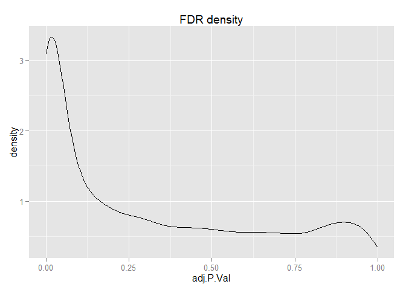
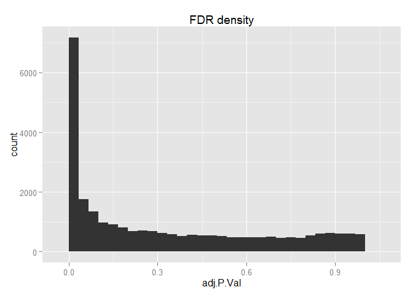
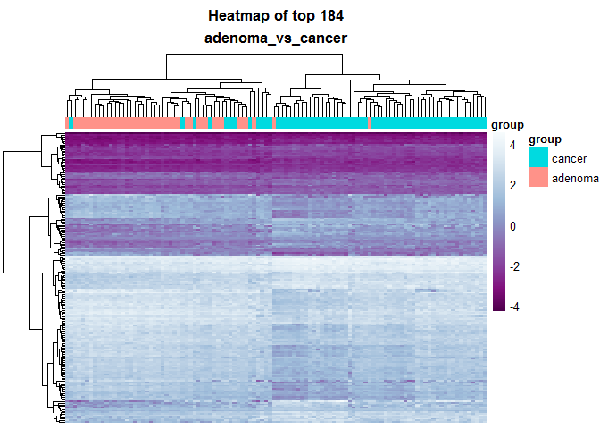

# LIMMA_analysis: adenoma vs cancer
Beryl Zhuang  
Sunday, April 05, 2015  
#### Differential methylation analysis comparing adenoma vs cancer


*LIMMA codes are writen by Ka Ming. The codes are modified for this analysis.


```r
library(dplyr)
```

```
## 
## Attaching package: 'dplyr'
## 
## The following object is masked from 'package:stats':
## 
##     filter
## 
## The following objects are masked from 'package:base':
## 
##     intersect, setdiff, setequal, union
```

```r
library(limma)
library(ggplot2)
```


```r
source("../../rscripts/helper_functions.R")
```


```r
# codes from Ka Ming

# loading the norm. CGI.
M.norm.CGI.path <- "../../data/GSE48684_raw_filtered.m.norm.cgi.Rdata"
load(M.norm.CGI.path)
M.norm.CGI <- na.omit(M.norm.CGI)

# load the metadata
metadata.path <- "../../data/metadata.Rdata"
load(metadata.path)

# sanity check
head(M.norm.CGI)
```

```
##                          GSM1183439  GSM1183440 GSM1183441 GSM1183442
## chr1:10003165-10003585   -2.6552923 -2.59856415 -2.5445386 -2.5589572
## chr1:1002663-1005318     -0.4691256 -0.09143954 -0.2533638 -0.2153825
## chr1:100315420-100316009 -3.2051837 -3.28066606 -3.1908783 -3.3171275
## chr1:100435297-100436070 -2.6509063 -2.53842308 -2.3740902 -2.6930074
## chr1:100503482-100504404 -2.5912106 -2.61793251 -2.5333289 -2.6985588
## chr1:10057121-10058108   -1.8793069 -1.60397303 -1.9452079 -1.4107345
##                           GSM1183443 GSM1183444 GSM1183445 GSM1183446
## chr1:10003165-10003585   -2.55737653 -2.5826043 -2.4911736  -2.554945
## chr1:1002663-1005318     -0.09556418 -0.1394251 -0.9472826  -0.156273
## chr1:100315420-100316009 -3.44138495 -3.2638314 -3.5903340  -3.175695
## chr1:100435297-100436070 -2.58548225 -2.6448828 -2.8978879  -2.530715
## chr1:100503482-100504404 -2.77076081 -2.7414266 -2.8660505  -2.676452
## chr1:10057121-10058108   -1.89517507 -2.1822275 -2.7476044  -1.366660
##                          GSM1183447 GSM1183448 GSM1183449 GSM1183450
## chr1:10003165-10003585   -2.8167373 -2.6015900 -2.7326851  -2.687569
## chr1:1002663-1005318     -0.9355684 -0.5594806 -0.9262892  -1.276605
## chr1:100315420-100316009 -3.7200904 -3.4311690 -3.5356330  -3.462461
## chr1:100435297-100436070 -2.9591127 -2.7513380 -2.9045330  -2.883730
## chr1:100503482-100504404 -2.7442432 -2.7249048 -2.7322991  -2.698558
## chr1:10057121-10058108   -2.7962893 -1.6385844 -2.9030710  -3.324011
##                          GSM1183451 GSM1183452 GSM1183453 GSM1183454
## chr1:10003165-10003585    -2.739601 -2.3145316 -2.4420093 -2.5683021
## chr1:1002663-1005318      -0.547058  0.2199845  0.1354862 -0.1364899
## chr1:100315420-100316009  -3.476851 -3.2057071 -3.1883463 -3.4435985
## chr1:100435297-100436070  -3.013518 -1.7599024 -1.9642126 -2.5990879
## chr1:100503482-100504404  -2.841048 -2.3777453 -2.4337830 -2.5278606
## chr1:10057121-10058108    -2.548544 -1.3898947 -1.7715518 -2.2878826
##                          GSM1183455 GSM1183456 GSM1183457 GSM1183458
## chr1:10003165-10003585   -2.5611068 -2.6112883 -2.9289910 -2.5701139
## chr1:1002663-1005318      0.0855106 -0.1495479 -0.2503045 -0.8035391
## chr1:100315420-100316009 -3.5442221 -3.3321487 -3.4719609 -3.3151074
## chr1:100435297-100436070 -2.9532561 -2.5944388 -2.7733070 -2.8305448
## chr1:100503482-100504404 -2.7577497 -2.6674068 -2.7293921 -2.6465480
## chr1:10057121-10058108   -1.8906351 -2.2961952 -0.7416368 -2.7446878
##                          GSM1183459 GSM1183460 GSM1183461 GSM1183462
## chr1:10003165-10003585   -2.5928901 -2.3889526 -2.6460887 -2.7231261
## chr1:1002663-1005318     -0.0978623 -0.5153299 -0.1302912 -0.2164913
## chr1:100315420-100316009 -3.1202442 -3.1034921 -3.3016168 -3.4521085
## chr1:100435297-100436070 -2.3362214 -2.3185678 -2.5481766 -2.5349049
## chr1:100503482-100504404 -2.6162707 -2.3970941 -2.7532512 -2.7130206
## chr1:10057121-10058108   -2.2802288 -2.7551910 -2.5061829 -0.4842863
##                          GSM1183463 GSM1183464 GSM1183465 GSM1183466
## chr1:10003165-10003585   -2.5491017 -2.4576876 -2.6634236 -2.6269710
## chr1:1002663-1005318      0.1777277  0.2527131  0.1042947 -0.4701124
## chr1:100315420-100316009 -3.2860087 -3.2898758 -3.2739430 -3.3949594
## chr1:100435297-100436070 -2.4025642 -2.3717973 -2.2822308 -2.6972064
## chr1:100503482-100504404 -2.6531850 -2.6213044 -2.6589155 -2.8621837
## chr1:10057121-10058108   -1.7501278 -0.9031143 -1.4175589 -2.5515072
##                          GSM1183467 GSM1183468 GSM1183469 GSM1183470
## chr1:10003165-10003585   -2.5975998 -2.5412295 -2.4850925 -2.4145797
## chr1:1002663-1005318     -0.1106584 -0.3974871 -0.1186928 -0.4646606
## chr1:100315420-100316009 -3.3165319 -3.2531491 -3.0885286 -3.3201661
## chr1:100435297-100436070 -2.7201684 -2.6577729 -2.6383212 -2.6271861
## chr1:100503482-100504404 -2.7140042 -2.6688105 -2.6891018 -2.5954421
## chr1:10057121-10058108   -1.9689749 -2.1921074 -2.1734550 -2.1911826
##                          GSM1183471 GSM1183472  GSM1183473 GSM1183474
## chr1:10003165-10003585   -2.5213979  -2.466313 -2.55134704 -2.4765215
## chr1:1002663-1005318     -0.2727839  -0.204244  0.04854337 -0.3592211
## chr1:100315420-100316009 -3.2953992  -3.218619 -3.28942467 -3.4000418
## chr1:100435297-100436070 -2.5079133  -2.562802 -2.69858064 -2.6323302
## chr1:100503482-100504404 -2.6814858  -2.463127 -2.67413839 -2.8827299
## chr1:10057121-10058108   -1.9749580  -2.118518 -1.98687058 -1.6137291
##                          GSM1183475 GSM1183476 GSM1183477 GSM1183478
## chr1:10003165-10003585   -2.5553456 -2.5007390 -2.5346772 -2.5382355
## chr1:1002663-1005318     -0.2639951 -0.3881833 -0.1877652 -0.2008505
## chr1:100315420-100316009 -3.3787453 -3.3049143 -3.2620533 -3.2547827
## chr1:100435297-100436070 -2.6092785 -2.6791712 -2.6729198 -2.6679753
## chr1:100503482-100504404 -2.7651728 -2.7097997 -2.7011483 -2.6685389
## chr1:10057121-10058108   -1.9800005 -2.2907397 -1.6842134 -2.2742424
##                           GSM1183479 GSM1183480 GSM1183481 GSM1183482
## chr1:10003165-10003585   -2.78934539 -2.4393726  -2.470685 -2.4599626
## chr1:1002663-1005318      0.03098998 -0.3446402  -0.356047 -0.2735848
## chr1:100315420-100316009 -3.22150296 -3.2752470  -3.283137 -3.2123623
## chr1:100435297-100436070 -2.49583434 -2.6676062  -2.679606 -2.6550079
## chr1:100503482-100504404 -2.66726367 -2.8328728  -2.624475 -2.7429252
## chr1:10057121-10058108   -1.90776652 -2.5284930  -2.390040 -2.4086346
##                          GSM1183483  GSM1183484 GSM1183485 GSM1183486
## chr1:10003165-10003585   -2.6406160 -2.70045313 -2.7033185 -2.6432762
## chr1:1002663-1005318      0.1419676  0.02287766 -0.2400202 -0.0466823
## chr1:100315420-100316009 -3.2889347 -3.48242760 -3.2918360 -3.3131523
## chr1:100435297-100436070 -2.4959864 -2.78518605 -2.5886347 -2.5103397
## chr1:100503482-100504404 -2.8480882 -2.70227145 -2.8255920 -2.5938201
## chr1:10057121-10058108   -2.1335111 -2.58234107 -1.7365505 -2.1008323
##                          GSM1183487 GSM1183488 GSM1183489 GSM1183490
## chr1:10003165-10003585   -2.1723282 -2.4762976 -2.7209445 -2.6450045
## chr1:1002663-1005318      0.3671142 -0.2484297  0.1206241  0.1053612
## chr1:100315420-100316009 -2.8700148 -3.1976002 -3.0185030 -2.9115272
## chr1:100435297-100436070 -2.0898900 -2.6466377 -2.3003844 -2.3822229
## chr1:100503482-100504404 -2.3997197 -2.7176038 -2.5165885 -2.6060197
## chr1:10057121-10058108   -1.7340586 -2.0591488 -2.0783172 -1.6675826
##                          GSM1183491 GSM1183492 GSM1183493 GSM1183494
## chr1:10003165-10003585   -2.6654612 -2.3219709 -2.4483201 -2.5511022
## chr1:1002663-1005318      0.3462601  0.4469207  0.1254926 -0.5048053
## chr1:100315420-100316009 -3.1088263 -2.9417798 -3.4914174 -3.3202710
## chr1:100435297-100436070 -2.3348525 -2.0809495 -2.4237925 -2.4554246
## chr1:100503482-100504404 -2.6348955 -2.4477740 -2.7663400 -2.9570593
## chr1:10057121-10058108   -2.0751118 -1.8962422 -1.7759178 -2.1877155
##                           GSM1183495  GSM1183496  GSM1183497  GSM1183498
## chr1:10003165-10003585   -2.63486408 -2.48162177 -2.47640016 -2.58026479
## chr1:1002663-1005318     -0.06303079 -0.02946225 -0.09298967 -0.08300383
## chr1:100315420-100316009 -3.30801504 -3.18349564 -3.32868542 -3.30487740
## chr1:100435297-100436070 -2.55596834 -2.52263929 -2.71459787 -2.58571296
## chr1:100503482-100504404 -2.68080449 -2.76371740 -2.82548106 -2.97470935
## chr1:10057121-10058108   -1.83718920 -2.17762440 -2.30781157 -2.10909408
##                           GSM1183499 GSM1183500 GSM1183501 GSM1183502
## chr1:10003165-10003585   -2.63209567 -2.4744933 -2.4949798 -2.5833351
## chr1:1002663-1005318     -0.03106036 -0.3583119 -0.3324479 -0.2687182
## chr1:100315420-100316009 -3.34801905 -3.3203624 -3.2989031 -3.2702818
## chr1:100435297-100436070 -2.73638456 -2.6032170 -2.6614142 -2.7622146
## chr1:100503482-100504404 -2.73326044 -2.7836071 -2.6894563 -2.7985445
## chr1:10057121-10058108   -2.27761366 -2.0391860 -2.5430220 -2.3298607
##                          GSM1183503 GSM1183504 GSM1183505 GSM1183506
## chr1:10003165-10003585   -2.3760920 -2.5018222 -2.5406260 -2.6798983
## chr1:1002663-1005318     -0.5727622 -0.5142741 -0.3024174 -0.7474327
## chr1:100315420-100316009 -3.5542411 -3.2108034 -3.3840248 -3.5504974
## chr1:100435297-100436070 -2.6699468 -2.6373828 -2.6761145 -2.9711555
## chr1:100503482-100504404 -2.6357915 -2.6687809 -2.7204119 -2.8171362
## chr1:10057121-10058108   -2.4608661 -2.5729041 -2.3695044 -2.8156203
##                          GSM1183507 GSM1183508 GSM1183509 GSM1183510
## chr1:10003165-10003585   -2.4892827 -2.8071124 -2.6441459 -2.5450091
## chr1:1002663-1005318     -0.6555263 -0.6368511 -0.5938308 -0.5133373
## chr1:100315420-100316009 -3.5385598 -3.6574768 -3.4092673 -3.3552417
## chr1:100435297-100436070 -3.0219965 -3.0268029 -2.7734492 -2.6306042
## chr1:100503482-100504404 -2.8428973 -2.8916099 -2.7695231 -2.5695898
## chr1:10057121-10058108   -2.5254960 -2.3954471 -2.8763173 -2.8564190
##                          GSM1183511 GSM1183512 GSM1183513   GSM1183514
## chr1:10003165-10003585   -2.3345401 -2.4611793 -2.5232826 -2.794565724
## chr1:1002663-1005318     -0.5646612 -0.6593965 -0.3996432 -0.893026075
## chr1:100315420-100316009 -3.3974549 -3.4518730 -3.3672605 -3.590974285
## chr1:100435297-100436070 -2.6486824 -3.0160474 -2.5688085 -2.871634800
## chr1:100503482-100504404 -2.8023253 -2.8171447 -2.6757521 -2.839093719
## chr1:10057121-10058108   -2.1076040 -2.8274641 -2.5582427 -0.004961779
##                          GSM1183515 GSM1183516  GSM1183517 GSM1183518
## chr1:10003165-10003585   -2.5574941 -2.4817320 -2.70980738 -2.4192976
## chr1:1002663-1005318      0.1908337 -0.3539109 -1.25742650 -0.2876498
## chr1:100315420-100316009 -3.1601333 -3.3948670 -3.39826153 -3.1621329
## chr1:100435297-100436070 -2.6326338 -2.8575446 -2.81982492 -2.5290203
## chr1:100503482-100504404 -2.7675520 -2.7245740 -2.86439386 -2.5466905
## chr1:10057121-10058108   -2.7167976 -2.4120587  0.02238012 -2.2057753
##                          GSM1183519 GSM1183520 GSM1183521 GSM1183522
## chr1:10003165-10003585   -2.8827217  -2.516365 -2.4537406 -2.6946777
## chr1:1002663-1005318     -0.3800922   0.487411 -0.1899291 -0.6922016
## chr1:100315420-100316009 -3.4278863  -3.180156 -3.3113328 -3.2982204
## chr1:100435297-100436070 -2.7879821  -2.160308 -2.7512474 -2.8967630
## chr1:100503482-100504404 -2.5341330  -2.466457 -2.7391940 -2.9843558
## chr1:10057121-10058108   -2.7943131  -1.627597 -2.6084962 -2.7768410
##                          GSM1183523 GSM1183524 GSM1183525 GSM1183526
## chr1:10003165-10003585   -2.4622112 -2.5451917 -2.6681450 -2.8270665
## chr1:1002663-1005318     -0.3450193 -0.4116018  0.1524643 -0.9742143
## chr1:100315420-100316009 -3.5347077 -3.3356859 -3.2475622 -3.6032944
## chr1:100435297-100436070 -2.7015844 -2.6075023 -2.4573471 -2.9766122
## chr1:100503482-100504404 -2.7011248 -2.5565389 -2.7428883 -2.8149033
## chr1:10057121-10058108   -2.3584792 -2.3597911 -1.9721684 -3.0843057
##                          GSM1183527  GSM1183528 GSM1183529  GSM1183530
## chr1:10003165-10003585    -2.715084 -2.51442884 -2.5722132 -2.51044935
## chr1:1002663-1005318      -1.052124 -0.07902266 -0.1090344 -0.08058042
## chr1:100315420-100316009  -3.577829 -3.25446329 -3.3411582 -3.40226436
## chr1:100435297-100436070  -3.096443 -2.51894210 -2.5145817 -2.78800177
## chr1:100503482-100504404  -2.786104 -2.52975089 -2.6832643 -2.61647446
## chr1:10057121-10058108    -2.856401 -2.35051733 -2.0999465 -2.45045802
##                          GSM1183531 GSM1183532 GSM1183533 GSM1183534
## chr1:10003165-10003585   -2.5230189 -2.4772421 -2.5054475 -2.5991168
## chr1:1002663-1005318     -0.7695092 -0.9591101 -0.5369419 -0.5766602
## chr1:100315420-100316009 -3.3759884 -3.5681969 -3.2956107 -3.3664893
## chr1:100435297-100436070 -2.7818569 -2.8156503 -2.5494621 -2.6290269
## chr1:100503482-100504404 -2.6662381 -2.7690945 -2.5586073 -2.7199332
## chr1:10057121-10058108   -2.6505661 -2.6469958 -2.2942003 -2.6646535
##                          GSM1183535 GSM1183536 GSM1183537 GSM1183538
## chr1:10003165-10003585    -2.363892  -2.666929  -2.616571 -2.5416443
## chr1:1002663-1005318      -0.154614  -1.045520  -1.254954 -0.8628501
## chr1:100315420-100316009  -3.383797  -3.531605  -3.549230 -3.4468167
## chr1:100435297-100436070  -2.777329  -2.977179  -2.886160 -2.7070430
## chr1:100503482-100504404  -2.684621  -2.946696  -2.937330 -2.7255946
## chr1:10057121-10058108    -2.439123  -1.864672  -2.005083 -2.9946131
##                          GSM1183539 GSM1183540 GSM1183541 GSM1183542
## chr1:10003165-10003585   -2.8752842 -2.4306625 -2.5951367  -2.676305
## chr1:1002663-1005318     -0.5308050  0.2092777 -0.1439707  -1.074767
## chr1:100315420-100316009 -3.5223805 -3.2474810 -3.1633167  -3.499562
## chr1:100435297-100436070 -2.7828174 -2.6042976 -2.3120103  -2.978451
## chr1:100503482-100504404 -2.9606268 -2.6586909 -2.6340278  -3.017156
## chr1:10057121-10058108   -0.8160312 -1.7308273 -2.5610825  -2.911221
##                          GSM1183543  GSM1183544 GSM1183545 GSM1183546
## chr1:10003165-10003585   -2.4328712 -2.68895993 -2.4035817 -2.7173873
## chr1:1002663-1005318     -0.5943623 -0.04813778  0.3884715 -0.3234209
## chr1:100315420-100316009 -3.3082008 -3.19362168 -3.1150482 -3.4909309
## chr1:100435297-100436070 -2.7679585 -2.45400458 -2.1515453 -2.6983911
## chr1:100503482-100504404 -2.5032138 -2.69788563 -2.6480267 -2.9672095
## chr1:10057121-10058108   -2.8442728 -1.89665624 -1.8706002 -2.0210757
##                          GSM1183547  GSM1183548 GSM1183549 GSM1183550
## chr1:10003165-10003585   -2.4708077 -2.67047241  -2.873039  -2.902766
## chr1:1002663-1005318     -0.1919004 -0.05228926  -1.225704  -1.020126
## chr1:100315420-100316009 -3.4013430 -3.30489431  -3.534048  -3.648111
## chr1:100435297-100436070 -2.6156074 -2.37281582  -3.085966  -2.986475
## chr1:100503482-100504404 -2.7828367 -2.67066895  -3.019369  -2.945886
## chr1:10057121-10058108   -2.2382613 -2.38875900  -2.206652  -2.058766
##                          GSM1183551 GSM1183552 GSM1183553  GSM1183554
## chr1:10003165-10003585   -2.6086813 -2.2954377 -2.4534002 -2.59945570
## chr1:1002663-1005318     -0.4032427  0.3948961  0.1173246  0.01771181
## chr1:100315420-100316009 -3.4765112 -3.0633456 -3.2935863 -3.26522873
## chr1:100435297-100436070 -2.6783351 -2.0686436 -2.4689794 -2.49531811
## chr1:100503482-100504404 -2.9638341 -2.4317759 -2.6365286 -2.67921463
## chr1:10057121-10058108   -2.3911001 -2.0523751 -1.7506630 -2.19764846
##                          GSM1183555  GSM1183556 GSM1183557   GSM1183558
## chr1:10003165-10003585   -2.7170612 -2.47360455 -2.7437807 -2.793726717
## chr1:1002663-1005318      0.0363121  0.02016923 -0.5060306 -1.417894319
## chr1:100315420-100316009 -3.5089492 -3.36980796 -3.3420403 -3.535314747
## chr1:100435297-100436070 -2.5036881 -2.75306404 -2.7442860 -3.275508203
## chr1:100503482-100504404 -2.6449797 -2.76934714 -2.6517998 -2.940411823
## chr1:10057121-10058108   -2.1389980 -2.56401695 -2.8584225 -0.001879325
##                           GSM1183559 GSM1183560 GSM1183561 GSM1235135
## chr1:10003165-10003585   -2.57914633 -2.8330552 -2.7309010 -2.6811757
## chr1:1002663-1005318     -0.04596533 -1.1547271 -0.8737399 -0.8261102
## chr1:100315420-100316009 -3.32159900 -3.7492971 -3.5794866 -3.4431519
## chr1:100435297-100436070 -2.52344354 -2.9957279 -2.7698383 -2.7759642
## chr1:100503482-100504404 -2.64300275 -3.0614550 -2.7066204 -2.8489858
## chr1:10057121-10058108   -1.96268277 -0.5575545 -1.7797307 -2.4014718
##                          GSM1235136 GSM1235137 GSM1235138 GSM1235139
## chr1:10003165-10003585   -2.6477766  -2.702564 -2.8023263 -2.4478487
## chr1:1002663-1005318     -0.3844503  -0.483281 -0.8482104 -0.3493395
## chr1:100315420-100316009 -3.4730226  -3.451509 -3.5055528 -3.3486040
## chr1:100435297-100436070 -2.7160374  -2.808582 -2.9682315 -2.6851538
## chr1:100503482-100504404 -2.8288185  -2.773447 -2.8228641 -2.7326488
## chr1:10057121-10058108   -1.7369457  -2.186193 -2.3280194 -2.2730317
##                          GSM1235140 GSM1235141 GSM1235142  GSM1235143
## chr1:10003165-10003585    -2.828660  -2.676493  -2.692334 -2.90152090
## chr1:1002663-1005318      -1.018976  -0.542397  -0.819848 -0.03415505
## chr1:100315420-100316009  -3.536803  -3.498916  -3.517102 -3.66291211
## chr1:100435297-100436070  -2.844221  -2.951094  -2.949362 -2.93604861
## chr1:100503482-100504404  -2.736433  -2.908117  -2.776179 -3.05398469
## chr1:10057121-10058108    -2.728394  -2.462111  -2.916486 -2.08641546
##                          GSM1235144 GSM1235145 GSM1235146 GSM1235147
## chr1:10003165-10003585    -2.862507 -2.5671695 -2.7707534 -2.6113458
## chr1:1002663-1005318      -1.429965 -0.3208506 -0.6404117 -0.7149859
## chr1:100315420-100316009  -3.735792 -3.5761870 -3.6200129 -3.4897598
## chr1:100435297-100436070  -3.105051 -2.6148847 -2.7674711 -2.5894137
## chr1:100503482-100504404  -2.908989 -2.8832492 -2.9253187 -2.7715724
## chr1:10057121-10058108    -1.103073 -2.0376414 -2.7294505 -2.3116782
##                          GSM1235148 GSM1235149 GSM1235150 GSM1235151
## chr1:10003165-10003585    -2.794790 -2.5643987  -2.626196 -2.3914945
## chr1:1002663-1005318      -0.195880 -0.8946123  -0.499279 -0.3712183
## chr1:100315420-100316009  -3.571170 -3.4136682  -3.344802 -3.6347130
## chr1:100435297-100436070  -2.791283 -2.8516547  -2.659318 -2.8817924
## chr1:100503482-100504404  -2.864650 -2.8154332  -2.801233 -2.7130548
## chr1:10057121-10058108    -2.507433 -2.3902709  -2.394794 -2.2583082
##                          GSM1235152 GSM1235153 GSM1235154 GSM1235155
## chr1:10003165-10003585   -2.6829868 -2.5431050 -2.6734087 -2.8229434
## chr1:1002663-1005318     -0.6720619 -0.3095247 -0.3535083 -0.9630747
## chr1:100315420-100316009 -3.6281184 -3.3301228 -3.3366841 -3.2905880
## chr1:100435297-100436070 -2.9513623 -2.6508038 -2.9213792 -2.8662826
## chr1:100503482-100504404 -2.7519088 -2.7644744 -2.8670847 -2.9335138
## chr1:10057121-10058108   -2.9960025 -2.3454842 -2.5402733 -2.8436313
##                          GSM1235156 GSM1235157 GSM1235158
## chr1:10003165-10003585   -2.5337367  -2.632813  -2.607099
## chr1:1002663-1005318     -0.6739876  -1.352517  -1.108535
## chr1:100315420-100316009 -3.4911129  -3.388591  -3.493868
## chr1:100435297-100436070 -2.6590959  -3.047235  -3.056798
## chr1:100503482-100504404 -2.7005638  -2.850698  -2.891250
## chr1:10057121-10058108   -2.5902250  -3.121232  -2.849576
```

```r
head(metadata)
```

```
##               group                                title geo_accession
## GSM1183439 normal-H Genomic DNA from normal individual 1    GSM1183439
## GSM1183440 normal-H Genomic DNA from normal individual 2    GSM1183440
## GSM1183441 normal-H Genomic DNA from normal individual 3    GSM1183441
## GSM1183442 normal-H Genomic DNA from normal individual 4    GSM1183442
## GSM1183443 normal-H Genomic DNA from normal individual 5    GSM1183443
## GSM1183444 normal-H Genomic DNA from normal individual 6    GSM1183444
##                       tissue colon_region gender stage
## GSM1183439 colorectal mucosa        colon   male  <NA>
## GSM1183440 colorectal mucosa        colon   male  <NA>
## GSM1183441 colorectal mucosa        colon female  <NA>
## GSM1183442 colorectal mucosa        colon   male  <NA>
## GSM1183443 colorectal mucosa        colon   male  <NA>
## GSM1183444 colorectal mucosa        colon   male  <NA>
```

```r
# function to perform limma to generate top table
limmaTopTables <- function(dat, des, file_name){
	myFit <- lmFit(dat, des)
	myEbFit <- eBayes(myFit)
	
	for (coeff in colnames(myEbFit$coefficients)[-1]){
		myTopTable <- topTable(myEbFit, number=nrow(dat), coef=c(coeff))
		
		save(myTopTable, file=file_name)
	}
}

# reorder factor level for `group`
metadata$group <- factor(metadata$group, levels=c("normal-H", "normal-C", "cancer", "adenoma"))
```


Subset the data and only keep normal-C and normal-H groups.
The design matrix is built only by normal-C and normal-H

```r
goal <- "adenoma_vs_cancer"
group_names <- c("adenoma","cancer")

# design matrix for limma on group
des <- metadata[which(metadata$group %in% group_names), ] %>% droplevels()
desMat.group <- model.matrix(~group, des)
desMat.group
```

```
##            (Intercept) groupadenoma
## GSM1183445           1            1
## GSM1183446           1            1
## GSM1183447           1            1
## GSM1183448           1            1
## GSM1183449           1            1
## GSM1183450           1            1
## GSM1183451           1            1
## GSM1183452           1            1
## GSM1183453           1            0
## GSM1183454           1            0
## GSM1183455           1            0
## GSM1183456           1            0
## GSM1183457           1            0
## GSM1183458           1            0
## GSM1183459           1            0
## GSM1183460           1            0
## GSM1183461           1            0
## GSM1183462           1            0
## GSM1183463           1            0
## GSM1183464           1            0
## GSM1183465           1            0
## GSM1183466           1            0
## GSM1183502           1            1
## GSM1183503           1            1
## GSM1183504           1            1
## GSM1183505           1            1
## GSM1183506           1            1
## GSM1183507           1            1
## GSM1183508           1            1
## GSM1183509           1            1
## GSM1183510           1            1
## GSM1183511           1            1
## GSM1183512           1            0
## GSM1183513           1            0
## GSM1183514           1            0
## GSM1183515           1            0
## GSM1183516           1            0
## GSM1183517           1            0
## GSM1183518           1            0
## GSM1183519           1            0
## GSM1183520           1            0
## GSM1183521           1            0
## GSM1183522           1            0
## GSM1183523           1            0
## GSM1183524           1            0
## GSM1183525           1            0
## GSM1183526           1            0
## GSM1183527           1            0
## GSM1183528           1            0
## GSM1183529           1            0
## GSM1183530           1            0
## GSM1183531           1            0
## GSM1183532           1            0
## GSM1183533           1            0
## GSM1183534           1            0
## GSM1183535           1            0
## GSM1183536           1            0
## GSM1183537           1            0
## GSM1183538           1            0
## GSM1183539           1            0
## GSM1183540           1            0
## GSM1183541           1            0
## GSM1183542           1            0
## GSM1183543           1            0
## GSM1183544           1            0
## GSM1183545           1            0
## GSM1183546           1            0
## GSM1183547           1            0
## GSM1183548           1            0
## GSM1183549           1            0
## GSM1183550           1            0
## GSM1183551           1            0
## GSM1183552           1            0
## GSM1183553           1            0
## GSM1183554           1            0
## GSM1183555           1            0
## GSM1183556           1            0
## GSM1183557           1            0
## GSM1183558           1            0
## GSM1183559           1            0
## GSM1183560           1            0
## GSM1183561           1            0
## GSM1235135           1            1
## GSM1235136           1            1
## GSM1235137           1            1
## GSM1235138           1            1
## GSM1235139           1            1
## GSM1235140           1            1
## GSM1235141           1            1
## GSM1235142           1            1
## GSM1235143           1            1
## GSM1235144           1            1
## GSM1235145           1            1
## GSM1235146           1            1
## GSM1235147           1            1
## GSM1235148           1            1
## GSM1235149           1            1
## GSM1235150           1            1
## GSM1235151           1            1
## GSM1235152           1            1
## GSM1235153           1            1
## GSM1235154           1            1
## GSM1235155           1            1
## GSM1235156           1            1
## GSM1235157           1            1
## GSM1235158           1            1
## attr(,"assign")
## [1] 0 1
## attr(,"contrasts")
## attr(,"contrasts")$group
## [1] "contr.treatment"
```

```r
group_subset <- as.character(metadata$geo_accession
														 [which(metadata$group %in% group_names)])
group_subset
```

```
##   [1] "GSM1183445" "GSM1183446" "GSM1183447" "GSM1183448" "GSM1183449"
##   [6] "GSM1183450" "GSM1183451" "GSM1183452" "GSM1183453" "GSM1183454"
##  [11] "GSM1183455" "GSM1183456" "GSM1183457" "GSM1183458" "GSM1183459"
##  [16] "GSM1183460" "GSM1183461" "GSM1183462" "GSM1183463" "GSM1183464"
##  [21] "GSM1183465" "GSM1183466" "GSM1183502" "GSM1183503" "GSM1183504"
##  [26] "GSM1183505" "GSM1183506" "GSM1183507" "GSM1183508" "GSM1183509"
##  [31] "GSM1183510" "GSM1183511" "GSM1183512" "GSM1183513" "GSM1183514"
##  [36] "GSM1183515" "GSM1183516" "GSM1183517" "GSM1183518" "GSM1183519"
##  [41] "GSM1183520" "GSM1183521" "GSM1183522" "GSM1183523" "GSM1183524"
##  [46] "GSM1183525" "GSM1183526" "GSM1183527" "GSM1183528" "GSM1183529"
##  [51] "GSM1183530" "GSM1183531" "GSM1183532" "GSM1183533" "GSM1183534"
##  [56] "GSM1183535" "GSM1183536" "GSM1183537" "GSM1183538" "GSM1183539"
##  [61] "GSM1183540" "GSM1183541" "GSM1183542" "GSM1183543" "GSM1183544"
##  [66] "GSM1183545" "GSM1183546" "GSM1183547" "GSM1183548" "GSM1183549"
##  [71] "GSM1183550" "GSM1183551" "GSM1183552" "GSM1183553" "GSM1183554"
##  [76] "GSM1183555" "GSM1183556" "GSM1183557" "GSM1183558" "GSM1183559"
##  [81] "GSM1183560" "GSM1183561" "GSM1235135" "GSM1235136" "GSM1235137"
##  [86] "GSM1235138" "GSM1235139" "GSM1235140" "GSM1235141" "GSM1235142"
##  [91] "GSM1235143" "GSM1235144" "GSM1235145" "GSM1235146" "GSM1235147"
##  [96] "GSM1235148" "GSM1235149" "GSM1235150" "GSM1235151" "GSM1235152"
## [101] "GSM1235153" "GSM1235154" "GSM1235155" "GSM1235156" "GSM1235157"
## [106] "GSM1235158"
```

```r
length(group_subset)
```

```
## [1] 106
```

```r
#####
dat <- M.norm.CGI[, group_subset] %>% droplevels()

head(dat)
```

```
##                          GSM1183445 GSM1183446 GSM1183447 GSM1183448
## chr1:10003165-10003585   -2.4911736  -2.554945 -2.8167373 -2.6015900
## chr1:1002663-1005318     -0.9472826  -0.156273 -0.9355684 -0.5594806
## chr1:100315420-100316009 -3.5903340  -3.175695 -3.7200904 -3.4311690
## chr1:100435297-100436070 -2.8978879  -2.530715 -2.9591127 -2.7513380
## chr1:100503482-100504404 -2.8660505  -2.676452 -2.7442432 -2.7249048
## chr1:10057121-10058108   -2.7476044  -1.366660 -2.7962893 -1.6385844
##                          GSM1183449 GSM1183450 GSM1183451 GSM1183452
## chr1:10003165-10003585   -2.7326851  -2.687569  -2.739601 -2.3145316
## chr1:1002663-1005318     -0.9262892  -1.276605  -0.547058  0.2199845
## chr1:100315420-100316009 -3.5356330  -3.462461  -3.476851 -3.2057071
## chr1:100435297-100436070 -2.9045330  -2.883730  -3.013518 -1.7599024
## chr1:100503482-100504404 -2.7322991  -2.698558  -2.841048 -2.3777453
## chr1:10057121-10058108   -2.9030710  -3.324011  -2.548544 -1.3898947
##                          GSM1183453 GSM1183454 GSM1183455 GSM1183456
## chr1:10003165-10003585   -2.4420093 -2.5683021 -2.5611068 -2.6112883
## chr1:1002663-1005318      0.1354862 -0.1364899  0.0855106 -0.1495479
## chr1:100315420-100316009 -3.1883463 -3.4435985 -3.5442221 -3.3321487
## chr1:100435297-100436070 -1.9642126 -2.5990879 -2.9532561 -2.5944388
## chr1:100503482-100504404 -2.4337830 -2.5278606 -2.7577497 -2.6674068
## chr1:10057121-10058108   -1.7715518 -2.2878826 -1.8906351 -2.2961952
##                          GSM1183457 GSM1183458 GSM1183459 GSM1183460
## chr1:10003165-10003585   -2.9289910 -2.5701139 -2.5928901 -2.3889526
## chr1:1002663-1005318     -0.2503045 -0.8035391 -0.0978623 -0.5153299
## chr1:100315420-100316009 -3.4719609 -3.3151074 -3.1202442 -3.1034921
## chr1:100435297-100436070 -2.7733070 -2.8305448 -2.3362214 -2.3185678
## chr1:100503482-100504404 -2.7293921 -2.6465480 -2.6162707 -2.3970941
## chr1:10057121-10058108   -0.7416368 -2.7446878 -2.2802288 -2.7551910
##                          GSM1183461 GSM1183462 GSM1183463 GSM1183464
## chr1:10003165-10003585   -2.6460887 -2.7231261 -2.5491017 -2.4576876
## chr1:1002663-1005318     -0.1302912 -0.2164913  0.1777277  0.2527131
## chr1:100315420-100316009 -3.3016168 -3.4521085 -3.2860087 -3.2898758
## chr1:100435297-100436070 -2.5481766 -2.5349049 -2.4025642 -2.3717973
## chr1:100503482-100504404 -2.7532512 -2.7130206 -2.6531850 -2.6213044
## chr1:10057121-10058108   -2.5061829 -0.4842863 -1.7501278 -0.9031143
##                          GSM1183465 GSM1183466 GSM1183502 GSM1183503
## chr1:10003165-10003585   -2.6634236 -2.6269710 -2.5833351 -2.3760920
## chr1:1002663-1005318      0.1042947 -0.4701124 -0.2687182 -0.5727622
## chr1:100315420-100316009 -3.2739430 -3.3949594 -3.2702818 -3.5542411
## chr1:100435297-100436070 -2.2822308 -2.6972064 -2.7622146 -2.6699468
## chr1:100503482-100504404 -2.6589155 -2.8621837 -2.7985445 -2.6357915
## chr1:10057121-10058108   -1.4175589 -2.5515072 -2.3298607 -2.4608661
##                          GSM1183504 GSM1183505 GSM1183506 GSM1183507
## chr1:10003165-10003585   -2.5018222 -2.5406260 -2.6798983 -2.4892827
## chr1:1002663-1005318     -0.5142741 -0.3024174 -0.7474327 -0.6555263
## chr1:100315420-100316009 -3.2108034 -3.3840248 -3.5504974 -3.5385598
## chr1:100435297-100436070 -2.6373828 -2.6761145 -2.9711555 -3.0219965
## chr1:100503482-100504404 -2.6687809 -2.7204119 -2.8171362 -2.8428973
## chr1:10057121-10058108   -2.5729041 -2.3695044 -2.8156203 -2.5254960
##                          GSM1183508 GSM1183509 GSM1183510 GSM1183511
## chr1:10003165-10003585   -2.8071124 -2.6441459 -2.5450091 -2.3345401
## chr1:1002663-1005318     -0.6368511 -0.5938308 -0.5133373 -0.5646612
## chr1:100315420-100316009 -3.6574768 -3.4092673 -3.3552417 -3.3974549
## chr1:100435297-100436070 -3.0268029 -2.7734492 -2.6306042 -2.6486824
## chr1:100503482-100504404 -2.8916099 -2.7695231 -2.5695898 -2.8023253
## chr1:10057121-10058108   -2.3954471 -2.8763173 -2.8564190 -2.1076040
##                          GSM1183512 GSM1183513   GSM1183514 GSM1183515
## chr1:10003165-10003585   -2.4611793 -2.5232826 -2.794565724 -2.5574941
## chr1:1002663-1005318     -0.6593965 -0.3996432 -0.893026075  0.1908337
## chr1:100315420-100316009 -3.4518730 -3.3672605 -3.590974285 -3.1601333
## chr1:100435297-100436070 -3.0160474 -2.5688085 -2.871634800 -2.6326338
## chr1:100503482-100504404 -2.8171447 -2.6757521 -2.839093719 -2.7675520
## chr1:10057121-10058108   -2.8274641 -2.5582427 -0.004961779 -2.7167976
##                          GSM1183516  GSM1183517 GSM1183518 GSM1183519
## chr1:10003165-10003585   -2.4817320 -2.70980738 -2.4192976 -2.8827217
## chr1:1002663-1005318     -0.3539109 -1.25742650 -0.2876498 -0.3800922
## chr1:100315420-100316009 -3.3948670 -3.39826153 -3.1621329 -3.4278863
## chr1:100435297-100436070 -2.8575446 -2.81982492 -2.5290203 -2.7879821
## chr1:100503482-100504404 -2.7245740 -2.86439386 -2.5466905 -2.5341330
## chr1:10057121-10058108   -2.4120587  0.02238012 -2.2057753 -2.7943131
##                          GSM1183520 GSM1183521 GSM1183522 GSM1183523
## chr1:10003165-10003585    -2.516365 -2.4537406 -2.6946777 -2.4622112
## chr1:1002663-1005318       0.487411 -0.1899291 -0.6922016 -0.3450193
## chr1:100315420-100316009  -3.180156 -3.3113328 -3.2982204 -3.5347077
## chr1:100435297-100436070  -2.160308 -2.7512474 -2.8967630 -2.7015844
## chr1:100503482-100504404  -2.466457 -2.7391940 -2.9843558 -2.7011248
## chr1:10057121-10058108    -1.627597 -2.6084962 -2.7768410 -2.3584792
##                          GSM1183524 GSM1183525 GSM1183526 GSM1183527
## chr1:10003165-10003585   -2.5451917 -2.6681450 -2.8270665  -2.715084
## chr1:1002663-1005318     -0.4116018  0.1524643 -0.9742143  -1.052124
## chr1:100315420-100316009 -3.3356859 -3.2475622 -3.6032944  -3.577829
## chr1:100435297-100436070 -2.6075023 -2.4573471 -2.9766122  -3.096443
## chr1:100503482-100504404 -2.5565389 -2.7428883 -2.8149033  -2.786104
## chr1:10057121-10058108   -2.3597911 -1.9721684 -3.0843057  -2.856401
##                           GSM1183528 GSM1183529  GSM1183530 GSM1183531
## chr1:10003165-10003585   -2.51442884 -2.5722132 -2.51044935 -2.5230189
## chr1:1002663-1005318     -0.07902266 -0.1090344 -0.08058042 -0.7695092
## chr1:100315420-100316009 -3.25446329 -3.3411582 -3.40226436 -3.3759884
## chr1:100435297-100436070 -2.51894210 -2.5145817 -2.78800177 -2.7818569
## chr1:100503482-100504404 -2.52975089 -2.6832643 -2.61647446 -2.6662381
## chr1:10057121-10058108   -2.35051733 -2.0999465 -2.45045802 -2.6505661
##                          GSM1183532 GSM1183533 GSM1183534 GSM1183535
## chr1:10003165-10003585   -2.4772421 -2.5054475 -2.5991168  -2.363892
## chr1:1002663-1005318     -0.9591101 -0.5369419 -0.5766602  -0.154614
## chr1:100315420-100316009 -3.5681969 -3.2956107 -3.3664893  -3.383797
## chr1:100435297-100436070 -2.8156503 -2.5494621 -2.6290269  -2.777329
## chr1:100503482-100504404 -2.7690945 -2.5586073 -2.7199332  -2.684621
## chr1:10057121-10058108   -2.6469958 -2.2942003 -2.6646535  -2.439123
##                          GSM1183536 GSM1183537 GSM1183538 GSM1183539
## chr1:10003165-10003585    -2.666929  -2.616571 -2.5416443 -2.8752842
## chr1:1002663-1005318      -1.045520  -1.254954 -0.8628501 -0.5308050
## chr1:100315420-100316009  -3.531605  -3.549230 -3.4468167 -3.5223805
## chr1:100435297-100436070  -2.977179  -2.886160 -2.7070430 -2.7828174
## chr1:100503482-100504404  -2.946696  -2.937330 -2.7255946 -2.9606268
## chr1:10057121-10058108    -1.864672  -2.005083 -2.9946131 -0.8160312
##                          GSM1183540 GSM1183541 GSM1183542 GSM1183543
## chr1:10003165-10003585   -2.4306625 -2.5951367  -2.676305 -2.4328712
## chr1:1002663-1005318      0.2092777 -0.1439707  -1.074767 -0.5943623
## chr1:100315420-100316009 -3.2474810 -3.1633167  -3.499562 -3.3082008
## chr1:100435297-100436070 -2.6042976 -2.3120103  -2.978451 -2.7679585
## chr1:100503482-100504404 -2.6586909 -2.6340278  -3.017156 -2.5032138
## chr1:10057121-10058108   -1.7308273 -2.5610825  -2.911221 -2.8442728
##                           GSM1183544 GSM1183545 GSM1183546 GSM1183547
## chr1:10003165-10003585   -2.68895993 -2.4035817 -2.7173873 -2.4708077
## chr1:1002663-1005318     -0.04813778  0.3884715 -0.3234209 -0.1919004
## chr1:100315420-100316009 -3.19362168 -3.1150482 -3.4909309 -3.4013430
## chr1:100435297-100436070 -2.45400458 -2.1515453 -2.6983911 -2.6156074
## chr1:100503482-100504404 -2.69788563 -2.6480267 -2.9672095 -2.7828367
## chr1:10057121-10058108   -1.89665624 -1.8706002 -2.0210757 -2.2382613
##                           GSM1183548 GSM1183549 GSM1183550 GSM1183551
## chr1:10003165-10003585   -2.67047241  -2.873039  -2.902766 -2.6086813
## chr1:1002663-1005318     -0.05228926  -1.225704  -1.020126 -0.4032427
## chr1:100315420-100316009 -3.30489431  -3.534048  -3.648111 -3.4765112
## chr1:100435297-100436070 -2.37281582  -3.085966  -2.986475 -2.6783351
## chr1:100503482-100504404 -2.67066895  -3.019369  -2.945886 -2.9638341
## chr1:10057121-10058108   -2.38875900  -2.206652  -2.058766 -2.3911001
##                          GSM1183552 GSM1183553  GSM1183554 GSM1183555
## chr1:10003165-10003585   -2.2954377 -2.4534002 -2.59945570 -2.7170612
## chr1:1002663-1005318      0.3948961  0.1173246  0.01771181  0.0363121
## chr1:100315420-100316009 -3.0633456 -3.2935863 -3.26522873 -3.5089492
## chr1:100435297-100436070 -2.0686436 -2.4689794 -2.49531811 -2.5036881
## chr1:100503482-100504404 -2.4317759 -2.6365286 -2.67921463 -2.6449797
## chr1:10057121-10058108   -2.0523751 -1.7506630 -2.19764846 -2.1389980
##                           GSM1183556 GSM1183557   GSM1183558  GSM1183559
## chr1:10003165-10003585   -2.47360455 -2.7437807 -2.793726717 -2.57914633
## chr1:1002663-1005318      0.02016923 -0.5060306 -1.417894319 -0.04596533
## chr1:100315420-100316009 -3.36980796 -3.3420403 -3.535314747 -3.32159900
## chr1:100435297-100436070 -2.75306404 -2.7442860 -3.275508203 -2.52344354
## chr1:100503482-100504404 -2.76934714 -2.6517998 -2.940411823 -2.64300275
## chr1:10057121-10058108   -2.56401695 -2.8584225 -0.001879325 -1.96268277
##                          GSM1183560 GSM1183561 GSM1235135 GSM1235136
## chr1:10003165-10003585   -2.8330552 -2.7309010 -2.6811757 -2.6477766
## chr1:1002663-1005318     -1.1547271 -0.8737399 -0.8261102 -0.3844503
## chr1:100315420-100316009 -3.7492971 -3.5794866 -3.4431519 -3.4730226
## chr1:100435297-100436070 -2.9957279 -2.7698383 -2.7759642 -2.7160374
## chr1:100503482-100504404 -3.0614550 -2.7066204 -2.8489858 -2.8288185
## chr1:10057121-10058108   -0.5575545 -1.7797307 -2.4014718 -1.7369457
##                          GSM1235137 GSM1235138 GSM1235139 GSM1235140
## chr1:10003165-10003585    -2.702564 -2.8023263 -2.4478487  -2.828660
## chr1:1002663-1005318      -0.483281 -0.8482104 -0.3493395  -1.018976
## chr1:100315420-100316009  -3.451509 -3.5055528 -3.3486040  -3.536803
## chr1:100435297-100436070  -2.808582 -2.9682315 -2.6851538  -2.844221
## chr1:100503482-100504404  -2.773447 -2.8228641 -2.7326488  -2.736433
## chr1:10057121-10058108    -2.186193 -2.3280194 -2.2730317  -2.728394
##                          GSM1235141 GSM1235142  GSM1235143 GSM1235144
## chr1:10003165-10003585    -2.676493  -2.692334 -2.90152090  -2.862507
## chr1:1002663-1005318      -0.542397  -0.819848 -0.03415505  -1.429965
## chr1:100315420-100316009  -3.498916  -3.517102 -3.66291211  -3.735792
## chr1:100435297-100436070  -2.951094  -2.949362 -2.93604861  -3.105051
## chr1:100503482-100504404  -2.908117  -2.776179 -3.05398469  -2.908989
## chr1:10057121-10058108    -2.462111  -2.916486 -2.08641546  -1.103073
##                          GSM1235145 GSM1235146 GSM1235147 GSM1235148
## chr1:10003165-10003585   -2.5671695 -2.7707534 -2.6113458  -2.794790
## chr1:1002663-1005318     -0.3208506 -0.6404117 -0.7149859  -0.195880
## chr1:100315420-100316009 -3.5761870 -3.6200129 -3.4897598  -3.571170
## chr1:100435297-100436070 -2.6148847 -2.7674711 -2.5894137  -2.791283
## chr1:100503482-100504404 -2.8832492 -2.9253187 -2.7715724  -2.864650
## chr1:10057121-10058108   -2.0376414 -2.7294505 -2.3116782  -2.507433
##                          GSM1235149 GSM1235150 GSM1235151 GSM1235152
## chr1:10003165-10003585   -2.5643987  -2.626196 -2.3914945 -2.6829868
## chr1:1002663-1005318     -0.8946123  -0.499279 -0.3712183 -0.6720619
## chr1:100315420-100316009 -3.4136682  -3.344802 -3.6347130 -3.6281184
## chr1:100435297-100436070 -2.8516547  -2.659318 -2.8817924 -2.9513623
## chr1:100503482-100504404 -2.8154332  -2.801233 -2.7130548 -2.7519088
## chr1:10057121-10058108   -2.3902709  -2.394794 -2.2583082 -2.9960025
##                          GSM1235153 GSM1235154 GSM1235155 GSM1235156
## chr1:10003165-10003585   -2.5431050 -2.6734087 -2.8229434 -2.5337367
## chr1:1002663-1005318     -0.3095247 -0.3535083 -0.9630747 -0.6739876
## chr1:100315420-100316009 -3.3301228 -3.3366841 -3.2905880 -3.4911129
## chr1:100435297-100436070 -2.6508038 -2.9213792 -2.8662826 -2.6590959
## chr1:100503482-100504404 -2.7644744 -2.8670847 -2.9335138 -2.7005638
## chr1:10057121-10058108   -2.3454842 -2.5402733 -2.8436313 -2.5902250
##                          GSM1235157 GSM1235158
## chr1:10003165-10003585    -2.632813  -2.607099
## chr1:1002663-1005318      -1.352517  -1.108535
## chr1:100315420-100316009  -3.388591  -3.493868
## chr1:100435297-100436070  -3.047235  -3.056798
## chr1:100503482-100504404  -2.850698  -2.891250
## chr1:10057121-10058108    -3.121232  -2.849576
```

```r
ncol(dat)
```

```
## [1] 106
```

```r
file_name <- paste0("../../data/limma/topTable_", goal, ".Rdata")
limmaTopTables(dat, desMat.group, file_name)

load(file_name)

head(myTopTable)
```

```
##                               logFC    AveExpr         t      P.Value
## chr14:21924242-21924568  -0.4306780 -2.5934715 -8.817390 2.499711e-14
## chr19:49255778-49256495  -0.8004475  0.2226608 -8.647374 5.999243e-14
## chr19:7267384-7267688    -0.3670212  3.3895078 -8.503097 1.258564e-13
## chr18:77515844-77516144  -0.5166213  3.6460875 -8.446664 1.680724e-13
## chr5:140222122-140223108  0.9016578  1.8883670  8.437090 1.765201e-13
## chr3:170625831-170626841  0.3099769 -0.4642330  8.320609 3.203097e-13
##                             adj.P.Val        B
## chr14:21924242-21924568  6.589988e-10 22.05767
## chr19:49255778-49256495  7.907902e-10 21.22034
## chr19:7267384-7267688    9.307199e-10 20.51158
## chr18:77515844-77516144  9.307199e-10 20.23486
## chr5:140222122-140223108 9.307199e-10 20.18794
## chr3:170625831-170626841 1.407388e-09 19.61787
```


```r
## plot density
ggplot(myTopTable, aes(adj.P.Val)) + 
	stat_density(geom = "line", position = "identity") +
	ggtitle("FDR density")
```

 

```r
ggplot(myTopTable, aes(adj.P.Val)) + 
	geom_histogram(position="identity") +
	ggtitle("FDR density")
```

```
## stat_bin: binwidth defaulted to range/30. Use 'binwidth = x' to adjust this.
```

 


Setting cutoffs


```r
cutoff <- 1e-6
length(which(myTopTable$adj.P.Val < cutoff))
```

```
## [1] 184
```


```r
top <- length(which(myTopTable$adj.P.Val < cutoff))
top_genes <-as.character(rownames(myTopTable)[1:top]) 
head(top_genes)
```

```
## [1] "chr14:21924242-21924568"  "chr19:49255778-49256495" 
## [3] "chr19:7267384-7267688"    "chr18:77515844-77516144" 
## [5] "chr5:140222122-140223108" "chr3:170625831-170626841"
```

```r
top_matrix <- subsetData(M.norm.CGI, top_genes, design = metadata)

#subset to the groups
top_matrix <- top_matrix[, group_subset]
head(top_matrix)	
```

```
##                          GSM1183445 GSM1183446 GSM1183447 GSM1183448
## chr1:1149055-1149524     -0.4886455  0.2257536  -0.710789 -0.2546457
## chr1:179198163-179199200 -1.6655408 -1.6867932  -1.876185 -1.8160297
## chr1:227746157-227746454  2.9891658  2.8299683   3.029560  2.9099822
## chr1:233497707-233497917  1.4486467  1.8897095   1.430137  1.5744625
## chr1:247463848-247464710  2.6286057  2.8398378   2.971166  3.0073353
## chr1:247681399-247681951  2.4883276  2.6297195   2.068230  2.6070686
##                          GSM1183449 GSM1183450 GSM1183451 GSM1183452
## chr1:1149055-1149524      -1.157268 -0.4096917  -1.137740   1.400927
## chr1:179198163-179199200  -1.846904 -1.6932631  -1.758155  -1.040445
## chr1:227746157-227746454   3.041562  3.4578964   3.618126   1.065056
## chr1:233497707-233497917   1.418751  1.7115840   1.719008   2.106421
## chr1:247463848-247464710   2.480054  2.7904077   2.541757   3.139030
## chr1:247681399-247681951   2.883109  2.4349114   2.798714   2.113319
##                          GSM1183453 GSM1183454 GSM1183455 GSM1183456
## chr1:1149055-1149524       1.024781  0.2446512  0.4047711  0.5472754
## chr1:179198163-179199200  -1.065169 -1.5846377 -1.6360149 -1.1388998
## chr1:227746157-227746454   1.725901  2.3023530  2.7728002  2.2784869
## chr1:233497707-233497917   2.390324  1.4525216  1.9239137  1.5546907
## chr1:247463848-247464710   3.128210  3.0820122  2.7906502  2.8251148
## chr1:247681399-247681951   2.147008  2.3413610  2.2687280  2.0587777
##                          GSM1183457 GSM1183458 GSM1183459 GSM1183460
## chr1:1149055-1149524      0.1343644 -0.4078319  0.2166411 -0.0464339
## chr1:179198163-179199200 -1.5004501 -1.5135391 -1.1393423 -1.2231787
## chr1:227746157-227746454  1.8778243  3.1276350  0.7234351  2.5470629
## chr1:233497707-233497917  2.5409617  1.9812914  2.9542652  2.2848425
## chr1:247463848-247464710  3.4810544  2.9902655  3.3222788  2.8729336
## chr1:247681399-247681951  2.2872983  2.4154344  2.1853399  2.5180277
##                          GSM1183461  GSM1183462 GSM1183463 GSM1183464
## chr1:1149055-1149524      0.3320466 -0.08731116  0.7370225  0.5880422
## chr1:179198163-179199200 -1.2353143 -1.13477668 -1.1849155 -1.0629702
## chr1:227746157-227746454  1.6205885  1.77121139  1.6095676  1.7102699
## chr1:233497707-233497917  2.6566295  2.88467888  2.2292228  2.4544956
## chr1:247463848-247464710  3.1474688  3.33755133  3.3257227  3.1226306
## chr1:247681399-247681951  2.2351550  2.10521795  2.1126770  2.0569749
##                          GSM1183465 GSM1183466 GSM1183502 GSM1183503
## chr1:1149055-1149524       1.246305 -0.1480635 -0.6938216 -0.7925679
## chr1:179198163-179199200  -1.145163 -1.3502234 -1.4979534 -1.4766141
## chr1:227746157-227746454   1.326646  2.3447763  2.6812669  2.7067041
## chr1:233497707-233497917   2.129324  2.4907879  2.0266270  1.6407768
## chr1:247463848-247464710   3.205460  3.1733896  3.0360480  2.8400709
## chr1:247681399-247681951   1.840300  1.9185923  2.5898789  2.9753126
##                            GSM1183504 GSM1183505 GSM1183506 GSM1183507
## chr1:1149055-1149524     -0.005199551 -0.7596131 -0.7800756  -1.464425
## chr1:179198163-179199200 -1.467665448 -1.3482387 -1.3609070  -1.708475
## chr1:227746157-227746454  2.411320205  2.8121000  2.6231460   2.432559
## chr1:233497707-233497917  2.291181038  2.3031763  1.9803776   1.816314
## chr1:247463848-247464710  3.216879985  3.1438236  2.9784464   2.815637
## chr1:247681399-247681951  2.234335964  1.9013574  2.8894778   2.468943
##                          GSM1183508 GSM1183509 GSM1183510 GSM1183511
## chr1:1149055-1149524      -1.487251 -0.9095892 -0.8879724  -0.764559
## chr1:179198163-179199200  -1.505493 -1.8750751 -1.3589291  -1.609827
## chr1:227746157-227746454   3.186568  2.2026371  3.0694994   2.985126
## chr1:233497707-233497917   1.923827  1.4872842  1.9341158   1.635501
## chr1:247463848-247464710   3.164403  2.8268045  2.7865344   2.608362
## chr1:247681399-247681951   2.916285  2.9227794  3.0685210   2.523339
##                          GSM1183512 GSM1183513 GSM1183514 GSM1183515
## chr1:1149055-1149524     -0.6552427 -0.1491658 -0.1393574 -0.1388775
## chr1:179198163-179199200 -1.6815645 -1.5334756 -1.6662770 -1.3810590
## chr1:227746157-227746454  2.5733143  2.3485265  2.1324652  2.7028442
## chr1:233497707-233497917  1.8694453  2.2314904  2.6635339  2.1919368
## chr1:247463848-247464710  3.0293883  3.0214333  3.6350431  3.2818972
## chr1:247681399-247681951  2.7386311  2.3205541  2.0974383  2.3346914
##                          GSM1183516 GSM1183517 GSM1183518 GSM1183519
## chr1:1149055-1149524     -0.4106439 -0.4353902  0.1987322 -0.2257949
## chr1:179198163-179199200 -1.2926014 -1.5219185 -1.1813195 -1.3338558
## chr1:227746157-227746454  2.3879254  1.8228224  1.6855679  2.3265987
## chr1:233497707-233497917  2.2170593  2.5703353  3.0489502  2.5729364
## chr1:247463848-247464710  3.0561426  3.3179831  3.3733153  3.3533471
## chr1:247681399-247681951  2.1501725  1.8311990  1.7945622  2.1400587
##                          GSM1183520 GSM1183521 GSM1183522 GSM1183523
## chr1:1149055-1149524       1.125005 -0.1748402  -1.004873 -0.4581802
## chr1:179198163-179199200  -1.385499 -1.5512929  -1.317656 -1.5462713
## chr1:227746157-227746454   1.772026  2.4459576   2.292201  2.2594299
## chr1:233497707-233497917   2.187649  2.2919329   2.731133  1.4963340
## chr1:247463848-247464710   3.217628  3.3287379   3.162208  3.0739021
## chr1:247681399-247681951   2.021053  2.4962925   1.809710  2.5425506
##                           GSM1183524 GSM1183525 GSM1183526  GSM1183527
## chr1:1149055-1149524     -0.09983563  0.5306971  -1.050996  0.08612231
## chr1:179198163-179199200 -1.29646085 -1.1560424  -1.352506 -1.27564234
## chr1:227746157-227746454  2.60869039  0.8535469   2.767261  2.36035028
## chr1:233497707-233497917  2.22899548  2.7341135   1.755751  1.68535054
## chr1:247463848-247464710  2.92276908  3.3162324   2.626729  2.78666409
## chr1:247681399-247681951  1.96752266  1.9019126   1.989721  2.04601008
##                          GSM1183528 GSM1183529 GSM1183530 GSM1183531
## chr1:1149055-1149524      0.3385141  0.2453593 -0.1092435 -0.5911337
## chr1:179198163-179199200 -1.2279707 -1.5273620 -1.1486117 -1.4606403
## chr1:227746157-227746454  2.4188937  2.0967513  2.6870946  2.8392380
## chr1:233497707-233497917  2.8380995  1.9713021  2.2232951  2.0091284
## chr1:247463848-247464710  3.2559545  2.9308225  3.1030160  3.1281200
## chr1:247681399-247681951  2.2165186  2.1926050  2.3570940  1.8624727
##                           GSM1183532 GSM1183533  GSM1183534 GSM1183535
## chr1:1149055-1149524      0.05436484  0.8580349  0.01648132  0.6130585
## chr1:179198163-179199200 -1.23644898 -1.4013031 -1.69406334 -0.9793453
## chr1:227746157-227746454  2.44734108  2.5254115  2.57422555  2.2220895
## chr1:233497707-233497917  2.54179342  2.4367154  2.27654477  2.4738737
## chr1:247463848-247464710  3.01039563  3.1686259  3.05117605  3.4305226
## chr1:247681399-247681951  2.13282629  1.8145549  2.12965495  1.4426206
##                           GSM1183536 GSM1183537 GSM1183538 GSM1183539
## chr1:1149055-1149524     -0.09618413 -0.7830647 -0.5719003 -0.6263518
## chr1:179198163-179199200 -1.23277712 -1.5345018 -1.2803522 -1.2333337
## chr1:227746157-227746454  2.47272739  2.8875943  2.0445224  2.3698116
## chr1:233497707-233497917  2.60952244  1.8457172  2.6553932  2.6020856
## chr1:247463848-247464710  3.37670102  3.2116956  2.9171845  3.1214236
## chr1:247681399-247681951  2.11651388  2.9100206  1.7981857  2.7953826
##                          GSM1183540 GSM1183541 GSM1183542   GSM1183543
## chr1:1149055-1149524     -0.4692231 -0.5396869  -1.100747  0.008369234
## chr1:179198163-179199200 -1.4561728 -1.0221079  -2.009249 -1.420429663
## chr1:227746157-227746454  3.0686284  2.4207299   2.600331  2.365572944
## chr1:233497707-233497917  2.2862919  2.9117545   1.698721  2.564045748
## chr1:247463848-247464710  2.9248873  3.0704525   2.403519  3.051132526
## chr1:247681399-247681951  2.6067631  1.9379661   2.818579  2.202367562
##                          GSM1183544 GSM1183545 GSM1183546  GSM1183547
## chr1:1149055-1149524      0.0271305  0.6049825 -0.6078218  0.07941572
## chr1:179198163-179199200 -1.4162426 -1.1095849 -1.4191603 -1.45484660
## chr1:227746157-227746454  2.4816751  0.6317033  1.7242524  2.76757469
## chr1:233497707-233497917  2.0852587  2.6480539  2.3363562  2.20165822
## chr1:247463848-247464710  2.9036283  3.4456484  3.1855482  3.01966685
## chr1:247681399-247681951  2.3241068  1.9707421  2.0933128  2.22871567
##                          GSM1183548 GSM1183549 GSM1183550 GSM1183551
## chr1:1149055-1149524      0.3692209  0.4322648  -1.069891 -0.0426811
## chr1:179198163-179199200 -0.9913514 -1.3095514  -1.521364 -1.4238657
## chr1:227746157-227746454  1.4548087  2.2855505   2.367811  2.1649902
## chr1:233497707-233497917  2.7793329  2.0461688   1.632395  2.7247490
## chr1:247463848-247464710  3.5301826  2.9089988   2.572970  3.4241570
## chr1:247681399-247681951  2.4114752  2.0212102   1.526249  2.1494697
##                          GSM1183552 GSM1183553 GSM1183554 GSM1183555
## chr1:1149055-1149524      0.5897269  0.1776143   0.161869  0.6177308
## chr1:179198163-179199200 -1.1458886 -1.2254535  -1.173876 -1.4754827
## chr1:227746157-227746454  0.3061811  1.6636854   1.684470  1.5143973
## chr1:233497707-233497917  2.9315839  2.0134336   2.552429  2.6631127
## chr1:247463848-247464710  3.3865537  3.1811388   3.330907  3.2666162
## chr1:247681399-247681951  1.5555398  2.2042283   2.234344  1.5068737
##                          GSM1183556 GSM1183557 GSM1183558 GSM1183559
## chr1:1149055-1149524      0.3921024 -0.5913975 -0.9272343 -0.3856149
## chr1:179198163-179199200 -1.4909094 -1.2010488 -1.1743304 -1.3980972
## chr1:227746157-227746454  2.8899675  2.5472712  2.2564001  1.3253211
## chr1:233497707-233497917  2.1414651  2.4635950  2.4577567  2.5649615
## chr1:247463848-247464710  2.8278726  3.1171661  3.2841969  3.0146400
## chr1:247681399-247681951  2.3974799  2.5269644  2.6382920  2.4762017
##                          GSM1183560  GSM1183561 GSM1235135 GSM1235136
## chr1:1149055-1149524      -0.738290  0.01414199 -0.9017584 -0.5668431
## chr1:179198163-179199200  -1.118193 -1.23722845 -1.8115850 -1.6349695
## chr1:227746157-227746454   2.314267  2.07407971  3.2741321  2.8876149
## chr1:233497707-233497917   2.624947  2.30775749  1.7968998  1.8405363
## chr1:247463848-247464710   3.339460  3.04610191  2.7849300  2.8051400
## chr1:247681399-247681951   2.563519  2.04965709  2.7726189  3.0100024
##                          GSM1235137 GSM1235138 GSM1235139 GSM1235140
## chr1:1149055-1149524     -0.7414278  -1.100089 -0.4639265 -0.7474718
## chr1:179198163-179199200 -1.7149942  -1.648372 -1.6041263 -1.7409901
## chr1:227746157-227746454  3.0160700   3.261405  2.5453854  3.1299372
## chr1:233497707-233497917  1.8940389   1.773147  2.1020975  1.3981150
## chr1:247463848-247464710  2.8457515   2.852743  3.0017629  2.5357296
## chr1:247681399-247681951  2.6584507   3.253188  2.4076439  2.9889196
##                          GSM1235141 GSM1235142 GSM1235143 GSM1235144
## chr1:1149055-1149524     -0.8770238 -0.9828973  -0.604624  -1.404480
## chr1:179198163-179199200 -1.7607787 -1.7024367  -1.705652  -1.327579
## chr1:227746157-227746454  3.1643541  3.3817288   2.760799   2.811229
## chr1:233497707-233497917  1.4611314  1.6784631   1.669926   1.838382
## chr1:247463848-247464710  2.3974644  2.7646498   2.940629   3.005112
## chr1:247681399-247681951  2.9687240  3.0390884   1.559183   2.803591
##                           GSM1235145 GSM1235146 GSM1235147 GSM1235148
## chr1:1149055-1149524     -0.08042939  -1.257471 -0.9593492 -0.6225233
## chr1:179198163-179199200 -1.67492625  -1.501836 -1.6437548 -1.4541018
## chr1:227746157-227746454  2.97685874   2.829449  3.0159219  2.3502997
## chr1:233497707-233497917  1.49333599   2.525983  1.7390865  2.0396318
## chr1:247463848-247464710  2.86289069   2.881717  2.5139813  2.8196809
## chr1:247681399-247681951  2.53704017   2.371956  2.3641369  3.0574182
##                          GSM1235149 GSM1235150 GSM1235151 GSM1235152
## chr1:1149055-1149524      -1.455963 -0.5989968 -0.5801592  -0.700686
## chr1:179198163-179199200  -1.755911 -1.3678655 -1.7979361  -1.485382
## chr1:227746157-227746454   3.035979  3.2784640  2.8099512   2.935671
## chr1:233497707-233497917   1.665149  2.1212798  1.7939637   1.791937
## chr1:247463848-247464710   2.510627  2.8829572  3.1343468   2.823579
## chr1:247681399-247681951   2.745711  2.5722539  2.6454975   2.871413
##                          GSM1235153 GSM1235154 GSM1235155 GSM1235156
## chr1:1149055-1149524     -0.3804704  -0.766947  -1.335289 -0.8314518
## chr1:179198163-179199200 -1.6278563  -1.667206  -1.616337 -1.7096484
## chr1:227746157-227746454  2.3540510   2.651215   3.157750  3.2012330
## chr1:233497707-233497917  1.5257075   1.653472   1.860384  1.9223537
## chr1:247463848-247464710  2.9583373   2.744513   2.941529  3.0075559
## chr1:247681399-247681951  2.6802896   2.735379   2.783776  2.2883313
##                          GSM1235157 GSM1235158
## chr1:1149055-1149524      -1.502189  -1.015072
## chr1:179198163-179199200  -1.848146  -1.773855
## chr1:227746157-227746454   2.955652   3.122062
## chr1:233497707-233497917   1.911386   1.503828
## chr1:247463848-247464710   2.777497   2.834157
## chr1:247681399-247681951   2.485220   2.987264
```

```r
ncol(top_matrix)
```

```
## [1] 106
```

```r
plotHeatmap(top_matrix, title = paste0("Heatmap of top ", top, "\n", goal),
						col_dendrogram = T, row_dendrogram = T)
```

 
