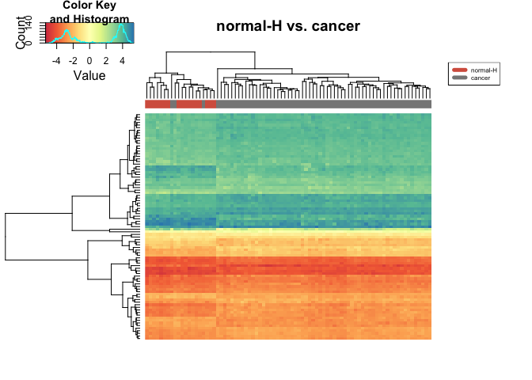

# Identifying DMR using limma
Eva Y  
April 4, 2015  

### Analysis goal: 
Get DMR between normal healthy samples and colorectal cancer samples. 


### Step 1: Attach packages for analysis

```r
library(ggplot2)
```

```
## Warning: package 'ggplot2' was built under R version 3.1.3
```

```r
library(gplots)
```

```
## 
## Attaching package: 'gplots'
## 
## The following object is masked from 'package:stats':
## 
##     lowess
```

```r
library(limma)
```

```
## Warning: package 'limma' was built under R version 3.1.3
```

```r
library(RColorBrewer)
```


### Step 2: Load and explore data

```r
# load m values
load("../../data/GSE48684_raw_filtered.m.norm.cgi.Rdata")
str(M.norm.CGI, max.level=0)
```

```
## 'data.frame':	26403 obs. of  147 variables:
##   [list output truncated]
```

```r
# load metadata
load("../../data/metadata.Rdata")
str(metadata, max.level=0)
```

```
## 'data.frame':	147 obs. of  7 variables:
```

> Rename sample labels: 


```r
# rename sample labels for the dataset
colnames(M.norm.CGI) <- paste(metadata$group, gsub("GSM", "", colnames(M.norm.CGI)), sep="_")
```

> Perform data cleaning by removing probes with NA:


```r
M.norm.CGI.rmna <- M.norm.CGI[complete.cases(M.norm.CGI), ]
str(M.norm.CGI.rmna, max.level=0)
```

```
## 'data.frame':	26363 obs. of  147 variables:
##   [list output truncated]
```

> Save the results with removed `NA` for future use. 


```r
save(M.norm.CGI.rmna, file="M.norm.CGI.rmna.Rdata")
```

### Step 3: Data preparation
We want to get DMR between normal healthy samples and colorectal cancer samples. Let's prepare the dataset for that.

```r
# make expression data with only normal-H and cancer samples
norm_h <- M.norm.CGI.rmna[ ,grepl("normal-H", colnames(M.norm.CGI.rmna))]
cancer <- M.norm.CGI.rmna[ ,grepl("cancer", colnames(M.norm.CGI.rmna))]
normH_cancer <- cbind(norm_h, cancer)

# make metadata with only normal-H and cancer samples
metadata_normH_cancer <- subset(metadata, group %in% c("normal-H", "cancer"))
```

### Step 3: Perform DMA using `limma`

```r
metadata_normH_cancer$group <- factor(metadata_normH_cancer$group, 
                                      levels=c("normal-H", "cancer"))
design <- model.matrix(~group, metadata_normH_cancer)
head(design, 10)
```

```
##            (Intercept) groupcancer
## GSM1183439           1           0
## GSM1183440           1           0
## GSM1183441           1           0
## GSM1183442           1           0
## GSM1183443           1           0
## GSM1183444           1           0
## GSM1183453           1           1
## GSM1183454           1           1
## GSM1183455           1           1
## GSM1183456           1           1
```

```r
# fit linear model
fit <- lmFit(normH_cancer, design)

# apply eBayes() to moderate the estimated error variances
ebfit <- eBayes(fit)

# get output of the linear model
top <- topTable(ebfit, number=Inf)
```

```
## Removing intercept from test coefficients
```

### Step 4: Pick differentially methylated regions at FDR < 1e-05

```r
# how many DMR are there at FDR < 1e-05?
nrow(subset(top, adj.P.Val < 1e-05))
```

```
## [1] 87
```

```r
# save DMR
dmr <- subset(top, adj.P.Val < 1e-05)
```

### Step 5: Plot heatmap of these 87 DMR

```r
# create data frame for heatmap.2
mval_dmr <- subset(normH_cancer, row.names(normH_cancer) %in% row.names(dmr))

# color palette 
j.spectral <- colorRampPalette(brewer.pal(n=9, "Spectral"))
palette.size <- 256
spectral.palette <- j.spectral(palette.size)

# specify color labels for different samples
sample.cols <- brewer.pal(11, "RdGy")[c(3,9)]

# plot heatmap without sample clustering
heatmap.2(as.matrix(mval_dmr), col=spectral.palette, 
          trace="none", labRow=NA, labCol=NA,
          ColSideColors=sample.cols[unclass(metadata_normH_cancer$group)],
          main="normal-H vs. cancer",
          margin=c(4,10))

# add legend
legend("topright", legend = levels(metadata_normH_cancer$group),
       col=sample.cols, ncol=1, lty=1, lwd=5, cex=0.5)
```

 

