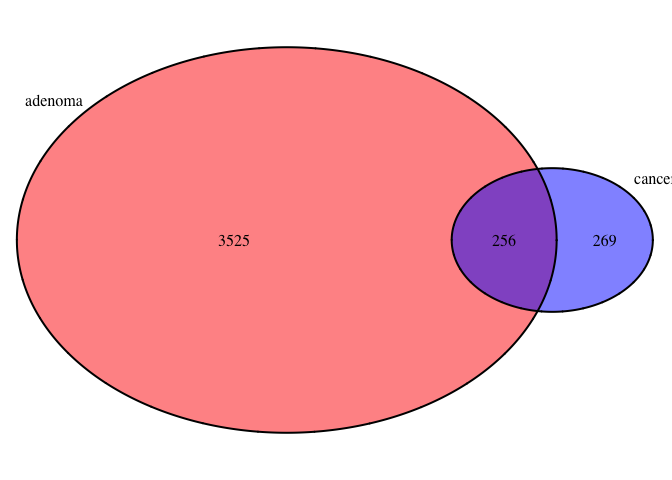
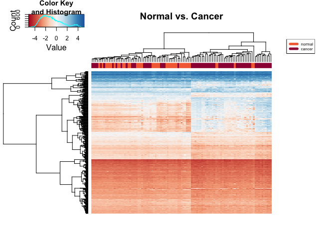
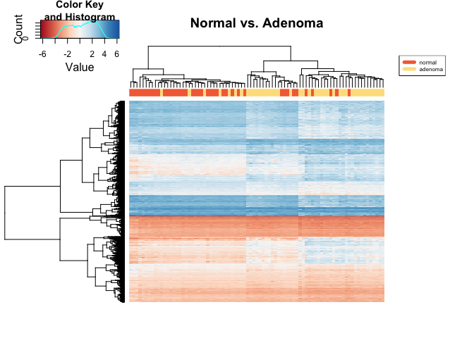
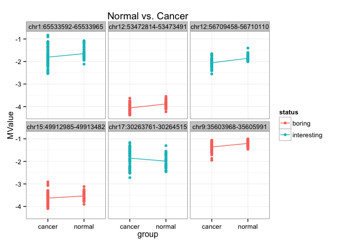
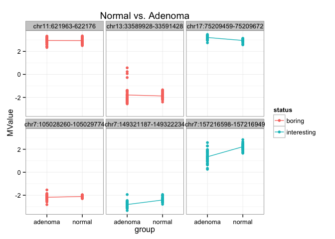

# limma_normalHC
Eva Y  
April 5, 2015  
### Analysis goal: 
Get DMR between normal samples (including normal healthy and normal cancer) and adenoma and colorectal cancer samples. 


### Step 1: Attach packages for analysis

```r
library(ggplot2)
library(gplots)
library(limma)
library(RColorBrewer)
library(reshape2)
library(VennDiagram)
```


### Step 2: Useful functions

```r
# 01 rename sample labels
rename_samples <- function(data){
  paste(metadata$group, gsub("GSM", "", colnames(data)), sep="_")
}

# 02 make expression data with only normal-H and normal-C/adenoma/cancer samples
prep_data <- function(sample1="", sample2="", data){
  sample1 <- data[ ,grepl(sample1, colnames(data))]
  sample2 <- data[ ,grepl(sample2, colnames(data))]
  cbind(sample1, sample2)
}

# 03 perform limma DMA
do.limma <- function(data, design){
  # fit linear model
  fit <- lmFit(data, design)
  
  # apply eBayes() to moderate the estimated error variances
  ebfit <- eBayes(fit)
  
  # get output of the linear model
  top <- topTable(ebfit, number=Inf)
}

# 04 prepare design matrix for different sample pairs
prep_design <- function(metadata="", sample1="", sample2=""){
  metadata$group <- factor(metadata$group, levels=c(sample1, sample2))
  model.matrix(~group, metadata)
}

# 05 plot heatmap for DMR
plot_heatmap <- function(data, palette, labels, metadata, x=""){
  heatmap.2(as.matrix(data), col=palette, 
          trace="none", labRow=NA, labCol=NA,
          ColSideColors=labels[unclass(metadata$group)],
          main=x,
          margin=c(4,10))
  
  # add legend
  legend("topright", legend = levels(metadata$group),
       col=labels, ncol=1, lty=1, lwd=5, cex=0.5)
}

# 06 when given a list of cgi, returns a tall&skinny data frame
get_cgi <- function(data, int.list, bor.list){
  # get interesting hits
  int <- subset(data, row.names(data) %in% int.list)
  
  # get boring hits
  bor <- subset(data, row.names(data) %in% bor.list)
  
  # make tall and skinny data frame
  df <- rbind(int, bor)
  df <- cbind(cgi=rep(row.names(df)), 
              status=rep(c("interesting", "boring"), each=3), df)
  df <- melt(df, id.vars=c("cgi", "status"), 
             variable.name="sample", value.name="MValue")
  df <- data.frame(df, group=df$sample)
  
  # get rid of "_\\d"
  df$group <- sub("[-].[_]\\d+", "", df$group)
  df$group <- sub("[_]\\d+", "", df$group)
  df
}
```


### Step 3: Load and explore data

```r
# load m values with renamed columns and removed NAs
load("M.norm.CGI.rmna.Rdata")
str(M.norm.CGI.rmna, max.level=0)
```

```
## 'data.frame':	26363 obs. of  147 variables:
##   [list output truncated]
```

```r
# load beta values
load("../03kmeans_cgi/beta.norm.cgi.rmna.Rdata")
str(norm_beta_filter_cgi, max.level=0)
```

```
## 'data.frame':	26363 obs. of  147 variables:
##   [list output truncated]
```

```r
# load metadata
load("../../data/metadata.Rdata")
str(metadata, max.level=0)
```

```
## 'data.frame':	147 obs. of  7 variables:
```

### Step 4: Data preparation
We want to get DMR between normal samples and adenoma/colorectal cancer samples. Let's prepare the datasets for that.

```r
## normal vs. cancer
# make methylation data with only normal-H and cancer samples
norm_cancer <- prep_data(sample1="normal*", sample2="cancer", M.norm.CGI.rmna)

# make metadata with only normal-H and cancer samples
metadata_norm_cancer <- subset(metadata, 
                               group %in% 
                                 c("normal-H", "normal-C", "cancer"))
metadata_norm_cancer$group <- gsub("[-].", "", metadata_norm_cancer$group)
metadata_norm_cancer$group <- factor(metadata_norm_cancer$group, 
                                      levels=c("normal", "cancer"))
                      
## normal vs. adenoma
# make methylation data with only normal-H and normal-C samples
norm_adenoma <- prep_data(sample1="normal*", sample2="adenoma", M.norm.CGI.rmna)

# make metadata with only normal-H and normal-C samples
metadata_norm_adenoma <- subset(metadata, 
                                group %in% 
                                  c("normal-H", "normal-C", "adenoma"))
metadata_norm_adenoma$group <- gsub("[-].", "", metadata_norm_adenoma$group)
metadata_norm_adenoma$group <- factor(metadata_norm_adenoma$group, 
                                      levels=c("normal", "adenoma"))
```


### Step 5: Perform DMA using `limma`

Make design matrix for different sample pairs.

```r
# normal vs. cancer
design_norm_cancer <- prep_design(metadata=metadata_norm_cancer, 
                                   sample1="normal", sample2="cancer")

# normal vs. adenoma
design_norm_adenoma <- prep_design(metadata=metadata_norm_adenoma, 
                                   sample1="normal", sample2="adenoma")
```

Perform DMA using `limma`.

```r
# normal vs. cancer
norm_cancer_dma <- do.limma(norm_cancer, design_norm_cancer)

# normal vs. adenoma
norm_adenoma_dma <- do.limma(norm_adenoma, design_norm_adenoma)

# save DMA results
save(norm_cancer_dma, file="../../data/norm_cancer_dma.Rdata")
save(norm_adenoma_dma, file="../../data/norm_adenoma_dma.Rdata")
```


### Step 6: Pick differentially methylated regions at FDR < 1e-05

```r
# how many DMR are there at FDR < 1e-05?
norm_cancer_dmr <- subset(norm_cancer_dma, adj.P.Val < 1e-04)
nrow(norm_cancer_dmr)
```

```
## [1] 525
```

```r
norm_adenoma_dmr <- subset(norm_adenoma_dma, adj.P.Val < 1e-04)
nrow(norm_adenoma_dmr)
```

```
## [1] 3781
```


### Step 7: Explore DMA and visualize DMR

What are the shared DMR between these different sample pairs analyses?

```r
# assign names to the lists for plotting
dmr <- list(adenoma=row.names(norm_adenoma_dmr), 
            cancer=row.names(norm_cancer_dmr))

# start a new plot
plot.new()

# draw the Venn diagram
venn.plot <- venn.diagram(dmr, filename = NULL, 
                          fill = c("red", "blue"))

# draw the plot on the screen
grid.draw(venn.plot)
```

 

Plot heatmap for each DMR list.

```r
# color palette 
jRdBu <- colorRampPalette(brewer.pal(n=9, "RdBu"))
palette.size <- 256
jRdBu.palette <- jRdBu(palette.size)

# specify color labels for different samples
sample.cancer <- brewer.pal(11, "Spectral")[c(3,1)]
sample.adenoma <- brewer.pal(11, "Spectral")[c(3,5)]

# create data frame for heatmap.2
# norm vs. cancer
hmap_normcancer <- subset(norm_cancer, 
                           row.names(norm_cancer) %in% 
                             row.names(norm_cancer_dmr))

# norm vs. adenoma
hmap_normadenoma <- subset(norm_adenoma, 
                           row.names(norm_adenoma) %in% 
                             row.names(norm_adenoma_dmr))


# plot heatmaps
plot_heatmap(hmap_normcancer, jRdBu.palette, sample.cancer, 
             metadata_norm_cancer, x="Normal vs. Cancer")
```

 

```r
plot_heatmap(hmap_normadenoma, jRdBu.palette, sample.adenoma, 
             metadata_norm_adenoma, x="Normal vs. Adenoma")
```

 

Plot some interesting and boring hits for each DMA. 

```r
# normal vs. cancer
int.list <- head(row.names(norm_cancer_dma), 3)
bor.list <- tail(row.names(norm_cancer_dma), 3)
norm_cancer_cgi <- get_cgi(norm_cancer, int.list, bor.list)

# plot
ggplot(norm_cancer_cgi, aes(x=group, y=MValue, color=status)) +
  geom_point() + 
  facet_wrap(~cgi) +
  theme_bw() +
  stat_summary(aes(group=1), fun.y=mean, geom="line") +
  ggtitle("Normal vs. Cancer")
```

 

```r
# normal vs. adenoma
int.list <- head(row.names(norm_adenoma_dma), 3)
bor.list <- tail(row.names(norm_adenoma_dma), 3)
norm_adenoma_cgi <- get_cgi(norm_adenoma, int.list, bor.list)

# plot
ggplot(norm_adenoma_cgi, aes(x=group, y=MValue, color=status)) +
  geom_point() + 
  facet_wrap(~cgi) +
  theme_bw() +
  stat_summary(aes(group=1), fun.y=mean, geom="line") +
  ggtitle("Normal vs. Adenoma")
```

 

## Summary
Guys, this looks good!
