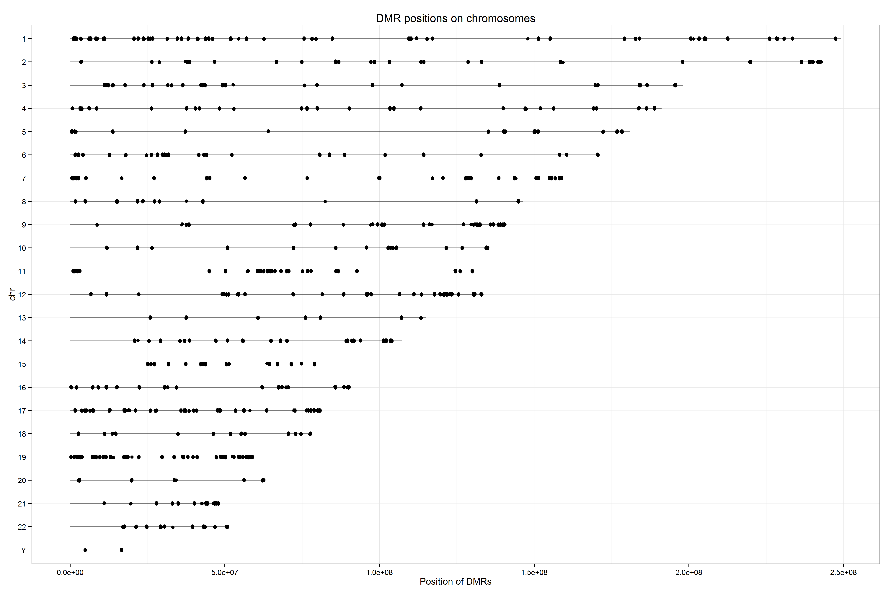
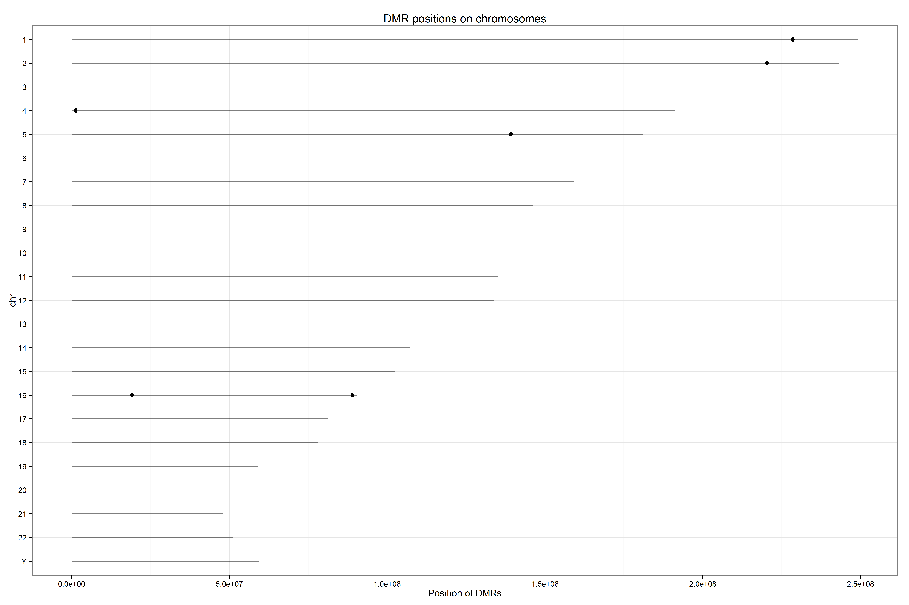
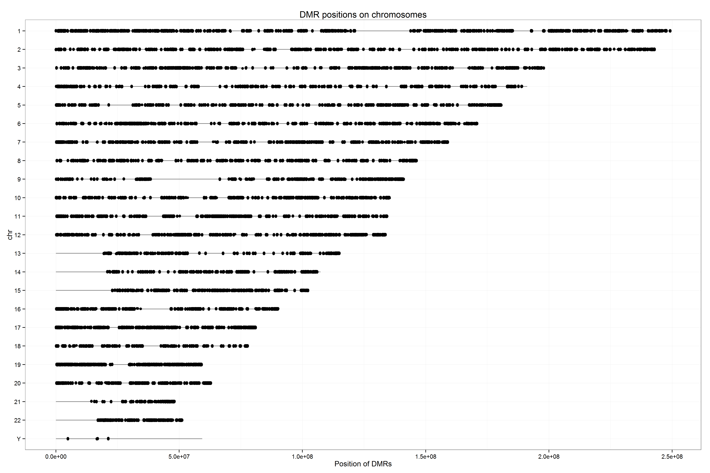
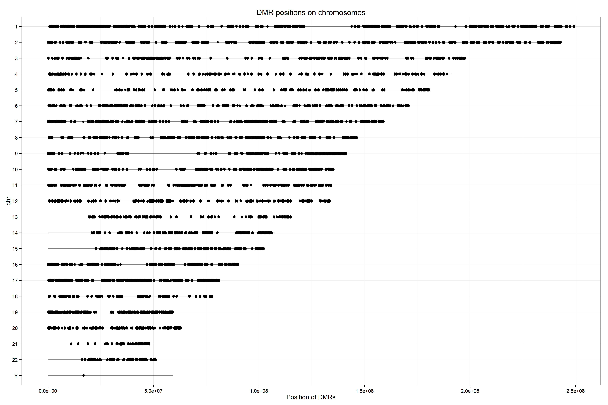

Scripting and interpretation of resutls: Rashedul Islam 

This plot tells the distribution and location of CGIs at chromosome level. Here we made the plots of the differentially methylated regions (DMRs) that are present in our four differential methylation analyses (DMA) in all chromosomes excluding 'X' chromosome. Interestingly, from those plots we can see that 'Y' chromosome have very little effect of methylation for all the DMAs. Since we did not exclude 'Y' chromosome data in out experiment, it might not created any bias in our results due to its very low abundance of methylation. On the other hand, from eye balling we can see that chromosome 1, 2, 17 and 19 have consistant hypermethylation in all four DMAs. We did not found differentially methylated regions at most of chromosomes when compared between normal_Cancer vsnormal_healthy tissues. Expectedly we found higher differential expression pattern when compare to normal vs adenoma and normal vs cancer. DMA of four different pairs are:

1. adenoma_vs_cancer
2. normalC_vs_normalH
3. normal_vs_adenoma
4. normal_vs_cancer

Input was the limma DMR results at FDR 1e-4.

**Plot_adenoma_vs_cancer plot**
1011 CGIs were differentially expressed. 

**Plot_normalC_vs_normalH:**
8 CGIs were differentially expressed. 

**Plot_normal_vs_adenoma:**
13276 CGIs were differentially expressed. 

**Plot_normal_vs_cancer:** 
8247 CGIs were differentially expressed. 

To generate the plots Seminar08 was followed. To pre-process the data the code we used are [here](https://github.com/STAT540-UBC/yy_team01_colorectal-cancer_STAT540_2015/blob/master/rscripts/DMR_positions_at_chr_pre-process.R). The function we used to generate those graphs can be found [here](https://github.com/STAT540-UBC/yy_team01_colorectal-cancer_STAT540_2015/blob/master/rscripts/DMR_positions_at_chr_plot.R).