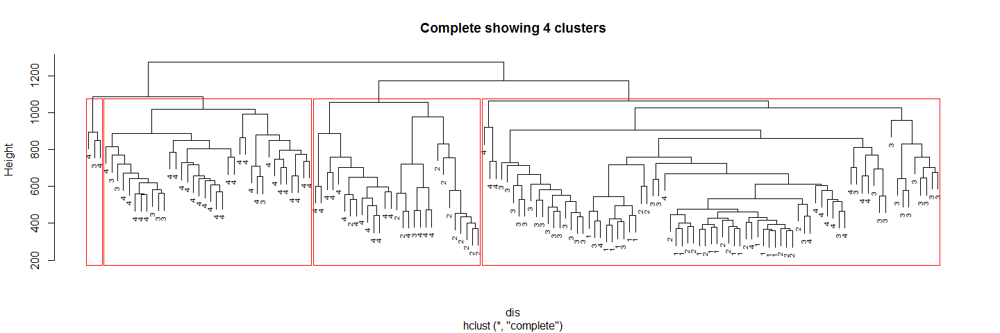

# Hierarchical Clustering Analysis
Santina  
Monday, March 16, 2015  

Beryl and Ka Ming has written the scripts for the rest of the group to download and filter raw data and raw meta data. Here I will try some clustering analysis to test the water... or look at the data at a high level.

The goal is to see if there are distinguishable features between different patient groups that clustering methods that come with R packages can pick out and correctly group the samples into their corresponding groups. 

This report is purely for internal communication. 

# Load the data

First we'll load the data:


```r
# run the script that gets the raw data and filter the raw data
# this step would take a while 
start <- proc.time()
source('../rscripts/get_data_and_filter.R')
(time <- proc.time() - start)

# run the script that take the metadata on our repo and process/filter it 
# reads in "GSE48684_metadata_raw.Rdata""
source('../rscripts/process_metadata.R')
load("../data/metadata.Rdata")
mD <- metadata
```

I am having trouble running the first script... Probably because (as Ka Ming suggested) that I have corrupted temp file and the script is using that. Anyway, I got the file from Beryl so I'll just use that : 


```r
library(knitr)
knitr::opts_chunk$set(ig.height = 09, fig.width = 15)
load('../data/GSE48684_raw_filtered.Rdata')
data <- raw_data_filter
load('../data/metadata.Rdata')
meta <- metadata
head(data[, 1:10])
```

```
##            GSM1183439 GSM1183440 GSM1183441 GSM1183442 GSM1183443
## cg00050873 0.87153040 0.89495460  0.6093750 0.87842130 0.89606860
## cg00063477 0.89772560 0.93803160  0.4852941 0.94228640 0.95133270
## cg00121626 0.70276340 0.44292580  0.5263158 0.54055630 0.54761520
## cg00212031 0.06251355 0.03182913  0.5037221 0.06570613 0.01812475
## cg00213748 0.77986580 0.86277300  0.3082902 0.77699040 0.83620970
## cg00214611 0.02722982 0.02486223  0.4694960 0.03288129 0.01453940
##            GSM1183444 GSM1183445 GSM1183446 GSM1183447 GSM1183448
## cg00050873 0.86411680  0.5121107  0.6389892 0.70725050  0.5295275
## cg00063477 0.92998790  0.5389049  0.5275311 0.92888770  0.5908558
## cg00121626 0.43066520  0.2141328  0.4771574 0.83613020  0.5928074
## cg00212031 0.07941718  0.5557692  0.3333333 0.80034610  0.3005952
## cg00213748 0.80006250  0.2034549  0.2849003 0.80853740  0.3333333
## cg00214611 0.02377164  0.4161850  0.3505976 0.02797866  0.3442623
```

```r
head(meta)
```

```
##      group                                title geo_accession
## 1 normal-H Genomic DNA from normal individual 1    GSM1183439
## 2 normal-H Genomic DNA from normal individual 2    GSM1183440
## 3 normal-H Genomic DNA from normal individual 3    GSM1183441
## 4 normal-H Genomic DNA from normal individual 4    GSM1183442
## 5 normal-H Genomic DNA from normal individual 5    GSM1183443
## 6 normal-H Genomic DNA from normal individual 6    GSM1183444
##              tissue colon_region gender stage
## 1 colorectal mucosa        colon   Male      
## 2 colorectal mucosa        colon   Male      
## 3 colorectal mucosa        colon Female      
## 4 colorectal mucosa        colon   Male      
## 5 colorectal mucosa        colon   Male      
## 6 colorectal mucosa        colon   Male
```

For my personal preference I'm gonna reorganize the meta data a bit. 


```r
rownames(meta) <- meta$geo_accession  # move labels to row names
meta$geo_accession <- NULL

#remove redundant words 
meta$title <- as.factor(gsub("Genomic DNA from ", "", meta$title)) 
meta$title <- as.factor(gsub("Genomic DNA of ", "", meta$title))
head(meta) # yay
```

```
##               group               title            tissue colon_region
## GSM1183439 normal-H normal individual 1 colorectal mucosa        colon
## GSM1183440 normal-H normal individual 2 colorectal mucosa        colon
## GSM1183441 normal-H normal individual 3 colorectal mucosa        colon
## GSM1183442 normal-H normal individual 4 colorectal mucosa        colon
## GSM1183443 normal-H normal individual 5 colorectal mucosa        colon
## GSM1183444 normal-H normal individual 6 colorectal mucosa        colon
##            gender stage
## GSM1183439   Male      
## GSM1183440   Male      
## GSM1183441 Female      
## GSM1183442   Male      
## GSM1183443   Male      
## GSM1183444   Male
```

# Scaling data 

Now let's do clustering. 

But first, as suggested in the seminar tutorial, let's scale so that we look at the distribution of methylation, not the absolute differences of methylation levels among regions. 


```r
s_data <- t(scale(t(data))) 

# for inspection : 
round(data.frame(avgBefore = rowMeans(head(data)),
                 avgAfter = rowMeans(head(s_data)),
                 varBefore = apply(head(data), 1, var),
                 varAfter = apply(head(s_data), 1, var)), 2)
```

```
##            avgBefore avgAfter varBefore varAfter
## cg00050873      0.59        0      0.05        1
## cg00063477      0.66        0      0.05        1
## cg00121626        NA       NA        NA       NA
## cg00212031      0.31        0      0.04        1
## cg00213748        NA       NA        NA       NA
## cg00214611      0.26        0      0.04        1
```

Looks like there are some missing values. I'm gonna scale it again so that this time NA is not being accounted (removing all the rows with NAs), just to make things easier. (good thing we inspect s_data first) 
Note that in this case the probes is much fewer.


```r
nrow(data[complete.cases(data), ]) # 256981 vs 301208 in the original. 
```

```
## [1] 256981
```

```r
s_data_noNA <- t(scale(t(data[complete.cases(data), ])))
```
Maybe doing this would get rid of too many probes. So I'll try replacing NA with zeros in case the NAs in this study mean that they couldn't get any signal (hence zeros)


```r
data_NA_zeros <- data 
data_NA_zeros[is.na(data_NA_zeros)] <- 0
# sanity check
nrow(data_NA_zeros[complete.cases(data_NA_zeros),]) == nrow(data)
```

```
## [1] TRUE
```

Now scale 


```r
s_data_NA_zeros <- t(scale(t(data_NA_zeros)))
```

Just as a reminder: 
- `data` : our original data
- `meta` : our meta data containing what each column in `data` is 
- `s_data`: the scaled `data` , it has NA because `data` has NAs
- `s_data_noNA` : after removing rows with NAs from `data` and then scale it 
- `s_data_NA_zeros` : after replacing NAs with zeros in `data` and then scale it 

BTW just want to make a point that I had to change my memory allocation limit from 3981 to 5000 `memory.limit(5000)` in order to knit this Rmarkdown up to this point. 

# Clustering 

Make distance matrix 

```r
# compute pairwise distances
dis <- dist(t(s_data), method = 'euclidean')
dis_noNA <- dist(t(s_data_noNA), method = 'euclidean')
dis_NAzeros <- dist(t(s_data_NA_zeros), method = 'euclidean')
```

To make it easier to see in the tree, we'll decode different group with a number: 


```r
library(car)
meta$code <- recode(meta$group, 
										'"normal-H"=1; "normal-C"=2; "adenoma"=3; "cancer"=4', 
										as.factor.result = TRUE)
table(meta$group, meta$code)
```

```
##           
##             1  2  3  4
##   adenoma   0  0 42  0
##   cancer    0  0  0 64
##   normal-C  0 24  0  0
##   normal-H 17  0  0  0
```

_Note that these numbers simply for easier visualization on the tree graphs, they are not the same numbers in the tables following each graphs_ The number in the tables are arbitrary number assigned by hclust and output by cutree. The tables are simply there to show how well each group cluster into the same class.

Now we'll do clustering for each different distance matrix, using two different methods 'ward.D' and 'complete', with two hyperlinks to random sources describing them. 

## Do clustering analysis for `dis`

[Ward's minimum variance method](http://en.wikipedia.org/wiki/Ward%27s_method)

```r
dis.w <- hclust(dis, method = 'ward.D')
plot(dis.w, labels = meta$code, cex = 0.6, 
     main = "Ward showing 4 clusters")
rect.hclust(dis.w, k = 4) # specify we want 4 clusters 
```

 

```r
# to see more clearly what gets clustered together: 
dis.w.groups <- cbind(meta, cluster = cutree(dis.w, k=4))
kable(table(dis.w.groups$group, dis.w.groups$cluster))
```

             1    2    3    4
---------  ---  ---  ---  ---
adenoma      3   28   11    0
cancer      10    8   36   10
normal-C     3    0    1   20
normal-H     6    0    0   11

Mmm.... cancer ones get clustered into different cluster.  

[Furthest neighbor or compact](http://ecology.msu.montana.edu/labdsv/R/labs/lab13/lab13.html)


```r
dis.w <- hclust(dis, method = 'complete')
plot(dis.w, labels = meta$code, cex = 0.6, 
     main = "Complete showing 4 clusters")
rect.hclust(dis.w, k = 4) # specify we want 4 clusters 
```

 

```r
# to see more clearly what gets clustered together: 
dis.w.groups <- cbind(meta, cluster = cutree(dis.w, k=4))
kable(table(dis.w.groups$group, dis.w.groups$cluster))
```

             1    2    3    4
---------  ---  ---  ---  ---
adenoma     34    1    6    1
cancer      15   17   30    2
normal-C    13   11    0    0
normal-H    17    0    0    0

Even worse. 

## Do clustering for `dis_noNA`
Ward: 

```r
dis_noNA.w <- hclust(dis_noNA, method = 'ward.D')
plot(dis_noNA.w, labels = meta$code, cex = 0.7, 
     main = "Ward showing 4 clusters, with NA removed")
rect.hclust(dis.w, k = 4) # specify we want 4 clusters  
```

 

```r
# to see more clearly what gets clustered together: 
dis_noNA.w.groups <- cbind(meta, cluster = cutree(dis_noNA.w, k=4))
kable(table(dis_noNA.w.groups$group, dis_noNA.w.groups$cluster))
```

             1    2    3    4
---------  ---  ---  ---  ---
adenoma      3   28   11    0
cancer      10    8   36   10
normal-C     3    0    1   20
normal-H     6    0    0   11

Complete: 


```r
dis_noNA.w <- hclust(dis_noNA, method = 'complete')
plot(dis_noNA.w, labels = meta$code, cex = 0.7, 
     main = "Complete showing 4 clusters, with NA removed")
rect.hclust(dis.w, k = 4) # specify we want 4 clusters  
```

 

```r
# to see more clearly what gets clustered together: 
dis_noNA.w.groups <- cbind(meta, cluster = cutree(dis_noNA.w, k=4))
kable(table(dis_noNA.w.groups$group, dis_noNA.w.groups$cluster))
```

             1    2    3    4
---------  ---  ---  ---  ---
adenoma      6   25    1   10
cancer       6    2    8   48
normal-C     0    0    3   21
normal-H     6    0    0   11


## Do clustering for `dis_NAzeros`

Wards

```r
dis_NAzeros.w <- hclust(dis_NAzeros, method = 'ward.D')
plot(dis_NAzeros.w, labels = meta$code, cex = 0.7, 
     main = "Ward showing 4 clusters, with NA set to zeros")
rect.hclust(dis.w, k = 4) # specify we want 4 clusters  
```

 

```r
# to see more clearly what gets clustered together: 
dis_NAzeros.w.groups <- cbind(meta, cluster = cutree(dis_NAzeros.w, k=4))
kable(table(dis_NAzeros.w.groups$group, dis_NAzeros.w.groups$cluster))
```

             1    2    3    4
---------  ---  ---  ---  ---
adenoma      3   27   12    0
cancer      19    8   36    1
normal-C     4    0    1   19
normal-H     6    0    0   11

complete: 

```r
dis_NAzeros.w <- hclust(dis_NAzeros, method = 'complete')
plot(dis_NAzeros.w, labels = meta$code, cex = 0.7, 
     main = "Complete showing 4 clusters, with NA set to zeros")
rect.hclust(dis.w, k = 4) # specify we want 4 clusters  
```

 

```r
# to see more clearly what gets clustered together: 
dis_NAzeros.w.groups <- cbind(meta, cluster = cutree(dis_NAzeros.w, k=4))
kable(table(dis_NAzeros.w.groups$group, dis_NAzeros.w.groups$cluster))
```

             1    2    3    4
---------  ---  ---  ---  ---
adenoma      6   11    1   24
cancer       6   13    9   36
normal-C     0    0    3   21
normal-H     6    0    0   11


I should have just written a function to do this kind of repeatitive work...but I already finished copied and pasted. 

> My conclusion, overall the data don't cluster that well together, but at least the majority from each group do get clustered into the same cluster. We should go ahead and do the analysis now and if we feel like coming back to these, we can go to the individual ones that get clustered into a different group to see how different they are. Note that clustering is stochastic. 


For normalized data, just use this same markdown and change the data source. 
